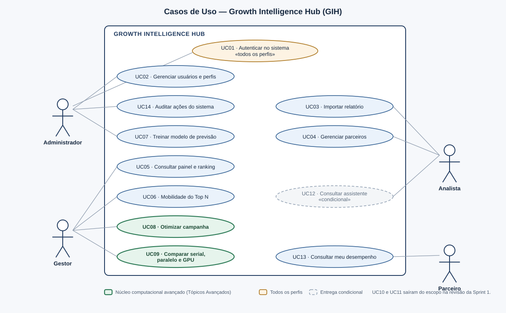

# 03 — Casos de Uso

**Projeto:** Growth Intelligence Hub (GIH)
**Sprint:** 1 — Planejamento e Descoberta
**Versão:** 2.0 — 16/09/2026

---

## 1. Atores

| Ator | Tipo | Descrição |
|---|---|---|
| **Administrador** | Primário | Responsável técnico da operação. Gerencia usuários, perfis e parâmetros do sistema; audita as ações registradas. Não participa da operação comercial. |
| **Gestor** | Primário | Responsável pela unidade. É quem decide: executa o otimizador, aprova mensagens e acompanha a mobilidade do ranking. Tem acesso a tudo que é operacional. |
| **Analista** | Primário | Executa o relacionamento no dia a dia. Importa relatórios, analisa parceiros e redige mensagens — mas **não aprova** envio nem executa o otimizador. |
| **Parceiro** | Primário | Comércio da rede. Acesso restrito ao próprio desempenho histórico. |
| **Modelo de Linguagem Local** | Secundário (sistema) | Serviço interno que redige textos e responde ao assistente. Nunca calcula números. |

> A separação entre **Gestor** e **Analista** é o que materializa a exigência de *diferentes perfis de
> usuários*: os dois enxergam o mesmo painel, mas apenas o Gestor pode comprometer recursos (executar
> campanha) e comprometer a relação com o parceiro (aprovar mensagem).

---

## 2. Diagrama de casos de uso

---

## 3. Visão geral dos casos de uso

| ID | Caso de uso | Ator principal | Requisitos cobertos |
|---|---|---|---|
| **UC01** | Autenticar no sistema | Todos | RF01, RF02, RF07 |
| **UC02** | Gerenciar usuários e perfis | Administrador | RF03, RF04, RF05 |
| **UC03** | Importar relatório de desempenho | Analista, Gestor | RF09, RF10, RF11, RF12, RF13 |
| **UC04** | Gerenciar parceiros e categorias | Analista, Gestor | RF14, RF15, RF16 |
| **UC05** | Consultar painel e ranking | Gestor, Analista | RF17, RF18, RF19, RF20, RF23, RF24, RF25 |
| **UC06** | Analisar mobilidade do Top N | Gestor, Analista | RF22 |
| **UC07** | Treinar modelo de previsão | Administrador, Gestor | RF27, RF28 |
| **UC08** | Configurar e executar otimização de campanha | Gestor | RF29, RF30, RF31, RF35 |
| **UC09** | Comparar desempenho serial, paralelo e GPU | Gestor, Administrador | RF32, RF33, RF34 |
| **UC10** | Gerar mensagens por segmento | Analista, Gestor | RF36, RF37 |
| **UC11** | Aprovar ou rejeitar mensagem | Gestor | RF38, RF39, RF40 |
| **UC12** | Consultar assistente analítico | Gestor, Analista | RF41, RF42, RF43 |
| **UC13** | Consultar meu desempenho | Parceiro | RF19, RF26 |
| **UC14** | Auditar ações do sistema | Administrador | RF06, RF08 |

### Matriz de permissões

| Caso de uso | ADM | GES | ANL | PAR |
|---|:--:|:--:|:--:|:--:|
| UC01 Autenticar | ● | ● | ● | ● |
| UC02 Gerenciar usuários | ● | — | — | — |
| UC03 Importar relatório | ○ | ● | ● | — |
| UC04 Gerenciar parceiros | — | ● | ● | — |
| UC05 Painel e ranking | ○ | ● | ● | — |
| UC06 Mobilidade do Top N | ○ | ● | ● | — |
| UC07 Treinar modelo | ● | ● | — | — |
| UC08 Executar otimização | — | ● | ○ | — |
| UC09 Benchmark | ● | ● | — | — |
| UC10 Gerar mensagens | — | ● | ● | — |
| UC11 Aprovar mensagem | — | ● | — | — |
| UC12 Assistente | — | ● | ● | — |
| UC13 Meu desempenho | — | — | — | ● |
| UC14 Auditoria | ● | — | — | — |

● executa · ○ somente leitura · — sem acesso

No UC03, o "somente leitura" do Administrador é o **histórico das importações** — quem trouxe cada
período, quando e quanto — que o RF13 lhe atribui. Importar continua sendo de Gestor e Analista. A matriz
dizia "sem acesso" e contradizia o RF13; o RF13 é o que vale.

---

## 4. Especificação detalhada

Os **quatorze** casos de uso, cada um com ator principal, objetivo, pré e pós-condições, requisitos
cobertos, fluxo principal, fluxos alternativos e exceções.

Os fluxos alternativos e as exceções recebem o mesmo peso do fluxo principal, e por um motivo prático: é
neles que mora o comportamento que o sistema erra em silêncio. Importação sem período, mobilidade lida do
segmento errado, mensagem que falha para parte do lote — os três já causaram defeito real em um projeto
anterior do mesmo domínio, e nenhum dos três aparece no caminho feliz.

---

### UC01 — Autenticar no sistema

| | |
|---|---|
| **Ator principal** | Todos os perfis |
| **Objetivo** | Obter acesso ao sistema conforme o perfil atribuído |
| **Pré-condições** | O usuário possui credenciais válidas e está ativo |
| **Pós-condições** | Sessão criada, identificador de sessão renovado e evento registrado na auditoria |
| **Requisitos** | RF01, RF02, RF05, RF06, RNF09, RNF10, RNF11 |

**Fluxo principal**

1. O usuário acessa o sistema e recebe a tela de autenticação.
2. Informa login e senha.
3. O sistema valida as credenciais contra o hash armazenado.
4. O sistema **renova o identificador de sessão** e cria a sessão com o perfil do usuário.
5. O sistema registra o evento na trilha de auditoria.
6. O sistema apresenta a área inicial correspondente ao perfil.

**Fluxos alternativos**

- **A1 — Credenciais inválidas.** No passo 3, o sistema retorna mensagem genérica de falha, **idêntica** para
  usuário inexistente e para senha incorreta, e incrementa o contador de tentativas da origem. Retorna ao
  passo 2.
- **A2 — Origem bloqueada.** Se a origem acumulou 5 falhas, o sistema recusa novas tentativas por 15 minutos,
  informando apenas que o acesso está temporariamente indisponível.
- **A3 — Usuário desativado.** O sistema responde com a mesma mensagem genérica de A1, sem revelar o estado
  da conta.

**Exceções**

- **E1 — Serviço de dados indisponível.** O sistema exibe mensagem genérica de indisponibilidade e registra o
  erro com identificador de correlação no log do servidor.

---

### UC02 — Gerenciar usuários e perfis

| | |
|---|---|
| **Ator principal** | Administrador |
| **Objetivo** | Controlar quem acessa o sistema e o que cada pessoa pode fazer |
| **Pré-condições** | Usuário autenticado com perfil Administrador |
| **Pós-condições** | Usuário criado, editado ou desativado; alteração registrada na auditoria |
| **Requisitos** | RF03, RF04, RF05; RNF09, RNF14 |

**Fluxo principal**

1. O Administrador abre a tela de usuários.
2. O sistema lista os usuários com nome, login, perfil e situação, permitindo filtrar por perfil e por situação.
3. O Administrador cria um usuário informando login, nome, senha inicial e **exatamente um** perfil.
4. O sistema valida o login, confere a força mínima da senha e a armazena apenas como hash (RNF09).
5. O sistema registra a criação na auditoria, com autor, data e o perfil atribuído.
6. O usuário criado já consegue autenticar e enxerga apenas o que o perfil dele permite.

**Fluxos alternativos**

- **A1 — Alteração de perfil.** O Administrador troca o perfil de um usuário. A mudança vale **na
  requisição seguinte**, porque a permissão é lida do usuário a cada requisição, não congelada no login.
  A auditoria guarda o valor anterior e o novo.
- **A2 — Desativação.** Desativar **encerra as sessões abertas** daquele usuário imediatamente. O registro
  não é apagado: a trilha de auditoria referencia o autor de cada ação, e remover a linha deixaria o
  histórico apontando para o nada.
- **A3 — Perfil Parceiro.** Só esse perfil aceita vínculo com um parceiro, e ele é obrigatório nesse caso.
  O banco garante a condição nos dois sentidos.
  **Na tela, o perfil Parceiro ainda não é oferecido:** escolher o parceiro exigiria que o Administrador
  listasse parceiros, o que a matriz não lhe dá, e o portal do parceiro (H39) ainda não existe. A API
  aceita a criação; a tela diz por que o perfil não está na lista.
- **A4 — Tentativa por perfil não autorizado.** Gestor, Analista ou Parceiro que chame a rota diretamente
  recebem recusa do servidor, independentemente do que a interface exiba (RNF14), e a tentativa entra na
  auditoria.

**Exceções**

- **E1 — Login já existente.** O sistema recusa e informa. A unicidade é garantida pelo banco, e não por
  uma consulta prévia, que deixaria uma janela entre a checagem e a gravação.
- **E2 — Último administrador ativo.** O sistema impede desativar ou rebaixar a última conta de
  Administrador ativa: sem ela, ninguém mais conseguiria gerenciar usuários e o RF03 ficaria impossível de
  cumprir sem intervenção direta no banco.

---

### UC03 — Importar relatório de desempenho

| | |
|---|---|
| **Ator principal** | Analista (também Gestor) |
| **Objetivo** | Incorporar ao sistema os dados de desempenho de um período |
| **Pré-condições** | Usuário autenticado com perfil Gestor ou Analista; relatório disponível em texto ou CSV |
| **Pós-condições** | Métricas do período gravadas, segmentação recalculada e importação registrada no histórico |
| **Requisitos** | RF09, RF10, RF11, RF12, RF13, RF20; regras RN03, RN04 |

**Fluxo principal**

1. O usuário abre a tela de importação.
2. Informa **a data inicial e a data final do período** — campos obrigatórios.
3. Cola o texto do relatório ou seleciona um arquivo CSV.
4. O sistema analisa o conteúdo e identifica, por parceiro, o faturamento e o número de pedidos.
5. O sistema apresenta uma **prévia** com: registros reconhecidos, registros rejeitados e o motivo de cada
   rejeição, além dos parceiros ainda não cadastrados.
6. O usuário confere a prévia e confirma.
7. O sistema grava as métricas, cadastra os parceiros novos e recalcula a segmentação de toda a base.
8. O sistema registra a importação no histórico com autor, data e período, e registra o evento na auditoria.
9. O sistema exibe o resumo: total gravado, total rejeitado e link para o painel do período.

**Fluxos alternativos**

- **A1 — Período não informado.** No passo 2, o sistema **recusa** o avanço e explica que sem o período as
  métricas não podem ser posicionadas na linha do tempo (RN03). Não há valor padrão.
- **A2 — Período já importado.** No passo 5, o sistema alerta que o período já existe e oferece duas opções
  explícitas: substituir os dados existentes ou cancelar. O padrão é cancelar.
- **A3 — Parceiros novos detectados.** No passo 5, o sistema lista os nomes ainda não cadastrados e **sugere**
  uma categoria para cada um, marcada como sugestão não confirmada (RN05). O usuário pode confirmar,
  corrigir ou deixar em branco.
- **A4 — Formato não reconhecido.** Se nenhuma linha for interpretável, o sistema informa que o formato não
  foi reconhecido e exibe as três primeiras linhas recebidas para ajudar o usuário a identificar o problema.
- **A5 — Rejeição parcial.** Se parte dos registros falhar na validação, o usuário pode prosseguir com os
  válidos; os rejeitados ficam listados no resumo para correção posterior.

**Exceções**

- **E1 — Entrada excede o limite.** O sistema recusa o conteúdo acima do tamanho máximo configurado e informa
  o limite (RNF15).
- **E2 — Falha durante a gravação.** A operação é revertida integralmente: ou o período inteiro entra, ou
  nada entra. O usuário recebe mensagem genérica e o erro vai para o log.

---

### UC04 — Gerenciar parceiros e categorias

| | |
|---|---|
| **Ator principal** | Analista (também Gestor) |
| **Objetivo** | Manter o cadastro da rede e a classificação por ramo de atuação |
| **Pré-condições** | Usuário autenticado com perfil Gestor ou Analista |
| **Pós-condições** | Parceiro cadastrado, editado ou desativado; categoria confirmada quando aplicável |
| **Requisitos** | RF14, RF15, RF16; regra RN05 |

**Fluxo principal**

1. O usuário abre a lista de parceiros, com busca por nome e filtro por categoria e situação.
2. Seleciona um parceiro ou inicia um cadastro novo.
3. Informa nome, categoria, status comercial e dados de contato.
4. O sistema grava e passa a considerar o parceiro nas consultas do período corrente.

**Fluxos alternativos**

- **A1 — Parceiro criado pela importação.** Parceiro novo detectado em um relatório entra **sem categoria**
  (UC03, A3). Ele aparece na lista marcado como pendente de classificação.
- **A2 — Sugestão de categoria.** O sistema sugere uma categoria a partir do nome e a apresenta
  explicitamente como **sugestão não confirmada** (RF15). Enquanto ninguém confirmar, ela não conta para
  ação comercial por categoria — é RN05, e existe para que um parceiro classificado por engano não entre
  numa campanha à qual não pertence.
- **A3 — Confirmação ou correção.** O usuário confirma a sugestão, corrige para outra categoria ou deixa em
  branco. Categoria em branco é resultado aceitável: melhor vazio que palpite gravado como se fosse decisão.
- **A4 — Desativação.** Parceiro desativado deixa de entrar em novas campanhas, mas o histórico de métricas
  dele permanece — apagá-lo falsearia as séries dos períodos já fechados.
- **A5 — Massa de demonstração.** O Administrador gera uma rede sintética de 100 a 10.000 parceiros com
  múltiplos períodos (RF16), para demonstração e para o benchmark do otimizador. **Nenhum dado real de
  operação entra no sistema por esse caminho.**

**Exceções**

- **E1 — Nome já cadastrado.** O sistema recusa a duplicata e mostra o parceiro existente, para o usuário
  decidir entre corrigir o nome e editar o registro que já existe.

---

### UC05 — Consultar painel e ranking

| | |
|---|---|
| **Ator principal** | Gestor (também Analista) |
| **Objetivo** | Entender o desempenho da rede no período e identificar quem merece atenção |
| **Pré-condições** | Usuário autenticado; existe ao menos um período importado |
| **Pós-condições** | Nenhuma alteração de estado — caso de uso de consulta |
| **Requisitos** | RF17, RF18, RF19, RF20, RF23, RF24, RF25; regras RN01, RN04 |

**Fluxo principal**

1. O usuário acessa o painel.
2. O sistema apresenta os indicadores consolidados do período mais recente: faturamento total, número de
   pedidos, ticket médio, parceiros ativos e a variação de cada um em relação ao período anterior.
3. O sistema apresenta o gráfico da série histórica da unidade.
4. O sistema apresenta a lista de parceiros com posição no ranking, posição anterior, faturamento, pedidos,
   ticket médio, variação e **segmento**.
5. O usuário aplica filtros por categoria e segmento, ordena por qualquer coluna ou busca por nome.
6. O sistema atualiza a lista conforme os critérios.
7. O usuário seleciona um parceiro e o sistema exibe a série histórica individual.

**Fluxos alternativos**

- **A1 — Base vazia.** No passo 2, se não houver período importado, o sistema exibe um estado inicial
  orientando o usuário a importar o primeiro relatório, com atalho para UC03.
- **A2 — Período único.** Com apenas um período, não há comparação possível: o sistema exibe os valores
  absolutos e informa que variação e segmentação por tendência exigem histórico.
- **A3 — Exportação.** No passo 6, o usuário solicita a exportação e o sistema gera um CSV contendo
  exatamente a visão filtrada em tela (RF25).

**Exceções**

- **E1 — Consulta acima do limite de tempo.** Se a consulta exceder o tempo previsto em RNF03, o sistema
  apresenta o resultado paginado e registra a ocorrência para análise de desempenho.

---

### UC06 — Analisar mobilidade do Top N

| | |
|---|---|
| **Ator principal** | Gestor (também Analista) |
| **Objetivo** | Saber quem entrou e quem saiu do grupo dos maiores entre dois períodos |
| **Pré-condições** | Usuário autenticado; existem **pelo menos dois** períodos importados |
| **Pós-condições** | Nenhuma alteração de estado — caso de uso de consulta |
| **Requisitos** | RF22; regra RN02 |

**Fluxo principal**

1. O usuário seleciona o período corrente e o período de comparação.
2. O sistema calcula o **ranking por faturamento** de cada um dos dois períodos.
3. O sistema compara as duas listas de posições e apura quem entrou no Top N, quem saiu e quem se manteve.
4. O sistema exibe as três listas, com a posição anterior e a atual de cada parceiro.

**Fluxos alternativos**

- **A1 — Top N configurável.** O tamanho do Top N vem da configuração da segmentação (RF21), não de um
  valor fixo em código.
- **A2 — Sem movimentação.** Se ninguém entrou nem saiu, o sistema diz isso explicitamente, em vez de
  mostrar três listas vazias sem explicação.

**Exceções**

- **E1 — Um único período disponível.** Mobilidade exige comparação. O sistema informa que é preciso ao
  menos um período anterior e oferece o caminho para a importação, em vez de exibir uma tela vazia.

> **A armadilha deste caso de uso.** A mobilidade **tem que ser lida do ranking**, nunca do segmento
> armazenado. Como *Em Risco* tem precedência sobre *Top* (RN01), um parceiro que está entre os N maiores
> **e** em queda fica gravado como `EM_RISCO`. Derivar a mobilidade do segmento faria o sistema anunciar que
> ele saiu do Top N enquanto ele continua lá — erro que passa despercebido porque a tela continua parecendo
> correta. É o conteúdo de RN02, e o teste que cobre isso precisa incluir exatamente esse parceiro.

---

### UC07 — Treinar modelo de previsão

| | |
|---|---|
| **Ator principal** | Administrador (também Gestor) |
| **Objetivo** | Produzir previsões de faturamento e de risco a partir do histórico já armazenado |
| **Pré-condições** | Usuário autenticado com perfil Administrador ou Gestor; histórico com períodos suficientes (8, RN09) |
| **Pós-condições** | Modelo treinado e versionado; previsões disponíveis para consulta |
| **Requisitos** | RF27, RF28; RNF16; RN09 |

**Fluxo principal**

1. O usuário abre a tela do modelo preditivo e vê o treino mais recente: data, volume de dados e métricas.
2. Dispara um treino novo.
3. O sistema separa o histórico em treino e validação **respeitando a ordem temporal** — embaralhar séries
   temporais vazaria o futuro para dentro do treino e produziria uma métrica boa e falsa.
4. O sistema treina, avalia contra os baselines já implementados e registra as métricas obtidas.
5. O sistema grava a versão do modelo e gera as previsões por parceiro: faturamento do próximo período e
   probabilidade de queda.
6. As previsões passam a alimentar o painel e o otimizador.

**Fluxos alternativos**

- **A1 — Modelo pior que o baseline.** Se o modelo treinado não superar a estimativa simples, o sistema
  **mantém a versão anterior** e reporta a comparação. Resultado negativo bem explicado é conteúdo técnico
  legítimo; substituir por um modelo pior não é.
- **A2 — Versões coexistem.** Previsões são únicas por parceiro, período-base e **versão do modelo**. É o
  que permite comparar duas versões sobre o mesmo histórico em vez de confiar na memória de quem treinou.

**Exceções**

- **E1 — Histórico insuficiente.** Abaixo do mínimo de períodos — 8, pela RN09 —, o sistema recusa o treino
  e diz quantos períodos faltam. Treinar com pouco dado produz um número com aparência de previsão e sem
  valor preditivo.

> **Na interface (Sprint 05 da disciplina).** A tela **Modelo** (`/modelo`) mostra a versão em uso, com as
> métricas lado a lado com as referências; dispara o treino com confirmação e acompanha o andamento até o
> resultado — entrou em uso, ficou a anterior com o motivo (A1), ou falhou. O treino roda fora da
> requisição, um por vez (ADR-010). As previsões aparecem no **cadastro do parceiro**, marcadas como
> estimativa, com o período-base e a versão; sem previsão, o motivo da RN09. Alimentar o otimizador (passo
> 6) é da Sprint 9–10, quando ele existir.

---

### UC08 — Configurar e executar otimização de campanha

| | |
|---|---|
| **Ator principal** | Gestor |
| **Objetivo** | Obter o plano de ações comerciais que maximiza o retorno esperado dentro das restrições reais |
| **Pré-condições** | Usuário autenticado com perfil Gestor; modelo de previsão treinado (UC07); ao menos um período importado |
| **Pós-condições** | Plano de campanha gerado e persistido; execução registrada no histórico e na auditoria |
| **Requisitos** | RF29, RF30, RF31, RF32, RF34, RF35; regras RN07, RN10 e RN11 |

**Fluxo principal**

1. O usuário abre a tela de campanha.
2. Informa os parâmetros: orçamento total, número máximo de ações, período de aplicação e o catálogo de ações
   disponíveis com o custo unitário de cada uma.
3. Opcionalmente define cotas por categoria — por exemplo, ao menos 30% das ações destinadas à cauda longa.
4. Opcionalmente escolhe o modo de execução; se não escolher, o sistema seleciona o modo disponível mais
   rápido (RF32).
5. O usuário dispara a otimização.
6. O sistema recupera, para cada parceiro elegível, o faturamento previsto e o risco de queda (UC07).
7. O sistema executa o otimizador, exibindo indicador de progresso.
8. O sistema apresenta o **plano de campanha**: a lista de pares parceiro-ação selecionados, o uplift total
   esperado, o custo total, a folga em relação a cada restrição e o tempo de execução.
9. O usuário pode exportar o plano ou encaminhá-lo para a geração de mensagens (UC10).
10. O sistema registra a execução com autor, parâmetros, modo, tempo e resultado.

**Fluxos alternativos**

- **A1 — Restrições inviáveis.** No passo 7, se as restrições forem mutuamente incompatíveis — por exemplo,
  cota mínima por categoria que excede o orçamento —, o sistema **não retorna plano parcial** (RN07):
  informa a inviabilidade e aponta qual restrição foi violada.
- **A2 — Orçamento superior ao necessário.** Se o orçamento comportar ações para toda a base elegível, o
  sistema retorna o plano completo e informa a sobra, sugerindo ampliar o catálogo de ações.
- **A3 — Comparação de cenários.** O usuário executa uma segunda otimização com parâmetros diferentes e
  solicita a comparação lado a lado dos dois planos (RF35).
- **A4 — GPU indisponível.** Se o modo GPU for solicitado sem placa compatível, o sistema executa em CPU
  paralelo e informa a substituição, sem interromper a operação (RNF06).

**Exceções**

- **E1 — Modelo não treinado.** No passo 6, se não houver modelo treinado, o sistema interrompe e direciona
  o usuário para UC07.
- **E2 — Execução excede o tempo limite.** O sistema encerra a execução, preserva a melhor solução encontrada
  até o momento, sinaliza que o resultado é parcial e registra a ocorrência.

---

### UC09 — Comparar desempenho serial, paralelo e GPU

| | |
|---|---|
| **Ator principal** | Gestor (também Administrador) |
| **Objetivo** | Evidenciar, com medição, o ganho obtido pela paralelização e pela aceleração em GPU |
| **Pré-condições** | Usuário autenticado com perfil Gestor ou Administrador; cenário de dados carregado |
| **Pós-condições** | Resultados do benchmark persistidos e disponíveis para consulta |
| **Requisitos** | RF32, RF33, RF34; RNF01, RNF02, RNF06 |

**Fluxo principal**

1. O usuário abre a tela de benchmark.
2. Escolhe o cenário: número de parceiros, número de tipos de ação e número de repetições.
3. O sistema detecta os modos de execução disponíveis na máquina e apresenta a lista.
4. O usuário dispara o benchmark.
5. O sistema executa o **mesmo problema** em cada modo disponível, com a mesma semente aleatória.
6. O sistema apresenta a tabela comparativa: modo, tempo médio, desvio, *speedup* sobre o baseline serial e
   uplift da solução encontrada.
7. O sistema apresenta o gráfico de escalabilidade — tempo por modo em função do número de parceiros.
8. O sistema registra a execução no histórico.

**Fluxos alternativos**

- **A1 — Sem GPU.** No passo 3, o sistema informa que não há placa compatível e executa apenas os modos
  serial e CPU paralelo, mantendo o comparativo válido para os modos disponíveis.
- **A2 — Cenário pequeno demais.** Se o cenário for pequeno a ponto de o custo de transferência para a GPU
  dominar o tempo total, o sistema apresenta o resultado e **explica** que o ganho da GPU só aparece a partir
  de determinada escala — o resultado negativo é informação legítima, não erro.
- **A3 — Divergência de qualidade.** Se o uplift obtido por um modo divergir do baseline além da tolerância
  de 2% (RNF02), o sistema destaca a divergência como possível defeito de implementação.

**Exceções**

- **E1 — Falha no dispositivo de GPU.** O sistema captura o erro, marca o modo como indisponível para aquela
  execução, prossegue com os demais e registra o detalhe no log.

---

### UC10 — Gerar mensagens por segmento

| | |
|---|---|
| **Ator principal** | Analista (também Gestor) |
| **Objetivo** | Produzir comunicação personalizada em escala, sem perder a individualidade de cada parceiro |
| **Pré-condições** | Usuário autenticado com perfil Gestor ou Analista; segmentação calculada |
| **Pós-condições** | Mensagens criadas no estado **pendente**, aguardando decisão humana |
| **Requisitos** | RF36, RF37; regras RN06, RN08 |

**Fluxo principal**

1. O usuário escolhe o público: um segmento, uma categoria, um plano de campanha ou uma seleção manual.
2. O sistema resolve a lista de parceiros-alvo e a exibe **antes** de gerar qualquer coisa.
3. Para cada parceiro, o sistema monta um bloco de contexto **factual** a partir das métricas já apuradas.
4. O assistente redige o texto a partir desse contexto e do tom correspondente ao público.
5. Cada mensagem é gravada no estado pendente assim que fica pronta, e aparece na fila individualmente.
6. Concluída a geração, o sistema informa quantas foram criadas e encaminha para a fila de aprovação (UC11).

**Fluxos alternativos**

- **A1 — Revelação progressiva.** As mensagens aparecem uma a uma, conforme ficam prontas, e não todas ao
  final. O progresso mostrado corresponde a trabalho de fato concluído — a diferença entre uma animação que
  *reporta* processamento e uma que o *finge*.
- **A2 — Falha em parte do lote.** Se a geração falhar para alguns parceiros, os demais continuam. **Os que
  falharam são mostrados com o motivo e a opção de tentar de novo** — nunca descartados em silêncio. Num
  projeto anterior do mesmo domínio esse foi o defeito mais grave da funcionalidade: parceiros deixavam de
  receber contato e ninguém ficava sabendo, num produto que existe justamente para não abandonar ninguém.

**Exceções**

- **E1 — Público vazio.** Nenhum parceiro no critério escolhido: o sistema informa e não cria nada.

> **O texto é redigido pelo modelo; os números, não.** O contexto entregue ao assistente já vem calculado
> pelo núcleo determinístico, e ele é proibido de produzir valor que não recebeu (RN08, RF43). Um modelo que
> soma tira a reprodutibilidade do resultado — e reprodutibilidade é critério de avaliação.

---

### UC11 — Aprovar ou rejeitar mensagem

| | |
|---|---|
| **Ator principal** | Gestor |
| **Objetivo** | Garantir que nenhuma comunicação chegue ao parceiro sem revisão humana |
| **Pré-condições** | Usuário autenticado com perfil Gestor; existem mensagens pendentes (UC10) |
| **Pós-condições** | Mensagem no estado aprovado ou rejeitado, com autor e data registrados |
| **Requisitos** | RF37, RF38, RF39, RF40; regra RN06 |

**Fluxo principal**

1. O Gestor abre a fila de aprovação.
2. O sistema lista as mensagens pendentes com o parceiro de destino, o segmento, a ação associada e o texto.
3. O Gestor seleciona uma mensagem e a revisa.
4. O Gestor aprova, edita ou rejeita.
5. O sistema registra a decisão com autor, data e conteúdo final, e move a mensagem para o histórico.
6. O sistema apresenta a próxima mensagem pendente.

**Fluxos alternativos**

- **A1 — Edição antes da aprovação.** No passo 4, o Gestor altera o texto; o sistema guarda a versão final
  editada, preservando a versão original gerada para efeito de auditoria.
- **A2 — Rejeição com motivo.** Ao rejeitar, o Gestor pode registrar o motivo, que fica disponível no
  histórico e serve de insumo para ajustar a geração.
- **A3 — Aprovação em lote.** O Gestor seleciona várias mensagens do mesmo segmento e aprova em conjunto —
  ainda assim é **ação humana explícita** e cada mensagem registra a decisão individualmente (RN06).
- **A4 — Tentativa por perfil não autorizado.** Se um Analista tentar aprovar, o servidor nega a operação
  independentemente do que a interface exiba (RNF14), e a tentativa é registrada na auditoria.

**Exceções**

- **E1 — Mensagem já decidida.** Se a mensagem tiver sido decidida por outro usuário nesse intervalo, o
  sistema informa a decisão já registrada e recarrega a fila, evitando sobrescrita.

---

### UC12 — Consultar assistente analítico

| | |
|---|---|
| **Ator principal** | Gestor (também Analista) |
| **Objetivo** | Perguntar sobre os dados em linguagem natural e receber resposta rastreável |
| **Pré-condições** | Usuário autenticado; existe ao menos um período importado |
| **Pós-condições** | Nenhuma alteração de estado — consulta |
| **Requisitos** | RF41, RF42, RF43; regra RN08 |

**Fluxo principal**

1. O usuário escreve a pergunta.
2. O sistema identifica de quais dados a pergunta depende e **recupera os valores já calculados** pelo
   núcleo determinístico.
3. O assistente redige a resposta **apenas** sobre os valores recuperados.
4. O sistema exibe a resposta **citando o período e a origem dos dados** usados (RF42).

**Fluxos alternativos**

- **A1 — Pergunta fora do alcance dos dados.** O sistema **declara a insuficiência** em vez de produzir uma
  resposta especulativa. Dizer "não há base para responder isso" é resposta correta; inventar não é.
- **A2 — Pergunta ambígua.** O sistema pede a precisão que falta — qual período, qual parceiro — em vez de
  escolher sozinho e responder com confiança sobre a interpretação errada.

**Exceções**

- **E1 — Assistente indisponível.** Com o modelo local fora do ar, o sistema informa e mantém o restante do
  painel funcionando. O assistente é acessório; o painel é o produto.
- **E2 — Entrada acima do limite.** Perguntas acima do tamanho máximo configurado são recusadas com o
  limite informado (RNF15).

> **A fronteira que define este caso de uso:** o modelo de linguagem **redige**; ele não conta, não soma,
> não compara e não classifica por valor. Isso é código determinístico, e reprocessar a mesma base precisa
> produzir o mesmo resultado (RNF16).

---

### UC13 — Consultar meu desempenho

| | |
|---|---|
| **Ator principal** | Parceiro |
| **Objetivo** | Acompanhar o próprio histórico sem enxergar dados de terceiros |
| **Pré-condições** | Usuário autenticado com perfil Parceiro e vínculo a um parceiro |
| **Pós-condições** | Nenhuma alteração de estado — consulta |
| **Requisitos** | RF19, RF26; RNF14 |

**Fluxo principal**

1. O Parceiro autentica e o sistema identifica, pelo vínculo do usuário, a qual comércio ele corresponde.
2. O sistema exibe **apenas** o histórico daquele parceiro: faturamento, pedidos e ticket médio por período.
3. O sistema exibe a série histórica em gráfico.

**Fluxos alternativos**

- **A1 — Sem histórico ainda.** Parceiro recém-cadastrado vê um estado vazio que explica que os dados
  aparecem após a primeira importação que o incluir.

**Exceções**

- **E1 — Tentativa de acessar outro parceiro.** Qualquer requisição a dados de terceiros é negada **no
  servidor**, mesmo que a interface não ofereça o caminho (RNF14), e a tentativa entra na auditoria.

> **Este perfil não vê ranking nem comparativo, e isso é requisito, não simplificação.** O parceiro enxerga
> a própria série; posição relativa e desempenho alheio são informação da rede, não dele (RF26).

---

### UC14 — Auditar ações do sistema

| | |
|---|---|
| **Ator principal** | Administrador |
| **Objetivo** | Investigar o que foi feito, por quem e quando |
| **Pré-condições** | Usuário autenticado com perfil Administrador |
| **Pós-condições** | Nenhuma alteração de estado — consulta |
| **Requisitos** | RF06, RF08 |

**Fluxo principal**

1. O Administrador abre a trilha de auditoria.
2. O sistema exibe os eventos do mais recente para o mais antigo, paginados.
3. O Administrador filtra por autor, tipo de ação e intervalo de datas.
4. O sistema exibe cada evento com autor, ação, parâmetros, origem e momento.

**Fluxos alternativos**

- **A1 — Autor ausente.** Tentativa de autenticação com login inexistente é registrada **sem autor**, porque
  não há usuário para apontar. O login tentado fica nos parâmetros do evento.
- **A2 — Lista de ações possíveis.** O filtro oferece todas as ações que o sistema pode registrar, e não só
  as que já ocorreram — o caso mais interessante de procurar costuma ser justamente o que nunca aconteceu.

**Exceções**

- **E1 — Intervalo sem eventos.** O sistema informa que não houve registro no período, em vez de exibir uma
  lista vazia sem explicação.

> **A trilha grava em transação própria, separada da operação auditada.** Se participasse da mesma
> transação, o `rollback` de uma falha levaria junto o registro da falha — e a trilha teria **só sucessos**,
> mentindo por omissão exatamente sobre o que alguém abre a auditoria para investigar. Nenhum dado sensível
> entra nos parâmetros: senha e identificador de sessão são filtrados antes da gravação.

---

## 5. Cobertura

Os **quatorze** casos de uso estão especificados: ator, objetivo, pré e pós-condições, requisitos cobertos,
fluxo principal, fluxos alternativos e exceções.

| Requisito funcional | Caso de uso |
|---|---|
| RF01, RF02, RF07 | UC01 |
| RF03, RF04, RF05 | UC02 |
| RF06, RF08 | UC14 |
| RF09 a RF13 | UC03 |
| RF14, RF15, RF16 | UC04 |
| RF17 a RF20, RF23 a RF25 | UC05 |
| RF21 | UC05, UC06 (configuração da segmentação) |
| RF22 | UC06 |
| RF26 | UC13 |
| RF27, RF28 | UC07 |
| RF29 a RF31, RF35 | UC08 |
| RF32, RF33, RF34 | UC09 |
| RF36, RF37 | UC10 |
| RF38, RF39, RF40 | UC11 |
| RF41, RF42, RF43 | UC12 |

Nenhum requisito funcional ficou órfão de caso de uso, e nenhum caso de uso existe sem requisito que o
justifique.
