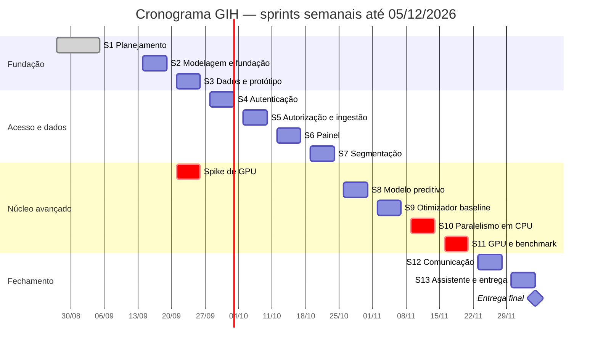

# 05 — Cronograma

**Projeto:** Growth Intelligence Hub (GIH)
**Versão:** 2.0 — 15/09/2026 · sprints semanais
**Datas oficiais da disciplina:** entrega da Sprint 1 em **05/09/2026** · entrega final em **05/12/2026**

---

## 1. Mudança para sprints semanais

A avaliação da Sprint 1 pediu que as sprints quinzenais passassem a **semanais**. Este documento aplica a
mudança: 13 sprints ao todo, sendo a primeira já entregue e 12 ciclos semanais de segunda a sexta até
04/12, com a entrega final em 05/12.

Não é só um recorte do calendário. Três consequências práticas:

- **Histórias de 13 pontos não cabem em uma semana.** As duas que existiam foram quebradas: H53 virou
  H53a e H53b; H54 virou H54a, H54b e H54c. O total em pontos não mudou.
- **Toda semana termina com algo demonstrável.** A disciplina não aceita orientação sem implementação, e
  agora isso vale a cada sete dias, não a cada quatorze.
- **O atraso aparece na primeira semana, não na terceira.** É a principal vantagem do ciclo curto, e a
  razão pela qual o pedido faz sentido.

### Carga

| | |
|---|---|
| Escopo total | **389 pontos** |
| Já entregue (Sprint 1) | 27 |
| Restante em 12 semanas | **362** |
| Média por sprint | **30,2 pontos** |
| Capacidade nominal da equipe | ~40 pontos por semana (5 integrantes) |

---

## 2. Visão geral

| Sprint | Período | Tema | Pts | Entregável demonstrável |
|:--:|---|---|--:|---|
| **1** | até 05/09 | Planejamento e descoberta | 27 | ✅ Documentação e repositório |
| **2** | 14/09 – 18/09 | Modelagem e fundação | 22 | Banco criado por migração; `docker compose up` sobe o sistema |
| **3** | 21/09 – 25/09 | Dados, protótipo e **spike de GPU** | 27 | Base populada por um comando; protótipo aprovado; kernel de GPU rodando |
| **4** | 28/09 – 02/10 | Autenticação e usuários | 31 | Login com sessão; CRUD de usuários e perfis |
| **5** | 05/10 – 09/10 | Autorização e ingestão por texto | 29 | Perfis barrados no servidor; relatório importado com prévia |
| **6** | 12/10 – 16/10 | Ingestão completa e painel | 28 | CSV, histórico e painel com indicadores e ranking |
| **7** | 19/10 – 23/10 | Segmentação e mobilidade do Top N | 32 | Cada parceiro segmentado; quem entrou e saiu do Top N |
| **8** | 26/10 – 30/10 | Modelo preditivo | 29 | Modelo treinado, MAPE melhor que o baseline, previsão na tela |
| **9** | 02/11 – 06/11 | Otimizador: formalização e baseline | 29 | Otimizador serial devolvendo plano válido |
| **10** | 09/11 – 13/11 | Otimizador integrado e CPU paralela | 30 | Plano na interface; versão C++ com OpenMP e ganho medido |
| **11** | 16/11 – 20/11 | **GPU e benchmark** | 31 | *Speedup* medido e exibido na tela |
| **12** | 23/11 – 27/11 | Central de comunicação | 29 | Mensagens geradas e fila de aprovação funcionando |
| **13** | 30/11 – 04/12 | Assistente e fechamento | 45 | Sistema completo, documentado e os dois vídeos |

---

## 3. Detalhamento

### Sprint 2 — Modelagem e fundação · 14/09 – 18/09 · 22 pts
`H07` modelo ER (8) · `H20` migrações (5) · `H09` ambiente com um comando (5) · `H10` CI (2) · `H71` proteção da `main` (2)

**Demonstrar:** `docker compose up` a partir de um clone limpo, com o banco criado pelas migrações.
H10 e H71 já estão concluídos; o esqueleto da API também já subiu.

### Sprint 3 — Dados, protótipo e spike de GPU · 21/09 – 25/09 · 27 pts
`H28` gerador sintético (5) · `H77` limpar e repovoar (2) · `H08` protótipo (5) · **`H47` spike de GPU (5)** · `H26` cadastro de parceiros (5) · `H27` sugestão de categoria (5)

**Demonstrar:** base de 2.000 parceiros populada por um comando; protótipo com direção visual aprovada;
kernel CUDA compilado e conferido contra a CPU.

> **Semana mais importante do começo do semestre.** O spike de GPU retira o maior risco técnico com oito
> semanas de antecedência. Se falhar, há tempo para trocar por CuPy, Numba ou OpenCL sem afetar a entrega.

### Sprint 4 — Autenticação e usuários · 28/09 – 02/10 · 31 pts
`H11` login (5) · `H12` logout (2) · `H13` renovar sessão (3) · `H14` bloqueio por tentativas (3) · `H19` alterar senha (3) · `H15` CRUD de usuários (5) · `H16` perfis (5) · `H18` auditoria (5)

### Sprint 5 — Autorização e ingestão por texto · 05/10 – 09/10 · 29 pts
`H17` autorização no servidor (8) · `H21` importar texto (8) · `H23` recusar sem período (3) · `H24` prévia (5) · `H78` teste de ponta a ponta (5)

**Demonstrar:** importar um relatório de ponta a ponta, e um perfil sem permissão sendo barrado **pelo servidor**.

### Sprint 6 — Ingestão completa e painel · 12/10 – 16/10 · 28 pts
`H22` CSV (3) · `H25` reimportação (3) · `H29` histórico (2) · `H30` indicadores (5) · `H31` ranking (5) · `H32` séries (5) · `H40` desempenho (3) · `H37` busca (2)

### Sprint 7 — Segmentação e mobilidade do Top N · 19/10 – 23/10 · 32 pts
`H33` segmentação determinística (8) · `H34` limiares (3) · `H35` mobilidade do Top N (5) · `H36` filtros (5) · `H38` exportação (3) · `H69` testes do núcleo (8)

> Atenção a **RN01** (Em Risco vence Top) e **RN02** (mobilidade lê o ranking, não o segmento). O teste
> precisa incluir um parceiro que está no Top N **e** em queda.

### Sprint 8 — Modelo preditivo · 26/10 – 30/10 · 29 pts
`H41` variáveis preditivas (8) · `H46` baselines (3) · `H42` treinar o modelo (8) · `H43` risco de queda (5) · `H44` previsão na interface (5)

> Os baselines vêm **antes** do modelo, de propósito: sem saber o alvo, não há como afirmar que o
> aprendizado agregou.

### Sprint 9 — Otimizador: formalização e baseline · 02/11 – 06/11 · 29 pts
`H45` retreino (5) · `H48` formalizar o problema (5) · `H49` baseline serial (8) · `H50` restrições da campanha (5) · `H52` recusar inviável (3) · `H39` portal do parceiro (3)

### Sprint 10 — Otimizador integrado e CPU paralela · 09/11 – 13/11 · 30 pts
`H51` executar e retornar o plano (8) · **`H53a` porte para C++ (8)** · **`H53b` OpenMP (5)** · `H55` escolha de modo (3) · `H56` degradação para CPU (3) · `H58` histórico de execuções (3)

### Sprint 11 — GPU e benchmark · 16/11 – 20/11 · 31 pts
**`H54a` estruturas na GPU (5)** · **`H54b` kernel de avaliação (5)** · **`H54c` laço completo (3)** · `H57` benchmark na interface (8) · `H70` testes de segurança (5) · `H59` comparar planos (5)

> **É a semana que define a nota do componente avançado.** Ao final dela o projeto precisa ter um número
> concreto de *speedup* para apresentar.

### Sprint 12 — Central de comunicação · 23/11 – 27/11 · 29 pts
`H60` gerar mensagens (8) · `H61` fila de pendentes (5) · `H62` aprovar, editar ou rejeitar (5) · `H63` impedir aprovação sem humano (5) · `H64` histórico (3) · `H68` abstenção do assistente (3)

### Sprint 13 — Assistente e fechamento · 30/11 – 04/12 · 45 pts
`H65` perguntas livres (8) · `H66` citação da fonte (5) · `H67` sem número inventado (5) · `H72` README reprodutível (5) · `H73` documentação final (5) · **`H74` vídeo horizontal (8)** · **`H75` vídeo vertical (5)** · `H76` acessibilidade (4)

---

## 4. A semana que não fecha

**A Sprint 13 está com 45 pontos contra uma média de 30, e é justamente a semana dos dois vídeos.**

Isso não é erro de distribuição: é o que sobra quando o escopo completo é dividido por doze semanas. As
outras onze já estão entre 22 e 32 pontos, e não há para onde empurrar.

Registrar isso agora tem um propósito: quando a pressão chegar, a decisão já estará tomada em vez de ser
improvisada. **O assistente analítico (H65, H66, H67 — 18 pontos) é a válvula de escape.** Se qualquer
semana entre a 8 e a 12 atrasar, ele é o que não se constrói.

A justificativa é a mesma de sempre: ele não é o componente de inteligência avaliado — esse papel cabe ao
modelo preditivo e ao otimizador paralelo — e a disciplina afirmou explicitamente que um assistente
conversacional não conta como componente de IA.

**O que não pode sair, em nenhuma hipótese:** os vídeos (H74, H75), a documentação final (H73) e a
reprodutibilidade (H72). Sem eles não há entrega.

---

## 5. Marcos

| Data | Marco | Critério de verificação |
|---|---|---|
| **05/09** | Planejamento entregue | ✅ Documento no Teams e formulário preenchido |
| **25/09** | **Risco de GPU retirado** | Kernel CUDA compilado e conferido contra a CPU |
| **02/10** | Acesso controlado | Login com 4 perfis, negação validada no servidor |
| **16/10** | Dados entrando e painel no ar | Importação completa e ranking com variação |
| **23/10** | Inteligência de negócio pronta | Segmentação determinística e mobilidade do Top N |
| **30/10** | Modelo batendo o baseline | MAPE registrado e inferior ao baseline ingênuo |
| **13/11** | Otimizador paralelo em CPU | Plano válido e ganho medido sobre o serial |
| **20/11** | **Componente avançado demonstrável** | *Speedup* medido e exibido na interface |
| **27/11** | Produto completo | Fluxo inteiro, do dado bruto à mensagem aprovada |
| **30/11** | **Congelamento de escopo** | Nenhuma funcionalidade nova a partir desta data |
| **05/12** | **Entrega final** | Sistema, código, documentação, banco e os dois vídeos |

---

## 6. Riscos

| # | Risco | Prob. | Impacto | Mitigação |
|:--:|---|:--:|:--:|---|
| **R1** | A cadeia de compilação de GPU não funcionar | Média | **Alto** | Spike na Sprint 3, oito semanas antes de ser necessário. Alternativas: CuPy, Numba com destino CUDA, OpenCL. O `nvcc` ainda não está instalado — é a primeira tarefa da H47. |
| **R2** | Escopo completo sem folga no calendário | **Alta** | **Alto** | A média de 30 pontos por semana não deixa margem. Válvula de escape definida na seção 4: o assistente sai primeiro. A velocidade real medida nas Sprints 2 e 3 recalibra o plano antes da Sprint 8. |
| **R3** | *Speedup* em GPU abaixo da meta de 5x | Média | **Alto** | O gerador sintético permite ampliar a escala até o ponto em que o paralelismo compensa a transferência. Não atingindo, o resultado medido é reportado com a análise do porquê — resultado negativo bem explicado é conteúdo técnico legítimo. |
| **R4** | **Trilha do núcleo concentrada em uma pessoa** | **Alta** | **Alto** | E5 e E6 somam 116 pontos sob o mesmo responsável, e a máquina com GPU é uma só. Como não há par, a mitigação passa a ser **transferência de conhecimento**: decisões registradas em ADR, e apresentação do código do núcleo na revisão das Sprints 10 e 11, para que mais alguém consiga explicá-lo na banca. |
| **R5** | Modelo preditivo não superar o baseline | Média | Médio | Baselines implementados antes do modelo (H46). Se o ganho não vier do aprendizado, o otimizador segue com a melhor estimativa disponível e a análise vira conteúdo da documentação. |
| **R6** | Ausência ou queda de participação | Média | **Alto** | Ciclo semanal expõe o problema em sete dias. Acompanhamento por commits e board em cada orientação. |
| **R7** | Vídeos deixados para o fim | **Alta** | **Alto** | A Sprint 13 já nasce sobrecarregada. Roteiros escritos na Sprint 12; congelamento em 30/11; gravação distribuída entre 01/12 e 04/12. |

---

## 7. Ritmo semanal

| Cerimônia | Quando | Duração |
|---|---|---|
| Planejamento | Segunda, início da sprint | 30 min |
| Acompanhamento | Quarta | 15 min |
| Orientação com a professora | Conforme a disciplina | — |
| Revisão e retrospectiva | Sexta, fim da sprint | 40 min |

Com ciclo de uma semana, o planejamento encurta e a revisão ganha peso: é nela que a velocidade real é
medida e o plano é recalibrado. A partir da Sprint 3 haverá duas semanas medidas — o suficiente para saber
se os 30 pontos por semana se sustentam.

O roteiro de cada orientação continua o mesmo: repositório atualizado, funcionalidade **rodando**,
dificuldades encontradas, e o planejamento da semana seguinte.
