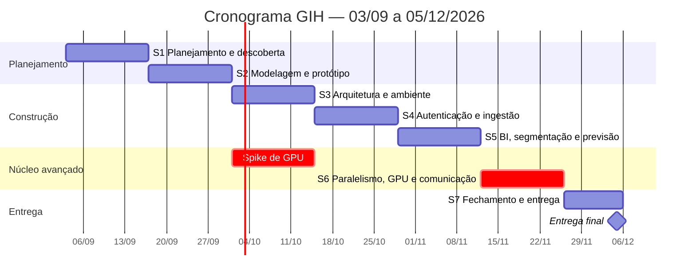

# 05 — Cronograma Inicial

**Projeto:** Growth Intelligence Hub (GIH)
**Sprint:** 1 — Planejamento e Descoberta
**Versão:** 1.0 — 03/09/2026
**Marco final:** entrega da disciplina em **05/12/2026**

---

## 1. Estrutura

O semestre foi dividido em **7 sprints quinzenais**, de quinta a quarta-feira, entre 03/09 e 05/12/2026.

A disciplina apresentou um esqueleto de 5 sprints e autorizou o acréscimo de novas sprints conforme a
necessidade. Optamos por 7 pelas duas razões abaixo:

- O componente de otimização paralela exige um ciclo próprio, com espaço para medir, corrigir e voltar a
  medir. Ele não cabe em uma sprint compartilhada com a construção da interface.
- A última quinzena é integralmente dedicada a fechamento: testes, documentação, os dois vídeos e o ensaio
  da apresentação. Deixar isso espremido no fim de uma sprint de desenvolvimento é o erro clássico que
  compromete os 20% de nota da apresentação.

**Regra permanente:** toda sprint termina com **algo executável**. A disciplina não aceita orientação
baseada apenas em slides ou ideias sem implementação — a partir da Sprint 3 há sempre uma demonstração
funcionando.

---

## 2. Visão geral

| Sprint | Período | Tema | Entregável executável |
|:--:|---|---|---|
| **1** | 03/09 – 16/09 | Planejamento e descoberta | Documentação completa e repositório configurado |
| **2** | 17/09 – 30/09 | Modelagem e protótipo | Esquema do banco criado por migração + protótipo navegável + gerador de dados |
| **3** | 01/10 – 14/10 | Arquitetura e ambiente | `docker compose up` sobe o sistema · CI verde · **kernel de GPU validado** |
| **4** | 15/10 – 28/10 | Autenticação, perfis e ingestão | Login com 4 perfis + importação gravando no banco |
| **5** | 29/10 – 11/11 | BI, segmentação e previsão | Painel com ranking e séries + modelo treinado + otimizador serial |
| **6** | 12/11 – 25/11 | Paralelismo, GPU e comunicação | Otimizador em CPU paralela e **GPU** + benchmark na tela + fila de aprovação |
| **7** | 26/11 – 05/12 | Fechamento e entrega | Sistema completo, testado, documentado e os dois vídeos publicados |

---

## 3. Detalhamento por sprint

### Sprint 1 — Planejamento e descoberta
**03/09 – 16/09 · 27 pontos**

| Meta | Histórias |
|---|---|
| Definir tema, problema, objetivos e público-alvo | H01 |
| Levantar requisitos funcionais e não funcionais | H02 |
| Modelar casos de uso | H03 |
| Priorizar o product backlog | H04 |
| Construir o cronograma | H05 |
| Configurar o repositório GitHub | H06 |

**Entregável:** documentação aprovada e repositório público com milestones, labels, board e regra de
proteção configurados.

**Como será demonstrado na orientação:** repositório aberto na tela, percorrendo os documentos e o board.

---

### Sprint 2 — Modelagem e protótipo
**17/09 – 30/09 · 23 pontos**

| Meta | Histórias |
|---|---|
| Modelar o banco (entidade-relacionamento) | H07 |
| Prototipar as telas principais | H08 |
| Versionar o esquema por migrações | H20 |
| Construir o gerador de dados sintéticos | H28 |

**Entregável:** banco criado a partir das migrações e populado pelo gerador; protótipo navegável das quatro
telas centrais.

**Por que o gerador entra tão cedo:** ele destrava três frentes ao mesmo tempo — permite desenvolver o
painel sem esperar dados, permite treinar o modelo preditivo, e é a única forma de gerar a escala
necessária para o benchmark do otimizador. Sem ele, a Sprint 6 começaria sem instância de teste.

---

### Sprint 3 — Arquitetura e ambiente
**01/10 – 14/10 · 14 pontos**

| Meta | Histórias |
|---|---|
| Subir o ambiente com um comando | H09 |
| Configurar integração contínua | H10 |
| Proteger o ramo principal | H71 |
| **Validar a cadeia de compilação da GPU** | **H47** |

**Entregável:** `docker compose up` sobe API, banco e interface; CI executando testes a cada Pull Request;
kernel mínimo de GPU compilado e invocado a partir do Python, com o resultado conferido contra a CPU.

**Sprint deliberadamente leve em pontos.** A folga existe para absorver o *spike* de GPU, que é o item de
maior incerteza do projeto. Ver seção 5.

---

### Sprint 4 — Autenticação, perfis e ingestão
**15/10 – 28/10 · 76 pontos**

| Meta | Histórias |
|---|---|
| Autenticação e gestão de sessão | H11, H12, H13, H14, H19 |
| Usuários, perfis e autorização no servidor | H15, H16, H17 |
| Trilha de auditoria | H18 |
| Importação por texto e CSV, com prévia e validação | H21, H22, H23, H24, H25, H29 |
| Cadastro de parceiros e sugestão de categoria | H26, H27 |

**Entregável:** um usuário faz login, importa um relatório com período, vê a prévia, confirma e encontra os
dados gravados. Perfis diferentes enxergam telas diferentes, com a negação validada no servidor.

**Frentes paralelas:** autenticação (backend + banco) e ingestão (backend + interface) avançam
simultaneamente, por pessoas diferentes.

---

### Sprint 5 — BI, segmentação e previsão
**29/10 – 11/11 · 111 pontos**

| Meta | Histórias |
|---|---|
| Painel, ranking, séries e desempenho | H30, H31, H32, H40 |
| Segmentação determinística e mobilidade do Top N | H33, H34, H35 |
| Filtros, busca e exportação | H36, H37, H38 |
| Variáveis, treino e avaliação do modelo | H41, H42, H43, H45, H46 |
| Previsão e risco na interface | H44 |
| Formalização e baseline do otimizador | H48, H49, H50, H51, H52 |
| Testes do núcleo de regras | H69 (parte) |

**Entregável:** painel completo com ranking, séries e segmentação; modelo treinado com MAPE registrado e
melhor que o baseline ingênuo; otimizador serial retornando plano de campanha válido.

**Sprint mais pesada do semestre.** Três trilhas correm em paralelo: interface e BI, modelo preditivo, e
formalização do otimizador. É o ponto de controle mais importante do cronograma — ver seção 5.

---

### Sprint 6 — Paralelismo, GPU e comunicação
**12/11 – 25/11 · 76 pontos**

| Meta | Histórias |
|---|---|
| Otimizador em C++ com paralelismo de CPU | H53 |
| **Otimizador em CUDA** | **H54** |
| Escolha de modo e degradação para CPU | H55, H56 |
| Benchmark comparativo na interface | H57 |
| Histórico de execuções | H58 |
| Geração de mensagens e fila de aprovação | H60, H61, H62, H63, H64 |
| Testes do núcleo e de segurança | H69 (parte), H70 |

**Entregável:** o mesmo problema resolvido nos três modos, com tabela de tempos, *speedup* e gráfico de
escalabilidade na tela; fila de aprovação impedindo envio sem decisão humana.

**É a sprint que define a nota do componente avançado.** Ao final dela o projeto precisa ter um número
concreto de *speedup* para apresentar.

---

### Sprint 7 — Fechamento e entrega
**26/11 – 05/12 · 51 pontos**

| Meta | Histórias |
|---|---|
| Assistente analítico com citação e abstenção | H65, H66, H67, H68 |
| Portal do parceiro e comparação de planos (se houver folga) | H39, H59 |
| Reprodutibilidade a partir do README | H72 |
| Documentação técnica final | H73 |
| Acessibilidade e responsividade | H76 |
| **Vídeo horizontal (até 10 min, 16:9)** | **H74** |
| **Vídeo vertical (9:16)** | **H75** |

**Entregável:** sistema completo, testado e documentado; os dois vídeos publicados; apresentação ensaiada.

**Regra desta sprint:** nenhuma funcionalidade nova entra a partir de **30/11**. Os últimos cinco dias são
exclusivamente para correção, gravação e ensaio.

---

## 4. Marcos

| Data | Marco | Critério de verificação |
|---|---|---|
| **16/09** | Planejamento aprovado | Documentação e repositório apresentados na orientação |
| **30/09** | Modelo de dados definido | Banco criado por migração e populado pelo gerador |
| **14/10** | Ambiente reprodutível e **risco de GPU retirado** | Sistema sobe com um comando; kernel de GPU executado com sucesso |
| **28/10** | Sistema com acesso controlado e dados reais entrando | Login com perfis + importação completa |
| **11/11** | Inteligência funcionando | Painel, segmentação, modelo treinado e otimizador serial |
| **25/11** | **Componente avançado demonstrável** | Speedup medido e exibido na interface |
| **30/11** | Congelamento de escopo | Nenhuma funcionalidade nova a partir desta data |
| **05/12** | **Entrega final** | Sistema, código, documentação, banco e os dois vídeos |

---

## 5. Riscos e mitigações

| # | Risco | Prob. | Impacto | Mitigação |
|:--:|---|:--:|:--:|---|
| **R1** | A cadeia de compilação de GPU não funcionar no ambiente disponível | Média | **Alto** | *Spike* antecipado para a Sprint 3 (H47), seis semanas antes de ser necessário. Se falhar, há alternativas em ordem de preferência: CuPy, Numba com destino CUDA, ou OpenCL. O `nvcc` ainda não está instalado na estação de desenvolvimento — instalar o CUDA Toolkit é a primeira tarefa da H47. |
| **R2** | A Sprint 5 concentrar carga acima da capacidade real | **Alta** | Médio | Medir a velocidade real nas Sprints 2 e 3 e recalibrar antes de iniciar a Sprint 5. Histórias marcadas S e C migram para a Sprint 7 na primeira evidência de atraso, não depois. |
| **R3** | O speedup em GPU ficar abaixo da meta de 5x | Média | **Alto** | O gerador sintético permite ampliar a escala do cenário até o ponto em que o paralelismo compensa o custo de transferência. Se ainda assim não atingir, o resultado medido é reportado com a análise do porquê — um resultado negativo bem explicado é conteúdo técnico legítimo, muito melhor que um número inflado. |
| **R4** | Concentração de conhecimento em um único integrante no núcleo em C++/CUDA | **Alta** | Médio | Programação em par obrigatória nas histórias H53 e H54; revisão por Pull Request de outro integrante; registro das decisões em documento de arquitetura. |
| **R5** | Modelo preditivo não superar o baseline ingênuo | Média | Médio | Baselines implementados **antes** do modelo (H46), para saber cedo qual é o alvo. Se o ganho não vier do aprendizado, o otimizador continua funcionando com as estimativas do baseline, e a análise do porquê vira conteúdo da documentação. |
| **R6** | Ausência ou queda de participação de um integrante | Média | **Alto** | Papéis com substituto natural definido; nenhuma história crítica com um único responsável; acompanhamento por commits e pelo board em cada orientação. |
| **R7** | Vídeos deixados para os últimos dias | Média | **Alto** | Roteiros escritos já na Sprint 6; congelamento de escopo em 30/11; gravação distribuída entre 01/12 e 04/12. |
| **R8** | Escopo crescer durante o semestre | Média | Médio | Toda ideia nova entra no backlog como história e disputa prioridade — não é incorporada direto à sprint em andamento. |

---

## 6. Ritmo de trabalho

| Cerimônia | Quando | Duração | Objetivo |
|---|---|---|---|
| Planejamento da sprint | Quinta, início da sprint | 60 min | Selecionar histórias e distribuir responsáveis |
| Acompanhamento | Segunda e quinta | 15 min | O que avançou, o que trava, o que vem |
| Orientação com a professora | Semanal | conforme a disciplina | Apresentar evolução prática, tirar dúvidas, validar arquitetura |
| Revisão da sprint | Quarta, fim da sprint | 45 min | Demonstrar o que ficou pronto |
| Retrospectiva | Quarta, após a revisão | 30 min | O que manter, o que mudar |

Detalhes de papéis, *Definition of Done* e fluxo de trabalho em
[06 — Equipe e processo](06-equipe-e-processo.md).

---

## 7. Observação sobre as datas

As datas das sprints foram construídas a partir do único marco fixo divulgado — a entrega final em
**05/12/2026** — e distribuídas em quinzenas regulares a partir de 03/09.

O calendário de orientações e a data de entrega de cada sprint definidos pela disciplina têm precedência:
na primeira orientação, este cronograma será ajustado às datas oficiais, preservando a sequência de temas e
os marcos técnicos.
