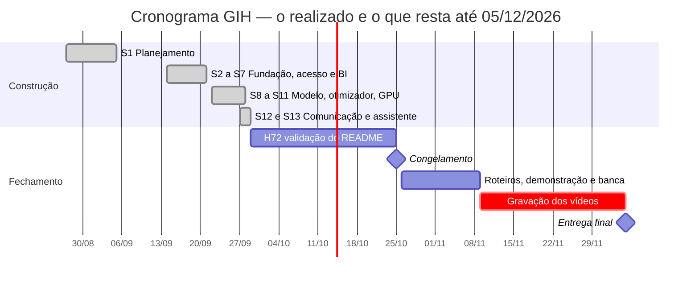

# 05 — Cronograma

**Projeto:** Growth Intelligence Hub (GIH)
**Versão:** 3.0 — 28/09/2026 · o calendário real (2.1 — 16/09/2026, o plano em sprints semanais)
**Datas oficiais da disciplina:** entrega da Sprint 1 em **05/09/2026** · entrega final em **05/12/2026**

---

## 1. Duas numerações de sprint — e como elas se correspondem

**Este projeto tem 13 sprints semanais. A disciplina tem sprints de entrega, que são outra coisa.** A
confusão é fácil e vale resolver logo: quando este documento diz "Sprint 3", é a terceira semana de
desenvolvimento da equipe, não a terceira entrega avaliada.

| Entrega da disciplina | Prazo | Cobre as nossas sprints | O que foi entregue |
|---|---|:--:|---|
| **Sprint 01** — planejamento e descoberta | 05/09/2026 | 1 | Tema, problema, objetivos, público-alvo, requisitos, casos de uso, backlog, cronograma, repositório |
| **Sprint 02** — arquitetura e modelagem | 19/09/2026 | 2 a 5 | Arquitetura, diagrama de classes, MER, modelo relacional, protótipo, banco criado, repositório estruturado |
| **Sprint 03** — estrutura inicial funcionando | 19/09/2026 | 6 | Login, cadastro de usuários, perfis, CRUD de parceiros, importação, painel, interface web, deploy local |
| **Sprint 04** — primeiro módulo completo | 26/09/2026 | 7 | Ingestão + BI: segmentação, mobilidade do Top N, limiares configuráveis, filtros, exportação, cadastro de parceiro na tela |
| **Sprint 05** — segundo módulo funcionando | 03/10/2026 | 8, e a H45 da 9 | Previsão: variáveis, referências, rede com risco calibrado, treino pela tela com versão em uso, previsão e risco no cadastro do parceiro |
| Sprint 06 em diante | conforme os enunciados | 9 a 13 | O otimizador em CPU e GPU, o benchmark, a comunicação e o assistente — já construídos |

A numeração semanal é a que aparece nas *issues*, nos *milestones* e nos commits do GitHub, e por isso não
foi renumerada: mudá-la desalinharia o histórico do repositório, que é justamente onde a disciplina pede
que a evolução do projeto seja demonstrada.

**A construção terminou antes do calendário.** As Sprints 2 a 13, planejadas para 14/09 a 04/12, tiveram
as histórias de código fechadas entre 15/09 e 28/09 (seção 3). O que resta até 05/12 não é código: a
validação do README por quem não o escreveu (H72), os dois vídeos (H74, H75), a preparação da banca e as
entregas da disciplina, na ordem em que os enunciados saírem.

**A H45 — retreino pela tela — foi antecipada da Sprint 9 para a 8**, e entregue na Sprint 05 da
disciplina. Sem ela, o módulo de previsão não teria fluxo de uso: o usuário só leria números prontos, e o
enunciado pede um módulo funcionando, com fluxo real. A Sprint 9 fica com as outras cinco histórias do
otimizador.

**A segunda entrega cobre quatro das nossas sprints, e não uma.** A equipe está adiantada em relação ao
calendário da disciplina: na data da entrega de arquitetura e modelagem, o banco já está criado e migrado,
a API já autentica com perfis e já ingere relatórios, e o risco técnico do núcleo em GPU já foi retirado
por medição.

---

## 2. Mudança para sprints semanais

A avaliação da Sprint 1 pediu que as sprints quinzenais passassem a **semanais**. Este documento aplica a
mudança: 13 sprints ao todo, sendo a primeira já entregue e 12 ciclos semanais de segunda a sexta até
04/12, com a entrega final em 05/12.

Não é só um recorte do calendário. Três consequências práticas:

- **Histórias de 13 pontos não cabem em uma semana.** As duas que existiam foram quebradas: H53 virou
  H53a e H53b; H54 virou H54a, H54b e H54c. O total em pontos não mudou.
- **Toda semana termina com algo demonstrável.** A disciplina não aceita orientação sem implementação, e
  agora isso vale a cada sete dias, não a cada quatorze.
- **O atraso aparece na primeira semana, não na terceira.** É a principal vantagem do ciclo curto, e a
  razão pela qual o pedido faz sentido.

### Carga

| | |
|---|---|
| Escopo total | **389 pontos** |
| Já entregue (Sprint 1) | 27 |
| Restante em 12 semanas | **362** |
| Média por sprint | **30,2 pontos** |
| Capacidade nominal da equipe | ~40 pontos por semana (5 integrantes) |

---

## 3. O plano e o realizado

A coluna **Realizado** é a data em que as issues da sprint fecharam no GitHub, no milestone dela — o
primeiro e o último fechamento. O plano é o da versão 2.1, de 16/09.

| Sprint | Previsto | Realizado | Tema | Pts | Entregável demonstrável |
|:--:|---|---|---|--:|---|
| **1** | até 05/09 | 03/09 | Planejamento e descoberta | 27 | ✅ Documentação e repositório |
| **2** | 14/09 – 18/09 | 15/09 | Modelagem e fundação | 22 | ✅ Banco criado por migração; `docker compose up` sobe o sistema |
| **3** | 21/09 – 25/09 | 15/09 – 24/09 | Dados, protótipo e **spike de GPU** | 27 | ✅ Base populada por um comando; protótipo aprovado; kernel de GPU rodando |
| **4** | 28/09 – 02/10 | 16/09 | Autenticação e usuários | 31 | ✅ Login com sessão; CRUD de usuários e perfis |
| **5** | 05/10 – 09/10 | 16/09 – 17/09 | Autorização e ingestão por texto | 29 | ✅ Perfis barrados no servidor; relatório importado com prévia |
| **6** | 12/10 – 16/10 | 17/09 – 20/09 | Ingestão completa e painel | 28 | ✅ CSV, histórico e painel com indicadores e ranking |
| **7** | 19/10 – 23/10 | 20/09 | Segmentação e mobilidade do Top N | 32 | ✅ Cada parceiro segmentado; quem entrou e saiu do Top N |
| **8** | 26/10 – 30/10 | 25/09 | Modelo preditivo | 29 | ✅ Modelo treinado, MAPE melhor que o baseline, previsão na tela |
| **9** | 02/11 – 06/11 | 25/09 – 26/09 | Otimizador: formalização e baseline | 29 | ✅ Otimizador serial devolvendo plano válido |
| **10** | 09/11 – 13/11 | 26/09 | Otimizador integrado e CPU paralela | 30 | ✅ Plano na interface; versão C++ com OpenMP e ganho medido |
| **11** | 16/11 – 20/11 | 26/09 – 27/09 | **GPU e benchmark** | 31 | ✅ *Speedup* medido e exibido na tela |
| **12** | 23/11 – 27/11 | 27/09 | Central de comunicação | 29 | ✅ Mensagens geradas e fila de aprovação funcionando |
| **13** | 30/11 – 04/12 | 28/09 — o código | Assistente e fechamento | 48 | Sistema completo e documentado ✅; os dois vídeos, em novembro |

Duas pendências ficam de fora das datas: a **#59**, o limiar de Recém-chegado da RN01, que espera a decisão
do PO, na Sprint 7; e a **H72**, que tem o ensaio feito em 28/09 (`docs/validacao-do-readme.md`) e espera a
validação numa máquina limpa, por outro integrante.

### O que resta até 05/12

| O que | Quem | Quando |
|---|---|---|
| **H72** — subir o sistema do zero numa máquina limpa, só com o README, e registrar o que travar | Thiago ou João Pedro | até 25/10 |
| **Congelamento de funcionalidades** — a partir dele, só correção, documentação e vídeo | equipe | 25/10 |
| Roteiros dos vídeos; a base de demonstração final (a rede, o modelo treinado, um plano, mensagens na fila e o benchmark com a GPU) | equipe | 26/10 – 08/11 |
| **Transferência do núcleo** (R4): o otimizador, a GPU e o benchmark apresentados à equipe; as perguntas prováveis da banca em `docs/banca.md` | Pedro e equipe | 26/10 – 08/11 |
| **H74** e **H75** — a gravação dos dois vídeos | equipe | 09/11 – 04/12 |
| As entregas da disciplina, pelo `docs/entrega` | equipe | quando cada enunciado sair |
| **Entrega final** | equipe | 05/12 |

**As entregas da disciplina passam na frente quando o enunciado sai.** Cada uma custa um ou dois dias, e
o resto do calendário anda.

```mermaid
gantt
    title Cronograma GIH — o realizado e o que resta até 05/12/2026
    dateFormat YYYY-MM-DD
    axisFormat %d/%m

    section Construção
    S1 Planejamento                 :done, 2026-08-27, 2026-09-05
    S2 a S7 Fundação, acesso e BI   :done, 2026-09-14, 2026-09-21
    S8 a S11 Modelo, otimizador, GPU :done, 2026-09-22, 2026-09-28
    S12 e S13 Comunicação e assistente :done, 2026-09-27, 2026-09-29

    section Fechamento
    H72 validação do README         :2026-09-29, 2026-10-25
    Congelamento                    :milestone, 2026-10-25, 0d
    Roteiros, demonstração e banca  :2026-10-26, 2026-11-09
    Gravação dos vídeos             :crit, 2026-11-09, 2026-12-05
    Entrega final                   :milestone, 2026-12-05, 0d
```

---

## 4. Detalhamento

As datas dos títulos são as do plano; as realizadas estão na seção 3.

### Sprint 2 — Modelagem e fundação · 14/09 – 18/09 · 22 pts
`H07` modelo ER (8) · `H20` migrações (5) · `H09` ambiente com um comando (5) · `H10` CI (2) · `H71` proteção da `main` (2)

**Demonstrar:** `docker compose up` a partir de um clone limpo, com o banco criado pelas migrações.
H10 e H71 já estão concluídos; o esqueleto da API também já subiu.

### Sprint 3 — Dados, protótipo e spike de GPU · 21/09 – 25/09 · 27 pts
`H28` gerador sintético (5) · `H77` limpar e repovoar (2) · `H08` protótipo (5) · **`H47` spike de GPU (5)** · `H26` cadastro de parceiros (5) · `H27` sugestão de categoria (5)

**Demonstrar:** base de 2.000 parceiros populada por um comando; protótipo com direção visual aprovada;
kernel CUDA compilado e conferido contra a CPU.

> **Semana mais importante do começo do semestre.** O spike de GPU retira o maior risco técnico com oito
> semanas de antecedência. Se falhar, há tempo para trocar por CuPy, Numba ou OpenCL sem afetar a entrega.

### Sprint 4 — Autenticação e usuários · 28/09 – 02/10 · 31 pts
`H11` login (5) · `H12` logout (2) · `H13` renovar sessão (3) · `H14` bloqueio por tentativas (3) · `H19` alterar senha (3) · `H15` CRUD de usuários (5) · `H16` perfis (5) · `H18` auditoria (5)

### Sprint 5 — Autorização e ingestão por texto · 05/10 – 09/10 · 29 pts
`H17` autorização no servidor (8) · `H21` importar texto (8) · `H23` recusar sem período (3) · `H24` prévia (5) · `H78` teste de ponta a ponta (5)

**Demonstrar:** importar um relatório de ponta a ponta, e um perfil sem permissão sendo barrado **pelo servidor**.

### Sprint 6 — Ingestão completa e painel · 12/10 – 16/10 · 28 pts
`H22` CSV (3) · `H25` reimportação (3) · `H29` histórico (2) · `H30` indicadores (5) · `H31` ranking (5) · `H32` séries (5) · `H40` desempenho (3) · `H37` busca (2)

### Sprint 7 — Segmentação e mobilidade do Top N · 19/10 – 23/10 · 32 pts
`H33` segmentação determinística (8) · `H34` limiares (3) · `H35` mobilidade do Top N (5) · `H36` filtros (5) · `H38` exportação (3) · `H69` testes do núcleo (8)

> Atenção a **RN01** (Em Risco vence Top) e **RN02** (mobilidade lê o ranking, não o segmento). O teste
> precisa incluir um parceiro que está no Top N **e** em queda.

### Sprint 8 — Modelo preditivo · 26/10 – 30/10 · 29 pts
`H41` variáveis preditivas (8) · `H46` baselines (3) · `H42` treinar o modelo (8) · `H43` risco de queda (5) · `H44` previsão na interface (5)

> Os baselines vêm **antes** do modelo, de propósito: sem saber o alvo, não há como afirmar que o
> aprendizado agregou.

### Sprint 9 — Otimizador: formalização e baseline · 02/11 – 06/11 · 29 pts
`H45` retreino (5) · `H48` formalizar o problema (5) · `H49` baseline serial (8) · `H50` restrições da campanha (5) · `H52` recusar inviável (3) · `H39` portal do parceiro (3)

> **Adiantada para 25/09 a 26/09**, na semana livre antes do enunciado 6. A H45 já tinha ido com a Sprint 8.
> Entraram as regras RN10 (o ganho de uma ação) e RN11 (cotas e elegibilidade), decididas na issue #117; a
> ADR-011 (o genético, a aritmética inteira e o gerador sem estado que deixam as três versões no mesmo
> plano); o pacote `nucleo/gih_nucleo`; a campanha na API; e a tela. A **H51** — executar e ver o plano —
> foi junto no modo serial, porque sem ela a tela não teria fluxo. A medição (`docs/medicoes/otimizador.md`)
> fixa o denominador do *speedup*: 27 s com 2.000 parceiros. A **H39**, de prioridade C, ficou para depois.

### Sprint 10 — Otimizador integrado e CPU paralela · 09/11 – 13/11 · 30 pts
`H51` executar e retornar o plano (8) · **`H53a` porte para C++ (8)** · **`H53b` OpenMP (5)** · `H55` escolha de modo (3) · `H56` degradação para CPU (3) · `H58` histórico de execuções (3)

### Sprint 11 — GPU e benchmark · 16/11 – 20/11 · 31 pts
**`H54a` estruturas na GPU (5)** · **`H54b` kernel de avaliação (5)** · **`H54c` laço completo (3)** · `H57` benchmark na interface (8) · `H70` testes de segurança (5) · `H59` comparar planos (5)

> **É a semana que define a nota do componente avançado.** Ao final dela o projeto precisa ter um número
> concreto de *speedup* para apresentar.

### Sprint 12 — Central de comunicação · 23/11 – 27/11 · 29 pts
`H60` gerar mensagens (8) · `H61` fila de pendentes (5) · `H62` aprovar, editar ou rejeitar (5) · `H63` impedir aprovação sem humano (5) · `H64` histórico (3) · `H39` portal do parceiro (3)

> **Replanejada em 27/09, para 28/09 a 11/10, e fechada em 27/09.** A H39, que ficou de fora da Sprint 9,
> entra no lugar da H68; a H68 vai para a 13, com o assistente cuja abstenção ela testa. Antes das
> histórias, a ADR-013 decide o modelo de linguagem: local, opcional e com a guarda numérica da RN08.

### Sprint 13 — Assistente e fechamento · 30/11 – 04/12 · 48 pts
`H65` perguntas livres (8) · `H66` citação da fonte (5) · `H67` sem número inventado (5) · `H68` abstenção do assistente (3) · `H72` README reprodutível (5) · `H73` documentação final (5) · **`H74` vídeo horizontal (8)** · **`H75` vídeo vertical (5)** · `H76` acessibilidade (4)

> **O código fechou em 28/09:** o assistente (H65 a H68), medido em `docs/medicoes/assistente.md`, e a
> acessibilidade (H76), em `docs/medicoes/acessibilidade.md`. No mesmo dia, o ensaio do README (H72) e a
> documentação técnica consolidada (H73), gerada por `node docs/entrega/gerar_documentacao.js`. Ficam a
> validação da H72 e os vídeos, no calendário da seção 3.

---

## 5. A semana que não fecha

**A Sprint 13 está com 48 pontos contra uma média de 30, e é justamente a semana dos dois vídeos.**

Isso não é erro de distribuição: é o que sobra quando o escopo completo é dividido por doze semanas. As
outras onze já estão entre 22 e 32 pontos, e não há para onde empurrar.

Registrar isso agora tem um propósito: quando a pressão chegar, a decisão já estará tomada em vez de ser
improvisada. **O assistente analítico (H65, H66, H67 — 18 pontos) é a válvula de escape.** Se qualquer
semana entre a 8 e a 12 atrasar, ele é o que não se constrói.

A justificativa é a mesma de sempre: ele não é o componente de inteligência avaliado — esse papel cabe ao
modelo preditivo e ao otimizador paralelo — e a disciplina afirmou explicitamente que um assistente
conversacional não conta como componente de IA.

**O que não pode sair, em nenhuma hipótese:** os vídeos (H74, H75), a documentação final (H73) e a
reprodutibilidade (H72). Sem eles não há entrega.

**Como terminou (28/09).** A válvula não foi usada. Com a construção à frente do calendário (seção 3), o
assistente foi construído inteiro — catálogo fechado, fonte citada, guarda numérica e abstenção — e medido
contra o modelo de verdade: o tipo e os campos certos em 47 de 49 perguntas de referência, nenhum número
sem origem na tela em 18 armadilhas, e abstenção em 20 de 20 perguntas sem resposta. A Sprint 13 que resta
tem só o que não podia sair, com mais de dois meses até 05/12.

---

## 6. Marcos

| Previsto | Marco | Critério de verificação | Realizado |
|---|---|---|---|
| **05/09** | Planejamento entregue | Documento no Teams e formulário preenchido | ✅ 05/09 |
| **25/09** | **Risco de GPU retirado** | Kernel CUDA compilado e conferido contra a CPU | ✅ 15/09 (H47) |
| **02/10** | Acesso controlado | Login com 4 perfis, negação validada no servidor | ✅ 16/09 |
| **16/10** | Dados entrando e painel no ar | Importação completa e ranking com variação | ✅ 20/09 |
| **23/10** | Inteligência de negócio pronta | Segmentação determinística e mobilidade do Top N | ✅ 20/09 |
| **30/10** | Modelo batendo o baseline | MAPE registrado e inferior ao baseline ingênuo | ✅ 25/09 — MAPE de 9,8%, contra 10,2% da melhor referência e 11,5% do ingênuo |
| **13/11** | Otimizador paralelo em CPU | Plano válido e ganho medido sobre o serial | ✅ 26/09 — OpenMP 5,9x sobre o C++ serial, com 8 threads e o mesmo plano |
| **20/11** | **Componente avançado demonstrável** | *Speedup* medido e exibido na interface | ✅ 27/09 — a GPU 106x sobre o Python no cenário de referência; o benchmark na tela (H57) |
| **27/11** | Produto completo | Fluxo inteiro, do dado bruto à mensagem aprovada | ✅ 27/09 |
| **30/11** | **Congelamento de escopo** | Nenhuma funcionalidade nova a partir desta data | Antecipado para **25/10** |
| **05/12** | **Entrega final** | Sistema, código, documentação, banco e os dois vídeos | — |

---

## 7. Riscos

**A seção fechada em 28/09, com a construção terminada.** Cada risco tem a situação final e o que a
decidiu; os que seguem abertos são os que dependem do que resta — a validação, os vídeos e a banca. As
probabilidades e os impactos do planejamento estão na versão 2.1 deste documento, no histórico do
repositório.

| # | Risco | Situação | Como terminou |
|:--:|---|---|---|
| **R1** | A cadeia de compilação de GPU não funcionar | **Encerrado em 15/09** | O spike (H47) compilou e rodou o kernel pelos dois caminhos — NVRTC e `nvcc` 13.4 com MSVC 19.44 —, conferindo contra a CPU. Depois, a ADR-012 levou a compilação para dentro do contêiner da API. Evidência em `nucleo/spike/RESULTADO.md` |
| **R2** | Escopo completo sem folga no calendário | **Encerrado em 28/09** | As Sprints 2 a 13 fecharam o código até 28/09, com mais de dois meses até a entrega. A válvula de escape — o assistente — não foi usada: ele foi construído e medido |
| **R3** | *Speedup* em GPU abaixo da meta de 5x | **Encerrado em 26/09** | No cenário de referência, a GPU responde em 248 ms de ponta a ponta, contra 26,29 s do Python: **106x**, com o mesmo plano (RNF02). O que sobrava do risco — a GPU contra o OpenMP — ficou medido e explicado: o laço na GPU ganha 7,4x do OpenMP com 2.000 parceiros, e o custo fixo de criar o contexto da placa, perto de 190 ms, faz a busca inteira perder com 500 e 2.000 parceiros e ganhar com 10.000 (`docs/medicoes/nucleo.md`) |
| **R4** | **Trilha do núcleo concentrada em uma pessoa** | **Aberto** | O registro está feito: as ADRs 005, 006, 011 e 012, o diagrama do núcleo em `docs/10` e as medições. Falta a transferência: o núcleo apresentado à equipe, e as perguntas prováveis da banca em `docs/banca.md`, antes da gravação (seção 3) |
| **R5** | Modelo preditivo não superar o baseline | **Encerrado em 25/09** | A rede superou as referências nas duas saídas: MAPE de 9,8% contra 10,2%, e Brier de 0,105 contra 0,122, com 500 parceiros. O risco dela é menos calibrado que o da referência, e isso está medido e escrito (`docs/medicoes/modelo.md`). Uma versão só entra em uso se superar as duas (ADR-010) |
| **R6** | Ausência ou queda de participação | **Aberto até a entrega** | O que resta — a validação do README, os vídeos e a banca — não é código, e depende dos cinco integrantes |
| **R7** | Vídeos deixados para o fim | **Mitigado** | O congelamento foi antecipado de 30/11 para 25/10. Os roteiros e a base de demonstração ficam para 26/10 a 08/11, e a gravação, de 09/11 a 04/12 — quase quatro semanas, contra os quatro dias do plano |
| **R8** | O modelo de linguagem escrever número que não veio do sistema (RN08), surgido na Sprint 12 | **Encerrado em 28/09** | O código calcula todo número, e a guarda recusa o texto com número sem origem, sentido trocado ou unidade sem origem (ADR-013). Medido contra o modelo de verdade: nenhum número sem origem na tela, em 18 armadilhas (`docs/medicoes/assistente.md`) |
| **R9** | A máquina da avaliação sem GPU, ou sem o modelo de linguagem | **Mitigado** | O sistema sobe e funciona sem os dois: o otimizador cai para a CPU (ADR-004), e as mensagens saem do modelo fixo (ADR-013). O ensaio do README, em 28/09, subiu o sistema do zero. Fecha com a validação da H72 numa máquina limpa |

---

## 8. Ritmo semanal

| Cerimônia | Quando | Duração |
|---|---|---|
| Planejamento | Segunda, início da sprint | 30 min |
| Acompanhamento | Quarta | 15 min |
| Orientação com a professora | Conforme a disciplina | — |
| Revisão e retrospectiva | Sexta, fim da sprint | 40 min |

Com ciclo de uma semana, o planejamento encurta e a revisão ganha peso: é nela que a velocidade real é
medida e o plano é recalibrado. A partir da Sprint 3 haverá duas semanas medidas — o suficiente para saber
se os 30 pontos por semana se sustentam.

**O que a medição mostrou:** a velocidade real ficou muito acima dos 30 pontos por semana — as Sprints 2 a
12 fecharam em duas semanas (seção 3). O escopo continuou o do backlog: a folga virou margem para a
validação, os vídeos e as entregas da disciplina.

O roteiro de cada orientação continua o mesmo: repositório atualizado, funcionalidade **rodando**,
dificuldades encontradas, e o planejamento da semana seguinte.
