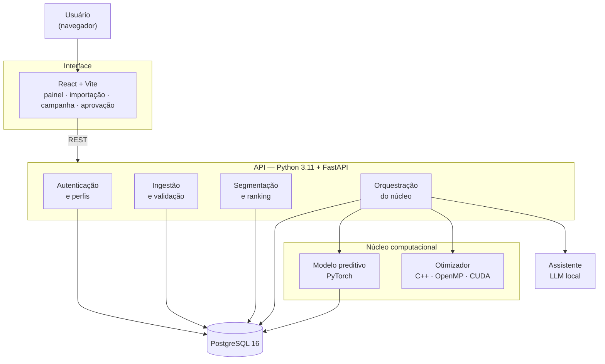

# 07 — Arquitetura Preliminar

**Projeto:** Growth Intelligence Hub (GIH)
**Sprint:** 1 — Planejamento e Descoberta
**Versão:** 1.0 — 03/09/2026

> Documento preliminar. A arquitetura definitiva é fechada na Sprint 3, após o *spike* de GPU (H47) e a
> validação em orientação. As decisões registradas aqui são as que orientam o início da construção.

---

## 1. Visão geral

<!-- diagrama: arquitetura-geral -->


### Divisão de responsabilidades

| Camada | Responsabilidade | O que **não** faz |
|---|---|---|
| **Interface** | Exibe, formata e coleta entrada | Nenhuma regra de negócio |
| **API** | Regras de negócio, autorização, persistência, orquestração | Não executa cálculo pesado no processo da requisição |
| **Núcleo computacional** | Previsão e otimização | Não conhece autenticação nem persistência |
| **Assistente** | Redige texto e responde perguntas | **Nunca calcula número** |
| **Banco** | Verdade persistida | Não contém lógica de negócio |

Duas consequências práticas dessa divisão:

- A interface pode ser reescrita sem tocar no restante do sistema.
- O núcleo em C++/CUDA é testável isoladamente, por linha de comando, sem subir a API — o que torna o
  benchmark reproduzível e independente do resto.

---

## 2. Stack

| Camada | Tecnologia | Justificativa |
|---|---|---|
| Núcleo computacional | **C++17 + OpenMP + CUDA** | Linguagem prioritária da disciplina; controle de memória e paralelismo necessário para o otimizador |
| Modelo preditivo | **Python + PyTorch + NumPy** | Modelo treinado pela equipe; PyTorch está na lista recomendada e usa a mesma GPU |
| API | **Python 3.11 + FastAPI** | Linguagem prioritária; integra nativamente com PyTorch e com o núcleo em C++ via extensão; documentação de API gerada automaticamente |
| Banco | **PostgreSQL 16** | Relacional, recomendado pela disciplina, adequado a séries por período |
| Migrações | **Alembic** | Esquema versionado e reproduzível |
| Interface | **React + Vite** | Recomendado pela disciplina; separação clara de responsabilidade no time |
| Gráficos | **Recharts** | Integra com React sem dependência pesada |
| Assistente | **LLM local via Ollama** | Executa na máquina; papel restrito à redação |
| Testes | **pytest** e **Vitest** | Cobertura do núcleo e da interface |
| Empacotamento | **Docker Compose** | Ambiente reproduzível com um comando |
| Versionamento | **Git + GitHub** | Issues, Projects, Pull Requests e Actions |

### Sobre o JavaScript

A disciplina orienta que JavaScript **não** seja a tecnologia do núcleo computacional. A arquitetura respeita
isso integralmente: JavaScript existe apenas na camada de interface. Inteligência artificial, processamento
intensivo, paralelização, otimização e GPU estão em Python, C++ e CUDA.

---

## 3. Modelo de dados

Este documento trazia um diagrama entidade-relacionamento preliminar, feito antes da modelagem detalhada.
Ele foi **removido em vez de atualizado**: existiam duas versões do mesmo diagrama no repositório, e elas
já tinham divergido — discordavam da cardinalidade entre `EXECUCAO_OTIMIZADOR` e `PLANO_CAMPANHA`.
Duplicata de diagrama sempre diverge, e a que ninguém está olhando é a que fica errada.

**O modelo de dados vive em [`08-modelo-de-dados.md`](08-modelo-de-dados.md)**, em uma versão só: modelo
conceitual, modelo relacional com tipos e chaves, índices, restrições e a evidência do banco criado.

As dezoito entidades, em resumo:

| Entidade | Papel |
|---|---|
| `USUARIO` | Credenciais e perfil de acesso |
| `SESSAO_ACESSO` | Sessão autenticada, com estado no servidor |
| `TENTATIVA_LOGIN` | Tentativas de autenticação, base do bloqueio por força bruta |
| `AUDITORIA` | Trilha de ações sensíveis |
| `CATEGORIA` | Classificação do parceiro, com a marca de confirmada ou sugerida |
| `PARCEIRO` | Comércio da rede |
| `PERIODO` | Janela de tempo de um relatório |
| `IMPORTACAO` | Registro de uma carga de dados |
| `METRICA` | Faturamento e pedidos de um parceiro em um período |
| `HISTORICO_SEGMENTO` | Segmento atribuído a um parceiro em um período |
| `CONFIGURACAO_SEGMENTACAO` | Os limiares da RN01, configuráveis sem alterar código (RF21) |
| `PREVISAO` | Faturamento previsto e risco estimado |
| `TREINO_MODELO` | Uma execução do treino do modelo, com métricas, versão em uso e pesos (RF27) |
| `ACAO_COMERCIAL` | Tipo de ação disponível, com custo e efeito esperado |
| `EXECUCAO_OTIMIZADOR` | Parâmetros, modo, tempo e resultado de uma execução |
| `PLANO_CAMPANHA` | Solução retornada pelo otimizador |
| `ITEM_PLANO` | Par parceiro-ação selecionado |
| `MENSAGEM` | Texto gerado, com estado e decisão humana |

Diagrama de classes, incluindo a camada de serviços e o núcleo computacional:
[`10-diagrama-de-classes.md`](10-diagrama-de-classes.md).

---


## 4. O núcleo computacional

### 4.1 Formalização do problema

Dado um conjunto de **N** parceiros elegíveis e **A** tipos de ação comercial, escolher no máximo uma ação
por parceiro de modo a **maximizar o ganho esperado (uplift)**, respeitando o orçamento, a capacidade e as
cotas. Elegível é o parceiro ativo com previsão da versão em uso (RN11).

| Elemento | Definição |
|---|---|
| Decisão | `x[i,a] ∈ {0,1}` — o parceiro *i* recebe a ação *a*; `Σₐ x[i,a] ≤ 1` |
| Objetivo | maximizar `Σ u(i,a) · x[i,a]`, com `u(i,a) = F̂ᵢ·cₐ + F̂ᵢ·pᵢ·rₐ` (RN10) |
| Orçamento | `Σ custoₐ · x[i,a] ≤ B` |
| Capacidade | `n = Σ x[i,a] ≤ K`, o número máximo de ações |
| Cota da categoria *k* | `⌈minₖ·K⌉ ≤ nₖ ≤ ⌊maxₖ·K⌋`, contando só a categoria **confirmada** (RN11) |
| Cota da cauda longa | `n_cauda ≥ ⌈m·K⌉`, em que a cauda longa é quem está fora do Top N no ranking do período-base |

As cotas são frações de **K** e viram contagens antes da busca (RN11): o núcleo recebe inteiros, e não
frações. Dinheiro também chega em centavos inteiros (ADR-011).

**Viabilidade decidida antes da busca (RF31, RN07).** Todo parceiro pode receber a ação mais barata, então
basta saber se o **menor conjunto que cumpre os mínimos** cabe em K e no orçamento a esse preço. O conjunto
se monta assim:

1. Em cada categoria, os mínimos são preenchidos primeiro com parceiros da cauda longa, que contam duas vezes.
2. O que ainda faltar de cauda longa sai das categorias com folga no máximo, ou de quem não tem categoria.

A conta é exata, e a recusa diz qual restrição falhou e quanto falta.

**Por que não é trivial:** o espaço de busca tem (A+1)^N configurações. Com N = 200 e A = 4, isso ultrapassa
10^139 — força bruta está fora de questão, e a estrutura das restrições de cota impede a decomposição
gulosa que resolveria o caso sem elas.

### 4.2 Estratégia de solução

Metaheurística populacional com múltiplas partidas independentes. A escolha é deliberada: partidas
independentes são **naturalmente paralelas**, o que torna o problema um caso legítimo — e não artificial —
de paralelização em CPU e GPU.

| Versão | Tecnologia | Papel |
|---|---|---|
| **Baseline** | Python puro | Referência de corretude e de tempo. Validado contra instância pequena com ótimo conhecido |
| **CPU paralela** | C++17 + OpenMP | Os filhos de cada geração, de todas as partidas de uma vez, distribuídos entre os núcleos da CPU (H53b) |
| **GPU** | CUDA | Avaliação da população em paralelo massivo na GPU |

As três versões resolvem o **mesmo problema com a mesma semente**, e é isso que dá sentido à comparação: o
*speedup* só é honesto se a qualidade da solução for equivalente (RNF02, tolerância de 2%). O algoritmo, o
tratamento das restrições e o que torna as três versões idênticas estão na ADR-011.

### 4.3 Cenário de referência do benchmark

| Parâmetro | Valor |
|---|---|
| Parceiros | 2.000 |
| Tipos de ação | 5 |
| Repetições | 10 |
| Meta de tempo (GPU) | até 5 s |
| Meta de *speedup* | no mínimo 5x sobre o baseline serial |
| Tolerância de qualidade | 2% de diferença no uplift |

O gerador de dados sintéticos (H28) produz as instâncias. Escala real de operação — cerca de 100 parceiros —
é pequena demais para evidenciar ganho de paralelismo: o custo de transferência para a GPU dominaria o
tempo total. O cenário ampliado é o que torna a medição significativa, e essa limitação está documentada
como parte do resultado.

### 4.4 Modelo preditivo

| Item | Definição |
|---|---|
| Alvo | Faturamento do próximo período e probabilidade de queda — de o parceiro estar **Em Risco no período seguinte**, pelo critério da RN01 (RN09) |
| Variáveis | Dos últimos 4 períodos do parceiro: faturamento e pedidos, ticket médio, tendência, posição no ranking do período (em percentil), categoria, tempo de casa |
| Modelo | Rede neural pequena em PyTorch, com duas saídas: o faturamento e o risco |
| Separação | **Por tempo**, para não haver vazamento do futuro: o último período testa, o penúltimo valida (parada antecipada e calibração do risco), os anteriores treinam |
| Baselines | Faturamento: repetir o último período; média móvel dos últimos 4. Risco: a taxa observada no treino, separada por "caiu no último período" |
| Métricas | MAPE do faturamento contra os baselines; Brier e erro de calibração do risco contra a referência |
| Mínimos | 8 períodos na base para treinar; 4 de histórico para o parceiro receber previsão (RN09) |

Se o modelo aprendido não superar os baselines, isso é reportado e o otimizador segue operando com a melhor
estimativa disponível. A conclusão negativa, bem medida, é resultado válido.

**Uma versão só entra em uso se superar a referência nas duas saídas** — MAPE abaixo do melhor baseline e
Brier abaixo da referência do risco. Uma versão que acerta o faturamento e erra o risco alimentaria o
otimizador com metade da informação pior do que uma conta simples. Onde o código mora, onde o treino roda e
onde ficam os pesos: ADR-010.

---

## 5. Decisões de arquitetura

### ADR-001 — Python + C++/CUDA como stack do núcleo

**Situação:** definir a linguagem principal do backend e do núcleo pesado.

**Alternativas:**

| Opção | Avaliação |
|---|---|
| **Python (API) + C++/CUDA (núcleo)** | **Escolhida** |
| Java + Spring Boot | Robusto, mas fora da lista de tecnologias prioritárias da disciplina; integração com PyTorch e CUDA seria indireta |
| Node.js | JavaScript no núcleo contraria a orientação explícita da disciplina |
| C++ puro em todo o sistema | Custo de desenvolvimento da API e da integração desproporcional ao prazo |

**Decisão:** Python 3.11 + FastAPI na API; C++17 com OpenMP e CUDA no núcleo; PyTorch no modelo preditivo.

**Consequências:** alinhamento direto com as tecnologias prioritárias; uma única linguagem para API, IA e
scripts, o que reduz a barreira de entrada para a equipe; em contrapartida, exige atenção com o custo de
travessia entre Python e C++, resolvido processando em lote em vez de chamada por item.

---

### ADR-002 — Otimização por metaheurística paralela, não por solver exato

**Situação:** o problema de alocação é combinatório com restrições.

**Alternativas:**

| Opção | Avaliação |
|---|---|
| **Metaheurística com múltiplas partidas** | **Escolhida** — naturalmente paralela, escala bem, aceita restrições arbitrárias |
| Programação linear inteira com solver pronto | Daria o ótimo garantido, mas o trabalho viraria *configurar um solver* — não haveria componente computacional próprio para avaliar |
| Heurística gulosa | Simples demais; não sustenta as restrições de cota nem justifica paralelismo |

**Decisão:** metaheurística populacional com múltiplas partidas independentes, implementada pela equipe nas
três versões.

**Consequências:** não há garantia de ótimo global — mitigado pela validação contra instâncias pequenas de
ótimo conhecido; em troca, o projeto ganha um núcleo computacional próprio, mensurável e paralelizável, que
é exatamente o que a integração com Tópicos Avançados pede.

---

### ADR-003 — Segmentação e ranking determinísticos, fora do modelo de linguagem

**Situação:** definir o que o LLM pode e o que não pode fazer.

**Decisão:** todo cálculo numérico — ranking, segmentação, métricas, previsão e otimização — é
determinístico e implementado em código. O modelo de linguagem apenas redige texto e responde sobre dados já
recuperados, citando a fonte ou se abstendo.

**Consequências:** o painel é reproduzível e auditável; a mesma base sempre produz o mesmo resultado; o
sistema não fica refém da variabilidade do modelo. Custo: o assistente é menos "esperto" do que um chatbot
solto — e isso é intencional.

---

### ADR-004 — Degradação para CPU quando não houver GPU

**Situação:** o sistema será executado em máquinas diferentes, incluindo a de avaliação.

**Decisão:** o otimizador detecta os modos disponíveis em tempo de execução e usa o mais rápido possível.
Sem GPU compatível, executa em CPU paralela e informa a substituição na interface.

**Consequências:** o sistema nunca deixa de funcionar por ausência de hardware específico; o benchmark
apresenta os modos disponíveis e explica a ausência dos demais.

---

### ADR-005 — CUDA via NVRTC, sem instalar o toolkit no sistema

**Status:** Superada pela **ADR-006** em 15/09/2026 · mantida como registro do que foi medido
**Data:** 15/09/2026

**Situação:** a máquina de desenvolvimento não tem **nenhum compilador C++** — nem MSVC, nem `g++`, nem
`clang++` — e não tem o CUDA Toolkit. No Windows, o `nvcc` depende do MSVC como compilador hospedeiro, o
que torna o caminho tradicional uma instalação de vários gigabytes antes da primeira linha de código.

**Alternativas:**

| Opção | Avaliação |
|---|---|
| **CuPy com `RawKernel` (NVRTC)** | **Escolhida para o spike.** Kernel é CUDA C de verdade, compilado em tempo de execução. Runtime e headers vêm por `pip`, sem instalação de sistema. Licença MIT |
| MSVC Build Tools + CUDA Toolkit | Caminho tradicional, necessário para `nvcc` e obrigatório para a H53 (OpenMP em C++). Custo: vários gigabytes e configuração |
| Numba com destino CUDA | Escreve-se Python anotado, não CUDA C — afasta o projeto da linguagem que a disciplina prioriza |
| OpenCL | Alternativa aberta registrada no risco R1; só faria sentido se a NVIDIA saísse do caminho |

**Decisão:** o spike usa CuPy com `RawKernel`. O kernel é CUDA C legítimo e roda na GPU — o que retira o
risco R1 sem bloquear o projeto numa instalação longa.

**Consequências:**

- O risco R1 está retirado com evidência medida: *speedup* total de 8,7x, acima da meta de 5x do RNF02
- A escolha **não resolve a H53**, que pede C++ com OpenMP e exige um compilador C++ de qualquer forma
- Descobriu-se que a transferência consome 95% do tempo, o que define a arquitetura da H54c: a população
  precisa permanecer na GPU entre gerações
- Se o toolchain C++ for instalado, migrar o kernel para compilação por `nvcc` é direto — o código CUDA C
  é o mesmo. **Foi o que aconteceu, no mesmo dia:** ver ADR-006

Resultado completo em [`nucleo/spike/RESULTADO.md`](../nucleo/spike/RESULTADO.md).

---

### ADR-006 — Toolchain nativo: compilar com `nvcc` e MSVC, não mais por NVRTC

**Status:** Decidido
**Data:** 15/09/2026

**Situação:** o MSVC Build Tools 2022 e o CUDA Toolkit 13.4 foram instalados na máquina de
desenvolvimento, removendo o impedimento que originou a ADR-005. A H53 exige C++ com OpenMP, que o NVRTC
não cobre de forma alguma.

**Decisão:** o núcleo passa a ser **C++ compilado antecipadamente** — `cl` para a versão serial e OpenMP,
`nvcc -arch=native` para a versão CUDA. O CuPy sai do caminho de produção e fica apenas no spike original,
como registro histórico.

**Consequências:**

- O caminho de CPU paralela do RNF06 está validado com medição: **~9x com 16 threads**, resultado idêntico
  ao serial
- O kernel compilado por `nvcc` confere com a CPU com **erro relativo zero** — mesma ordem de soma, mesmo
  `float32`
- Mediu-se o que a ADR-005 não podia medir: contra **OpenMP**, e não contra o serial, a GPU com
  transferência a cada geração ganha só **1,1x a 1,3x**, e abaixo de ~4.000 planos **perde**. Sem a
  transferência, ganha 11x. Isso promove a residência da população na GPU de otimização a **requisito** da
  H54c
- `nvcc` no Windows usa o `cl` como compilador hospedeiro, então o ambiente do MSVC precisa ser carregado
  **antes** do CUDA entrar no `PATH`. Está encapsulado em `nucleo/spike/ambiente.bat`
- O caminho do projeto contém acento, o que quebra o encadeamento de comandos no `cmd`. Por isso compilar é
  sempre via `construir.bat`, nunca chamando `cl` ou `nvcc` soltos
- **Custo assumido:** compilar deixa de ser reprodutível só com `pip`. Quem for mexer no `nucleo/` precisa
  do Build Tools e do Toolkit instalados. Para o restante da equipe nada muda — `api/`, `web/` e `modelo/`
  não dependem disso
- A imagem Docker do núcleo ainda não foi construída; empacotar o `nvcc` é trabalho em aberto —
  *resolvido pelo spike da parte 3 e pela ADR-012, em 26/09/2026*

Resultado completo em [`nucleo/spike/RESULTADO.md`](../nucleo/spike/RESULTADO.md), parte 2.

---

### ADR-007 — Sessão com estado no servidor, não token autocontido

**Status:** Decidido
**Data:** 15/09/2026

**Situação:** o RF01 pede sessão identificada, o RF02 pede que o encerramento a invalide **no servidor**, e
o RNF10 pede cookie com `HttpOnly` e `SameSite` e renovação do identificador no momento da autenticação.

**Alternativas:**

| Opção | Avaliação |
|---|---|
| **Identificador opaco com estado no servidor** | **Escolhida.** 256 bits sorteados, guardados como hash; a linha em `sessao_acesso` é a fonte da verdade |
| JWT em cookie | Rejeitada. Um token assinado só deixa de valer quando expira, e o RF02 exige efeito imediato. A lista de revogação que contornaria isso reintroduz exatamente o estado que o JWT existia para evitar |
| Sessão na memória do processo | Rejeitada. Some a cada reinício do contêiner e não sobrevive a mais de uma réplica |

**Decisão:** identificador opaco, `secrets.token_urlsafe(32)`, gravado como SHA-256. Argon2 seria errado
aqui: o token já tem entropia suficiente para não haver força bruta a temer, e a conferência acontece a
cada requisição, onde um hash lento custaria caro. O que se protege é o vazamento da tabela.

**Consequências:**

- Encerrar sessão, desativar usuário e trocar senha têm efeito **imediato**, não no fim da sessão em curso
- Uma consulta a mais por requisição, por índice único — aceitável
- **Não existe segredo de assinatura para gerenciar**, um a menos no `.env`
- O CSRF fica coberto por `SameSite=Lax`. Se aparecer um fluxo entre sites, passa a ser preciso um token
  dedicado
- **Pendente:** a tabela de sessões só cresce. A limpeza das expiradas não foi implementada e vira tarefa
  quando o volume justificar

---

### ADR-008 — A auditoria grava em transação própria

**Status:** Decidido
**Data:** 15/09/2026

**Situação:** o RF06 manda registrar as ações sensíveis, e a mais sensível de todas — a tentativa de login
recusada — termina numa resposta de erro.

**Decisão:** `app/auditoria.py` abre a própria sessão de banco e comita imediatamente, separada da
transação da requisição.

**Consequências:**

- Se a auditoria participasse da transação da requisição, o `rollback` da falha levaria junto o registro
  da falha. A trilha teria **só sucessos** — e mentiria por omissão exatamente sobre o que se investiga
- O mesmo vale para `tentativa_login`: sem transação própria, o contador de força bruta apagaria as
  próprias evidências e nunca chegaria às cinco falhas do RNF11
- Em troca, existe uma janela em que a operação é revertida e o registro fica. É o lado certo do
  compromisso: registro a mais é ruído, registro a menos é ponto cego
- Falha ao auditar **nunca** derruba a operação do usuário; vai para o log

---

### ADR-009 — Formato do relatório importado: tolerante, guiado por cabeçalho

**Status:** Decidido pela equipe
**Data:** 16/09/2026

**Situação:** a H21 pedia "interpreta o formato definido", mas o formato não estava definido em lugar
nenhum de `docs/`. O UC03 diz *o que* precisa ser extraído — nome do parceiro, faturamento e número de
pedidos — e não *como* o texto chega.

**Alternativas:**

| Opção | Avaliação |
|---|---|
| **Tolerante, guiado por cabeçalho** | **Escolhida.** Separador `;`, tabulação, `\|` ou `,`; ordem das colunas livre; sinônimos aceitos nos nomes |
| Formato fixo e declarado | Interpretador mais simples e erro mais preciso, mas quebra quando a origem muda a exportação, e obriga o usuário a arrumar o texto antes de colar |
| Texto em prosa, por expressão regular | Serviria se o relatório fosse texto corrido. Mais frágil, e difícil de explicar quando rejeita uma linha |

**Decisão:** o relatório precisa de **uma linha de cabeçalho** nomeando as colunas. Exemplo mínimo:

```
Parceiro;Faturamento;Pedidos
Comércio Alfa;12500,40;312
Comércio Beta;8940,00;201
```

| Coluna | Sinônimos aceitos |
|---|---|
| nome | parceiro, nome, estabelecimento, loja, comercio, restaurante |
| faturamento | faturamento, vendas, valor, receita, total |
| pedidos | pedidos, qtd, quantidade, numero de pedidos |

Acentuação e caixa são ignoradas. Colunas extras são ignoradas. O valor monetário aceita `12.500,40`,
`12500,40`, `12500.40` e `R$ 12.500,40` — **o último separador que aparecer é o decimal**.

**Consequências:**

- Colar de planilha (que produz tabulação) e importar CSV exportado passam pelo **mesmo** interpretador.
  A H22, na Sprint 6, vira só a leitura do arquivo e a decodificação
- A vírgula é o **último** separador testado de propósito: em português ela também é decimal, e num
  arquivo separado por vírgula o valor `1.000,50` seria partido ao meio
- Linha ruim não interrompe a leitura — vira rejeição com motivo, e o usuário decide na prévia se segue
  com o resto (UC03, A5)
- **Custo assumido:** tolerância esconde erro. Um cabeçalho escrito `Faturamentos` não é reconhecido e o
  relatório inteiro é recusado. A mitigação é a mensagem do fluxo A4, que devolve as três primeiras
  linhas recebidas junto com a recusa
- O interpretador é função pura de texto para resultado, em `app/leitor_relatorio.py`. É o que permite a
  prévia da H24 usar **o mesmo** código da gravação da H21, sem risco de a prévia mostrar uma coisa e a
  gravação fazer outra

---

### ADR-010 — Modelo preditivo: pacote próprio, treino em segundo plano, pesos no banco

**Status:** Decidido
**Data:** 24/09/2026

**Situação:** a Sprint 05 da disciplina entrega o módulo de previsão (UC07, RF27, RF28, histórias H41 a H46).
Três perguntas não tinham resposta em `docs/`: onde mora o código do modelo; onde o treino roda, já que a API
não faz cálculo pesado no processo da requisição (seção 1); e onde ficam os pesos treinados.

**Alternativas — onde o treino roda:**

| Opção | Avaliação |
|---|---|
| Dentro da requisição | Mais simples, mas segura a conexão enquanto treina, e o navegador desiste antes do fim |
| Fila de tarefas com serviço próprio (Celery ou RQ, com Redis) | O caminho quando a carga cresce. Aqui traz um serviço e uma dependência a mais para um treino disparado à mão |
| **Tarefa em segundo plano no processo da API, com o estado no banco** | **Escolhida.** A requisição devolve na hora, e a tela acompanha o estado gravado |

**Alternativas — onde ficam os pesos:**

| Opção | Avaliação |
|---|---|
| Arquivo num volume do Docker | Mais um volume para lembrar de preservar, e o banco passa a apontar para algo que pode não existir |
| **Na linha do treino, no banco** | **Escolhida.** A rede tem poucos milhares de parâmetros; os pesos cabem numa coluna |

**Decisão:**

- **`modelo/` é um pacote Python próprio**, `gih_modelo`: variáveis, baselines, rede, treino e avaliação.
  Recebe séries numéricas e devolve números. Não conhece banco, FastAPI nem regra de negócio — o mesmo
  desenho do `nucleo/`, testável por linha de comando sem subir a API.
- **A API orquestra**, em `app/servico_previsao.py`: lê o histórico numa consulta agregada, calcula o rótulo
  de risco com a mesma função que classifica o segmento (RN09), chama o modelo e grava o treino e as
  previsões. A regra de negócio fica onde as outras estão.
- **O treino roda em segundo plano.** A requisição devolve `202` com o treino criado, e a tela consulta o
  estado até ele terminar.
- **Um treino por vez, garantido pelo banco**, com um índice único parcial sobre os treinos em andamento.
  Uma trava em memória não serviria: com mais de um processo, um não enxerga a memória do outro.
- **Treino interrompido não prende a trava.** Se a API reiniciar no meio de um treino, a subida seguinte o
  marca como falho, com o motivo. Sem isso, a trava de um por vez ficaria fechada para sempre.
- **Os pesos ficam na linha do treino**, junto com a normalização e o vocabulário de categorias usados. A
  versão em uso sobrevive a reinício, e uma versão antiga consegue prever sobre dados novos — é o que o
  UC07-A1 precisa para "manter a versão anterior" depois que chega um período novo.
- **PyTorch na roda CPU** (issue #86). A rede é pequena e a CPU basta; o sistema funciona sem GPU (RNF06), e
  a GPU fica para o otimizador.
- **Reprodutível** (RNF16): semente fixa, algoritmos determinísticos e uma thread. A mesma base com a mesma
  semente dá as mesmas métricas — e isso é teste, não promessa.
- **A imagem da API recebe `modelo/` como contexto adicional de build**, sem trocar o contexto principal.
  Construir a partir da raiz do repositório levaria `web/node_modules` e `docs/` para dentro do build.

**Consequências:**

- Enquanto treina, o treino ocupa um núcleo do processo da API. O tempo é medido e registrado junto com as
  métricas (H46); se a base crescer a ponto de pesar, o treino vira um processo separado **sem mudar o
  contrato da tela**, porque a tela só conhece o estado gravado
- A versão em uso é sempre derivável do banco: cada treino concluído registra qual versão ficou em uso
  depois dele — a própria, se superou a referência, ou a anterior, com o motivo
- **Custo assumido:** o PyTorch aumenta a imagem da API e o tempo da CI. A roda CPU é a menor disponível, e
  o tamanho medido fica registrado no Pull Request que a introduz

---

### ADR-011 — Otimizador: genético com partidas independentes, restrições por viabilidade, aritmética inteira

**Status:** Decidido
**Data:** 25/09/2026

**Situação:** a ADR-002 fixou a família do algoritmo, uma metaheurística populacional com partidas
independentes. Faltava decidir três coisas antes da primeira linha (H48, H49):

- como as restrições entram na busca;
- o que garante que o plano devolvido seja viável (RN07);
- como três implementações (Python, C++ com OpenMP e CUDA) chegam ao mesmo resultado. A H53a pede resultado
  idêntico ao do Python, e o RNF02 mede o *speedup* com qualidade equivalente.

**Alternativas — restrições:**

| Opção | Avaliação |
|---|---|
| Penalidade somada ao objetivo | O peso da penalidade é arbitrário, e com o peso errado o melhor encontrado é inviável |
| Decodificador que só gera soluções viáveis | Garante viabilidade, mas a construção fixa escolhas (quem cobre a cota) e pode deixar o ótimo fora do alcance da busca |
| **Comparação por viabilidade, com semente viável e elitismo** | **Escolhida.** Viável vence inviável; entre viáveis, maior ganho; entre inviáveis, menor violação. Sem peso para calibrar, e a busca pode atravessar o inviável para chegar ao ótimo |

**Decisão:**

- **Algoritmo genético, com partidas independentes** e o melhor delas ao final.
  - Cada solução é um vetor com um gene por parceiro: 0 é "sem ação", e de 1 a A é a ação.
  - Seleção por torneio de dois, cruzamento uniforme e mutação que sorteia outro valor para o gene.
  - Cada geração guarda o melhor da anterior (elitismo).
- **As duas primeiras soluções de toda partida são viáveis por construção.** Saem da mesma montagem que
  decide a viabilidade (§4.1): os mínimos com a ação mais barata, completados por um guloso. Uma completa pela
  razão ganho/custo, que acerta quando o orçamento aperta; a outra pelo ganho, que acerta quando o que aperta
  é o máximo de ações. Com o elitismo, o melhor encontrado nunca é pior que a melhor delas. Por isso, **quando
  a campanha é viável, o plano devolvido é viável**; e ele ainda passa por um verificador independente antes
  de ser gravado.
- **Uma mutação por filho, em média**, qualquer que seja N. Com duas ou quatro, o genético não saiu dos planos
  gulosos em duas de três campanhas de teste, e uma mutação por troca (tirar a ação de um parceiro e dar a
  outro) também rendeu menos. Os números estão na medição do otimizador.
- **A violação é inteira e em unidades de ação:** o excesso sobre K e sobre os máximos, o que falta nos
  mínimos, e o excesso de orçamento dividido pelo custo da ação mais barata (arredondado para cima). Não há
  mistura de reais com contagens. Por isso toda ação do catálogo que entra na campanha custa mais que zero:
  uma ação gratuita não consome orçamento e não é o que uma campanha distribui.
- **Dinheiro em centavos inteiros.** Ganho, custo e orçamento chegam ao núcleo como inteiros. A soma de
  inteiros dá o mesmo resultado em qualquer ordem, e a de `float` não; sem isso, a soma em paralelo da GPU
  divergiria da serial no último centavo e mudaria desempates.
- **Gerador aleatório sem estado.** Cada sorteio é o SplitMix64 aplicado em cadeia a (semente, partida,
  geração, indivíduo, gene). Escrito igual em Python, C++ e CUDA, ele dá o mesmo número em qualquer versão, e
  cada thread da GPU calcula o seu sem compartilhar estado. Probabilidades são inteiras, em partes por milhão.
- **Gerações síncronas e desempate fixo** (o menor índice vence). Cada filho depende só da geração anterior e
  do sorteio dele. Serial, OpenMP e GPU executam a mesma sequência, e o paralelismo muda o tempo, não o plano.
- **O baseline serial é Python puro, sem NumPy no laço.** Ele é a referência de corretude e o denominador do
  *speedup* (RNF02). Vetorizá-lo deixaria o baseline mais rápido e o ganho medido menos honesto.
- **Limite de tempo** (UC08, E2): ao estourar, devolve o melhor viável encontrado e marca o plano como parcial.

**Consequências:**

- A qualidade é conferida contra a **enumeração exata** em instâncias pequenas, sem solver pronto (ADR-002), e
  contra o guloso numa instância em que ele falha
- A GPU avalia a população inteira em paralelo, que é o kernel medido no spike da H47, e com a população
  residente entre gerações (ADR-006)
- Aritmética inteira limita o ganho de um plano a 2⁶³ centavos, muito acima de qualquer campanha
- **Custo assumido:** o baseline em Python puro é lento de propósito. Na tela, o limite de tempo o protege até
  as versões em C++ chegarem (Sprint 10)

**Adendo (26/09/2026, H53b) — o que o OpenMP paraleliza:**

- **As partidas avançam juntas, uma geração por vez**, e os filhos de todas elas formam um único laço
  paralelo: 4 × 47 = 188 tarefas por geração, com os parâmetros padrão. Paralelizar só as partidas, como a
  §4.2 dizia antes, ocuparia no máximo 4 threads.
- **O plano é o mesmo da versão serial com qualquer número de threads.** Nenhum filho lê o que outro escreve
  na mesma geração, e o vencedor sai das partidas percorridas na ordem, com a mesma comparação estrita. Os
  testes conferem com 1, 2, 3 e 7 threads e com o padrão; a medição confere em toda execução.
- **Escalonamento dinâmico, um filho por vez.** Cada geração termina numa barreira, e na divisão estática
  ela espera a thread mais atrasada. No WSL2, os processadores virtuais são divididos com o Windows, e em
  150 gerações sempre há um que atrasa: medido no contêiner, o estático perdeu em todos os tamanhos.
- **O limite de tempo é a única diferença visível.** Na serial, a busca interrompida encerra a partida em
  curso e não começa as seguintes; no OpenMP, todas param na mesma geração. As duas devolvem o melhor plano
  viável encontrado e o marcam como parcial.
- **Tantas threads quantos núcleos físicos.** No contêiner, com 8 threads, o ganho sobre o C++ serial foi de
  **6,0x** com 2.000 parceiros, na faixa de 5,3x a 6,5x. Com 16, todas as threads lógicas da máquina, a
  mediana caiu para 4,6x e a faixa foi de 1,0x a 6,9x: o contêiner passa a disputar a CPU com o próprio
  Windows. A espera passiva nas barreiras tira o pico, mas deixa tudo mais lento. A H55 faz a API pedir o
  número de núcleos físicos. Medição completa em [`docs/medicoes/nucleo.md`](medicoes/nucleo.md).

---

### ADR-012 — O núcleo é um executável dentro da imagem da API, chamado por processo

**Status:** Decidido
**Data:** 26/09/2026

**Situação:** a API roda num contêiner Linux, e o núcleo em C++ com OpenMP e CUDA (H53, H54) só tinha sido
compilado no Windows (ADR-006). A Sprint 10 precisa que a API chame o C++. Antes de escrever o porte, o
spike da issue #123 mediu se o mesmo código compila em Linux e roda **dentro da imagem da API**, com a GPU
([`nucleo/spike/RESULTADO.md`](../nucleo/spike/RESULTADO.md), parte 3).

**Alternativas — onde o núcleo roda:**

| Opção | Avaliação |
|---|---|
| **Na imagem da API, como executável** | **Escolhida.** Medido: roda em `python:3.11-slim` com `--gpus all`, acrescenta ~1 MB à imagem e recusa de forma limpa sem GPU |
| Serviço próprio no Compose, com a imagem da NVIDIA | Mais um serviço, mais uma chamada pela rede, e 5,1 GB de imagem para bibliotecas que o núcleo não usa |
| Nativo no host Windows | Sai do Docker: quebra o "sobe com um comando" (RNF07) e depende de a máquina da avaliação ter o MSVC e o toolkit |

**Alternativas — como a API chama:**

| Opção | Avaliação |
|---|---|
| **Executável, com a instância na entrada padrão e o plano na saída** | **Escolhida.** A ida e volta do cenário de referência (2.000 parceiros, 76 KB de texto) mediu cerca de 2 ms. Uma falha na GPU derruba o processo do núcleo, e não o da API |
| Módulo de extensão (pybind11, BSD) | Chamada sem cópia, mas amarra o binário à versão do Python e põe a GPU dentro do processo da API: um erro no kernel derruba o servidor inteiro |

**Decisão:**

- **O C++ vira um executável, compilado num estágio do Dockerfile da API** e copiado para a imagem final,
  com o runtime do CUDA embutido (`cudart` estático, o padrão do `nvcc`). A imagem da API continua sendo a
  `python:3.11-slim`; nenhuma camada da NVIDIA vai para ela.
- **A instância vai em texto, em inteiros** — os mesmos centavos e contagens da ADR-011 —, e o plano volta em
  texto. Lido com a biblioteca padrão do C++: nenhuma dependência nova.
- **O CUDA é opcional no build.** O estágio de CPU (g++ com OpenMP) roda sempre; o de CUDA, só quando um
  arquivo à parte do Compose pede — e é esse arquivo que reserva a GPU. Sem ele, `docker compose up` não
  baixa os GB da imagem de compilação da NVIDIA nem exige placa NVIDIA: o sistema sobe em qualquer máquina,
  em CPU paralela (RNF06, H72).
- **A API pergunta ao executável quais modos existem.** Sem GPU, o CUDA recusa com saída 1, e a API cai para
  CPU paralela com aviso (ADR-004, H56).
- **O baseline serial em Python continua na API**: é o denominador do *speedup* do RNF02. O serial em C++, o
  OpenMP e o CUDA ficam no executável, com o mesmo algoritmo e o mesmo gerador aleatório (ADR-011).
- **O benchmark é medido dentro do contêiner**, onde o sistema roda, e não no Windows.
- **O benchmark mostra quatro colunas**, e não três: Python (o baseline do RNF02), C++ serial, OpenMP e
  CUDA. O porte da H53a mediu o C++ serial **76x** mais rápido que o Python, com o mesmo plano (0,34 s
  contra 25,5 s, 2.000 parceiros, no contêiner): a meta de 5x do RNF02 já cai sozinha com a compilação. O
  ganho do **paralelismo** só se lê contra o C++ serial — anunciar o ganho da GPU sobre o Python seria
  creditar a ela o que é do compilador.

**Consequências:**

- Uma falha do núcleo volta à API como saída diferente de zero e vira execução `FALHOU` com motivo, como no
  treino do modelo — a API continua de pé
- No WSL2, a transferência para a GPU custa ~40% a mais que no Windows nativo (parte 3). É mais um motivo
  para a população ficar residente na GPU entre gerações (H54c, ADR-006)
- O OpenMP do GCC ganha menos que o do MSVC nos tamanhos pequenos (0,8x contra 10,4x em 256 planos). O
  benchmark vai mostrar isso, e não esconder
- O `construir.bat` continua sendo o caminho para desenvolver o kernel no Windows; o contêiner é a
  referência para medir e para rodar o sistema
- **Custo assumido:** o build com CUDA baixa a imagem de compilação da NVIDIA, de alguns GB, sob licença
  proprietária — a mesma exceção do CUDA Toolkit na regra 2.8 do `CLAUDE.md`

---

## 6. Ambiente de desenvolvimento

| Item | Situação |
|---|---|
| GPU de desenvolvimento | NVIDIA GeForce RTX 4060, 8 GB, driver 616.56 — **disponível e verificada** |
| CUDA Toolkit (`nvcc`) | **13.4 — instalado e validado** em 15/09/2026 (H47) |
| Compilador C++ | **MSVC 19.44 (Build Tools 2022)** — instalado e validado; exigido só para `nucleo/` |
| Python | 3.11 |
| Node.js | 20 |
| Docker Desktop | Necessário para o banco e para o empacotamento |

Nem todas as estações da equipe têm GPU. É exatamente por isso que a ADR-004 existe: o desenvolvimento do
restante do sistema não pode ficar bloqueado pelo hardware de um integrante.

---

## 7. Estrutura de diretórios prevista

```
growth-intelligence-hub/
├── api/                    # FastAPI: rotas, regras de negócio, autenticação
│   ├── app/
│   ├── migrations/         # Alembic
│   └── tests/
├── nucleo/                 # C++ / CUDA
│   ├── src/                # otimizador: serial, OpenMP, CUDA
│   ├── bindings/           # ponte para o Python
│   └── tests/
├── modelo/                 # PyTorch: variáveis, treino, avaliação
├── web/                    # React + Vite
├── scripts/                # gerador de dados sintéticos, benchmark
├── docs/                   # esta documentação
└── docker-compose.yml
```

Estrutura criada na Sprint 3, junto com o ambiente (H09).

---

## 8. Segurança

Os controles estão especificados como requisitos não funcionais em
[02 — Requisitos](02-requisitos.md), parte II. Em resumo: senha em hash com derivação lenta, sessão em
cookie `HttpOnly` com renovação do identificador no login, bloqueio após tentativas repetidas, autorização
verificada no servidor em todos os endpoints, consultas parametrizadas, escape de toda saída, limite de
tamanho de entrada e mensagens de erro genéricas com o detalhe apenas no log.

Cada um desses pontos tem teste automatizado previsto nas histórias H70 e H17.
