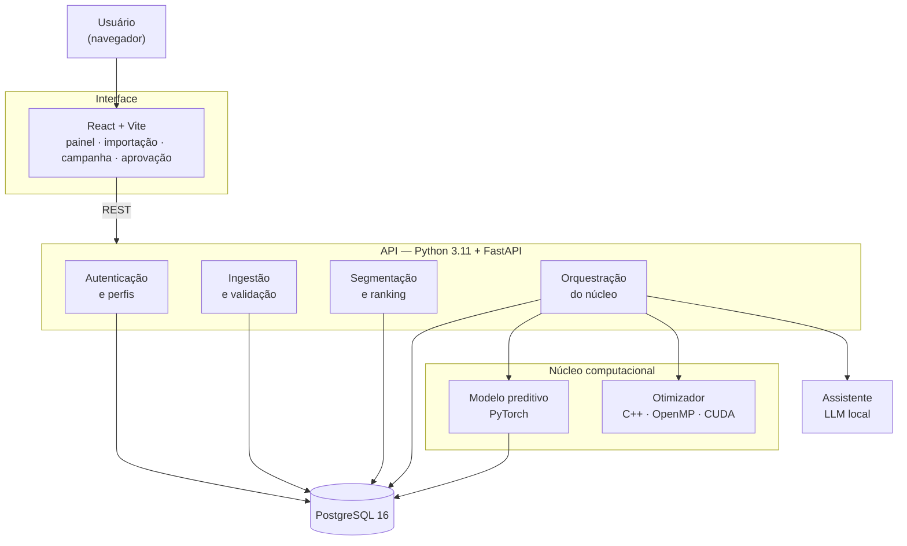

# 07 — Arquitetura Preliminar

**Projeto:** Growth Intelligence Hub (GIH)
**Sprint:** 1 — Planejamento e Descoberta
**Versão:** 1.0 — 03/09/2026

> Documento preliminar. A arquitetura definitiva é fechada na Sprint 3, após o *spike* de GPU (H47) e a
> validação em orientação. As decisões registradas aqui são as que orientam o início da construção.

---

## 1. Visão geral

<!-- diagrama: arquitetura-geral -->


### Divisão de responsabilidades

| Camada | Responsabilidade | O que **não** faz |
|---|---|---|
| **Interface** | Exibe, formata e coleta entrada | Nenhuma regra de negócio |
| **API** | Regras de negócio, autorização, persistência, orquestração | Não executa cálculo pesado no processo da requisição |
| **Núcleo computacional** | Previsão e otimização | Não conhece autenticação nem persistência |
| **Assistente** | Redige texto e responde perguntas | **Nunca calcula número** |
| **Banco** | Verdade persistida | Não contém lógica de negócio |

Duas consequências práticas dessa divisão:

- A interface pode ser reescrita sem tocar no restante do sistema.
- O núcleo em C++/CUDA é testável isoladamente, por linha de comando, sem subir a API — o que torna o
  benchmark reproduzível e independente do resto.

---

## 2. Stack

| Camada | Tecnologia | Justificativa |
|---|---|---|
| Núcleo computacional | **C++17 + OpenMP + CUDA** | Linguagem prioritária da disciplina; controle de memória e paralelismo necessário para o otimizador |
| Modelo preditivo | **Python + PyTorch + NumPy** | Modelo treinado pela equipe; PyTorch está na lista recomendada e usa a mesma GPU |
| API | **Python 3.11 + FastAPI** | Linguagem prioritária; integra nativamente com PyTorch e com o núcleo em C++ via extensão; documentação de API gerada automaticamente |
| Banco | **PostgreSQL 16** | Relacional, recomendado pela disciplina, adequado a séries por período |
| Migrações | **Alembic** | Esquema versionado e reproduzível |
| Interface | **React + Vite** | Recomendado pela disciplina; separação clara de responsabilidade no time |
| Gráficos | **Recharts** | Integra com React sem dependência pesada |
| Assistente | **LLM local via Ollama** | Executa na máquina; papel restrito à redação |
| Testes | **pytest** e **Vitest** | Cobertura do núcleo e da interface |
| Empacotamento | **Docker Compose** | Ambiente reproduzível com um comando |
| Versionamento | **Git + GitHub** | Issues, Projects, Pull Requests e Actions |

### Sobre o JavaScript

A disciplina orienta que JavaScript **não** seja a tecnologia do núcleo computacional. A arquitetura respeita
isso integralmente: JavaScript existe apenas na camada de interface. Inteligência artificial, processamento
intensivo, paralelização, otimização e GPU estão em Python, C++ e CUDA.

---

## 3. Modelo de dados

Este documento trazia um diagrama entidade-relacionamento preliminar, feito antes da modelagem detalhada.
Ele foi **removido em vez de atualizado**: existiam duas versões do mesmo diagrama no repositório, e elas
já tinham divergido — discordavam da cardinalidade entre `EXECUCAO_OTIMIZADOR` e `PLANO_CAMPANHA`.
Duplicata de diagrama sempre diverge, e a que ninguém está olhando é a que fica errada.

**O modelo de dados vive em [`08-modelo-de-dados.md`](08-modelo-de-dados.md)**, em uma versão só: modelo
conceitual, modelo relacional com tipos e chaves, índices, restrições e a evidência do banco criado.

As dezoito entidades, em resumo:

| Entidade | Papel |
|---|---|
| `USUARIO` | Credenciais e perfil de acesso |
| `SESSAO_ACESSO` | Sessão autenticada, com estado no servidor |
| `TENTATIVA_LOGIN` | Tentativas de autenticação, base do bloqueio por força bruta |
| `AUDITORIA` | Trilha de ações sensíveis |
| `CATEGORIA` | Classificação do parceiro, com a marca de confirmada ou sugerida |
| `PARCEIRO` | Comércio da rede |
| `PERIODO` | Janela de tempo de um relatório |
| `IMPORTACAO` | Registro de uma carga de dados |
| `METRICA` | Faturamento e pedidos de um parceiro em um período |
| `HISTORICO_SEGMENTO` | Segmento atribuído a um parceiro em um período |
| `CONFIGURACAO_SEGMENTACAO` | Os limiares da RN01, configuráveis sem alterar código (RF21) |
| `PREVISAO` | Faturamento previsto e risco estimado |
| `TREINO_MODELO` | Uma execução do treino do modelo, com métricas, versão em uso e pesos (RF27) |
| `ACAO_COMERCIAL` | Tipo de ação disponível, com custo e efeito esperado |
| `EXECUCAO_OTIMIZADOR` | Parâmetros, modo, tempo e resultado de uma execução |
| `PLANO_CAMPANHA` | Solução retornada pelo otimizador |
| `ITEM_PLANO` | Par parceiro-ação selecionado |
| `MENSAGEM` | Texto gerado, com estado e decisão humana |

Diagrama de classes, incluindo a camada de serviços e o núcleo computacional:
[`10-diagrama-de-classes.md`](10-diagrama-de-classes.md).

---


## 4. O núcleo computacional

### 4.1 Formalização do problema

Dado um conjunto de **N** parceiros e **A** tipos de ação comercial, escolher no máximo uma ação por
parceiro de modo a **maximizar o uplift esperado**, respeitando:

- **Orçamento:** a soma dos custos das ações escolhidas não excede o orçamento disponível
- **Capacidade:** o número total de ações não excede o que a equipe consegue executar no período
- **Cotas por categoria:** limites mínimos ou máximos de ações por categoria de parceiro

O uplift esperado de aplicar a ação *a* ao parceiro *i* combina o faturamento previsto pelo modelo, o risco
de queda estimado e o efeito histórico daquele tipo de ação.

**Por que não é trivial:** o espaço de busca tem (A+1)^N configurações. Com N = 200 e A = 4, isso ultrapassa
10^139 — força bruta está fora de questão, e a estrutura das restrições de cota impede a decomposição
gulosa que resolveria o caso sem elas.

### 4.2 Estratégia de solução

Metaheurística populacional com múltiplas partidas independentes. A escolha é deliberada: partidas
independentes são **naturalmente paralelas**, o que torna o problema um caso legítimo — e não artificial —
de paralelização em CPU e GPU.

| Versão | Tecnologia | Papel |
|---|---|---|
| **Baseline** | Python puro | Referência de corretude e de tempo. Validado contra instância pequena com ótimo conhecido |
| **CPU paralela** | C++17 + OpenMP | Partidas distribuídas entre os núcleos da CPU |
| **GPU** | CUDA | Avaliação da população em paralelo massivo na GPU |

As três versões resolvem o **mesmo problema com a mesma semente**, e é isso que dá sentido à comparação: o
*speedup* só é honesto se a qualidade da solução for equivalente (RNF02, tolerância de 2%).

### 4.3 Cenário de referência do benchmark

| Parâmetro | Valor |
|---|---|
| Parceiros | 2.000 |
| Tipos de ação | 5 |
| Repetições | 10 |
| Meta de tempo (GPU) | até 5 s |
| Meta de *speedup* | no mínimo 5x sobre o baseline serial |
| Tolerância de qualidade | 2% de diferença no uplift |

O gerador de dados sintéticos (H28) produz as instâncias. Escala real de operação — cerca de 100 parceiros —
é pequena demais para evidenciar ganho de paralelismo: o custo de transferência para a GPU dominaria o
tempo total. O cenário ampliado é o que torna a medição significativa, e essa limitação está documentada
como parte do resultado.

### 4.4 Modelo preditivo

| Item | Definição |
|---|---|
| Alvo | Faturamento do próximo período e probabilidade de queda |
| Variáveis | Faturamento e pedidos dos últimos períodos, ticket médio, tendência, posição no ranking, categoria, tempo de casa |
| Modelo | Rede neural em PyTorch, treinada com o histórico |
| Separação | Treino e teste separados **por tempo**, para não haver vazamento do futuro |
| Baselines | Repetir o último período; média móvel |
| Métrica | MAPE, comparado contra os baselines |

Se o modelo aprendido não superar os baselines, isso é reportado e o otimizador segue operando com a melhor
estimativa disponível. A conclusão negativa, bem medida, é resultado válido.

---

## 5. Decisões de arquitetura

### ADR-001 — Python + C++/CUDA como stack do núcleo

**Situação:** definir a linguagem principal do backend e do núcleo pesado.

**Alternativas:**

| Opção | Avaliação |
|---|---|
| **Python (API) + C++/CUDA (núcleo)** | **Escolhida** |
| Java + Spring Boot | Robusto, mas fora da lista de tecnologias prioritárias da disciplina; integração com PyTorch e CUDA seria indireta |
| Node.js | JavaScript no núcleo contraria a orientação explícita da disciplina |
| C++ puro em todo o sistema | Custo de desenvolvimento da API e da integração desproporcional ao prazo |

**Decisão:** Python 3.11 + FastAPI na API; C++17 com OpenMP e CUDA no núcleo; PyTorch no modelo preditivo.

**Consequências:** alinhamento direto com as tecnologias prioritárias; uma única linguagem para API, IA e
scripts, o que reduz a barreira de entrada para a equipe; em contrapartida, exige atenção com o custo de
travessia entre Python e C++, resolvido processando em lote em vez de chamada por item.

---

### ADR-002 — Otimização por metaheurística paralela, não por solver exato

**Situação:** o problema de alocação é combinatório com restrições.

**Alternativas:**

| Opção | Avaliação |
|---|---|
| **Metaheurística com múltiplas partidas** | **Escolhida** — naturalmente paralela, escala bem, aceita restrições arbitrárias |
| Programação linear inteira com solver pronto | Daria o ótimo garantido, mas o trabalho viraria *configurar um solver* — não haveria componente computacional próprio para avaliar |
| Heurística gulosa | Simples demais; não sustenta as restrições de cota nem justifica paralelismo |

**Decisão:** metaheurística populacional com múltiplas partidas independentes, implementada pela equipe nas
três versões.

**Consequências:** não há garantia de ótimo global — mitigado pela validação contra instâncias pequenas de
ótimo conhecido; em troca, o projeto ganha um núcleo computacional próprio, mensurável e paralelizável, que
é exatamente o que a integração com Tópicos Avançados pede.

---

### ADR-003 — Segmentação e ranking determinísticos, fora do modelo de linguagem

**Situação:** definir o que o LLM pode e o que não pode fazer.

**Decisão:** todo cálculo numérico — ranking, segmentação, métricas, previsão e otimização — é
determinístico e implementado em código. O modelo de linguagem apenas redige texto e responde sobre dados já
recuperados, citando a fonte ou se abstendo.

**Consequências:** o painel é reproduzível e auditável; a mesma base sempre produz o mesmo resultado; o
sistema não fica refém da variabilidade do modelo. Custo: o assistente é menos "esperto" do que um chatbot
solto — e isso é intencional.

---

### ADR-004 — Degradação para CPU quando não houver GPU

**Situação:** o sistema será executado em máquinas diferentes, incluindo a de avaliação.

**Decisão:** o otimizador detecta os modos disponíveis em tempo de execução e usa o mais rápido possível.
Sem GPU compatível, executa em CPU paralela e informa a substituição na interface.

**Consequências:** o sistema nunca deixa de funcionar por ausência de hardware específico; o benchmark
apresenta os modos disponíveis e explica a ausência dos demais.

---

### ADR-005 — CUDA via NVRTC, sem instalar o toolkit no sistema

**Status:** Superada pela **ADR-006** em 15/09/2026 · mantida como registro do que foi medido
**Data:** 15/09/2026

**Situação:** a máquina de desenvolvimento não tem **nenhum compilador C++** — nem MSVC, nem `g++`, nem
`clang++` — e não tem o CUDA Toolkit. No Windows, o `nvcc` depende do MSVC como compilador hospedeiro, o
que torna o caminho tradicional uma instalação de vários gigabytes antes da primeira linha de código.

**Alternativas:**

| Opção | Avaliação |
|---|---|
| **CuPy com `RawKernel` (NVRTC)** | **Escolhida para o spike.** Kernel é CUDA C de verdade, compilado em tempo de execução. Runtime e headers vêm por `pip`, sem instalação de sistema. Licença MIT |
| MSVC Build Tools + CUDA Toolkit | Caminho tradicional, necessário para `nvcc` e obrigatório para a H53 (OpenMP em C++). Custo: vários gigabytes e configuração |
| Numba com destino CUDA | Escreve-se Python anotado, não CUDA C — afasta o projeto da linguagem que a disciplina prioriza |
| OpenCL | Alternativa aberta registrada no risco R1; só faria sentido se a NVIDIA saísse do caminho |

**Decisão:** o spike usa CuPy com `RawKernel`. O kernel é CUDA C legítimo e roda na GPU — o que retira o
risco R1 sem bloquear o projeto numa instalação longa.

**Consequências:**

- O risco R1 está retirado com evidência medida: *speedup* total de 8,7x, acima da meta de 5x do RNF02
- A escolha **não resolve a H53**, que pede C++ com OpenMP e exige um compilador C++ de qualquer forma
- Descobriu-se que a transferência consome 95% do tempo, o que define a arquitetura da H54c: a população
  precisa permanecer na GPU entre gerações
- Se o toolchain C++ for instalado, migrar o kernel para compilação por `nvcc` é direto — o código CUDA C
  é o mesmo. **Foi o que aconteceu, no mesmo dia:** ver ADR-006

Resultado completo em [`nucleo/spike/RESULTADO.md`](../nucleo/spike/RESULTADO.md).

---

### ADR-006 — Toolchain nativo: compilar com `nvcc` e MSVC, não mais por NVRTC

**Status:** Decidido
**Data:** 15/09/2026

**Situação:** o MSVC Build Tools 2022 e o CUDA Toolkit 13.4 foram instalados na máquina de
desenvolvimento, removendo o impedimento que originou a ADR-005. A H53 exige C++ com OpenMP, que o NVRTC
não cobre de forma alguma.

**Decisão:** o núcleo passa a ser **C++ compilado antecipadamente** — `cl` para a versão serial e OpenMP,
`nvcc -arch=native` para a versão CUDA. O CuPy sai do caminho de produção e fica apenas no spike original,
como registro histórico.

**Consequências:**

- O caminho de CPU paralela do RNF06 está validado com medição: **~9x com 16 threads**, resultado idêntico
  ao serial
- O kernel compilado por `nvcc` confere com a CPU com **erro relativo zero** — mesma ordem de soma, mesmo
  `float32`
- Mediu-se o que a ADR-005 não podia medir: contra **OpenMP**, e não contra o serial, a GPU com
  transferência a cada geração ganha só **1,1x a 1,3x**, e abaixo de ~4.000 planos **perde**. Sem a
  transferência, ganha 11x. Isso promove a residência da população na GPU de otimização a **requisito** da
  H54c
- `nvcc` no Windows usa o `cl` como compilador hospedeiro, então o ambiente do MSVC precisa ser carregado
  **antes** do CUDA entrar no `PATH`. Está encapsulado em `nucleo/spike/ambiente.bat`
- O caminho do projeto contém acento, o que quebra o encadeamento de comandos no `cmd`. Por isso compilar é
  sempre via `construir.bat`, nunca chamando `cl` ou `nvcc` soltos
- **Custo assumido:** compilar deixa de ser reprodutível só com `pip`. Quem for mexer no `nucleo/` precisa
  do Build Tools e do Toolkit instalados. Para o restante da equipe nada muda — `api/`, `web/` e `modelo/`
  não dependem disso
- A imagem Docker do núcleo ainda não foi construída; empacotar o `nvcc` é trabalho em aberto

Resultado completo em [`nucleo/spike/RESULTADO.md`](../nucleo/spike/RESULTADO.md), parte 2.

---

### ADR-007 — Sessão com estado no servidor, não token autocontido

**Status:** Decidido
**Data:** 15/09/2026

**Situação:** o RF01 pede sessão identificada, o RF02 pede que o encerramento a invalide **no servidor**, e
o RNF10 pede cookie com `HttpOnly` e `SameSite` e renovação do identificador no momento da autenticação.

**Alternativas:**

| Opção | Avaliação |
|---|---|
| **Identificador opaco com estado no servidor** | **Escolhida.** 256 bits sorteados, guardados como hash; a linha em `sessao_acesso` é a fonte da verdade |
| JWT em cookie | Rejeitada. Um token assinado só deixa de valer quando expira, e o RF02 exige efeito imediato. A lista de revogação que contornaria isso reintroduz exatamente o estado que o JWT existia para evitar |
| Sessão na memória do processo | Rejeitada. Some a cada reinício do contêiner e não sobrevive a mais de uma réplica |

**Decisão:** identificador opaco, `secrets.token_urlsafe(32)`, gravado como SHA-256. Argon2 seria errado
aqui: o token já tem entropia suficiente para não haver força bruta a temer, e a conferência acontece a
cada requisição, onde um hash lento custaria caro. O que se protege é o vazamento da tabela.

**Consequências:**

- Encerrar sessão, desativar usuário e trocar senha têm efeito **imediato**, não no fim da sessão em curso
- Uma consulta a mais por requisição, por índice único — aceitável
- **Não existe segredo de assinatura para gerenciar**, um a menos no `.env`
- O CSRF fica coberto por `SameSite=Lax`. Se aparecer um fluxo entre sites, passa a ser preciso um token
  dedicado
- **Pendente:** a tabela de sessões só cresce. A limpeza das expiradas não foi implementada e vira tarefa
  quando o volume justificar

---

### ADR-008 — A auditoria grava em transação própria

**Status:** Decidido
**Data:** 15/09/2026

**Situação:** o RF06 manda registrar as ações sensíveis, e a mais sensível de todas — a tentativa de login
recusada — termina numa resposta de erro.

**Decisão:** `app/auditoria.py` abre a própria sessão de banco e comita imediatamente, separada da
transação da requisição.

**Consequências:**

- Se a auditoria participasse da transação da requisição, o `rollback` da falha levaria junto o registro
  da falha. A trilha teria **só sucessos** — e mentiria por omissão exatamente sobre o que se investiga
- O mesmo vale para `tentativa_login`: sem transação própria, o contador de força bruta apagaria as
  próprias evidências e nunca chegaria às cinco falhas do RNF11
- Em troca, existe uma janela em que a operação é revertida e o registro fica. É o lado certo do
  compromisso: registro a mais é ruído, registro a menos é ponto cego
- Falha ao auditar **nunca** derruba a operação do usuário; vai para o log

---

### ADR-009 — Formato do relatório importado: tolerante, guiado por cabeçalho

**Status:** Decidido pela equipe
**Data:** 16/09/2026

**Situação:** a H21 pedia "interpreta o formato definido", mas o formato não estava definido em lugar
nenhum de `docs/`. O UC03 diz *o que* precisa ser extraído — nome do parceiro, faturamento e número de
pedidos — e não *como* o texto chega.

**Alternativas:**

| Opção | Avaliação |
|---|---|
| **Tolerante, guiado por cabeçalho** | **Escolhida.** Separador `;`, tabulação, `\|` ou `,`; ordem das colunas livre; sinônimos aceitos nos nomes |
| Formato fixo e declarado | Interpretador mais simples e erro mais preciso, mas quebra quando a origem muda a exportação, e obriga o usuário a arrumar o texto antes de colar |
| Texto em prosa, por expressão regular | Serviria se o relatório fosse texto corrido. Mais frágil, e difícil de explicar quando rejeita uma linha |

**Decisão:** o relatório precisa de **uma linha de cabeçalho** nomeando as colunas. Exemplo mínimo:

```
Parceiro;Faturamento;Pedidos
Comércio Alfa;12500,40;312
Comércio Beta;8940,00;201
```

| Coluna | Sinônimos aceitos |
|---|---|
| nome | parceiro, nome, estabelecimento, loja, comercio, restaurante |
| faturamento | faturamento, vendas, valor, receita, total |
| pedidos | pedidos, qtd, quantidade, numero de pedidos |

Acentuação e caixa são ignoradas. Colunas extras são ignoradas. O valor monetário aceita `12.500,40`,
`12500,40`, `12500.40` e `R$ 12.500,40` — **o último separador que aparecer é o decimal**.

**Consequências:**

- Colar de planilha (que produz tabulação) e importar CSV exportado passam pelo **mesmo** interpretador.
  A H22, na Sprint 6, vira só a leitura do arquivo e a decodificação
- A vírgula é o **último** separador testado de propósito: em português ela também é decimal, e num
  arquivo separado por vírgula o valor `1.000,50` seria partido ao meio
- Linha ruim não interrompe a leitura — vira rejeição com motivo, e o usuário decide na prévia se segue
  com o resto (UC03, A5)
- **Custo assumido:** tolerância esconde erro. Um cabeçalho escrito `Faturamentos` não é reconhecido e o
  relatório inteiro é recusado. A mitigação é a mensagem do fluxo A4, que devolve as três primeiras
  linhas recebidas junto com a recusa
- O interpretador é função pura de texto para resultado, em `app/leitor_relatorio.py`. É o que permite a
  prévia da H24 usar **o mesmo** código da gravação da H21, sem risco de a prévia mostrar uma coisa e a
  gravação fazer outra

---

## 6. Ambiente de desenvolvimento

| Item | Situação |
|---|---|
| GPU de desenvolvimento | NVIDIA GeForce RTX 4060, 8 GB, driver 616.56 — **disponível e verificada** |
| CUDA Toolkit (`nvcc`) | **13.4 — instalado e validado** em 15/09/2026 (H47) |
| Compilador C++ | **MSVC 19.44 (Build Tools 2022)** — instalado e validado; exigido só para `nucleo/` |
| Python | 3.11 |
| Node.js | 20 |
| Docker Desktop | Necessário para o banco e para o empacotamento |

Nem todas as estações da equipe têm GPU. É exatamente por isso que a ADR-004 existe: o desenvolvimento do
restante do sistema não pode ficar bloqueado pelo hardware de um integrante.

---

## 7. Estrutura de diretórios prevista

```
growth-intelligence-hub/
├── api/                    # FastAPI: rotas, regras de negócio, autenticação
│   ├── app/
│   ├── migrations/         # Alembic
│   └── tests/
├── nucleo/                 # C++ / CUDA
│   ├── src/                # otimizador: serial, OpenMP, CUDA
│   ├── bindings/           # ponte para o Python
│   └── tests/
├── modelo/                 # PyTorch: variáveis, treino, avaliação
├── web/                    # React + Vite
├── scripts/                # gerador de dados sintéticos, benchmark
├── docs/                   # esta documentação
└── docker-compose.yml
```

Estrutura criada na Sprint 3, junto com o ambiente (H09).

---

## 8. Segurança

Os controles estão especificados como requisitos não funcionais em
[02 — Requisitos](02-requisitos.md), parte II. Em resumo: senha em hash com derivação lenta, sessão em
cookie `HttpOnly` com renovação do identificador no login, bloqueio após tentativas repetidas, autorização
verificada no servidor em todos os endpoints, consultas parametrizadas, escape de toda saída, limite de
tamanho de entrada e mensagens de erro genéricas com o detalhe apenas no log.

Cada um desses pontos tem teste automatizado previsto nas histórias H70 e H17.
