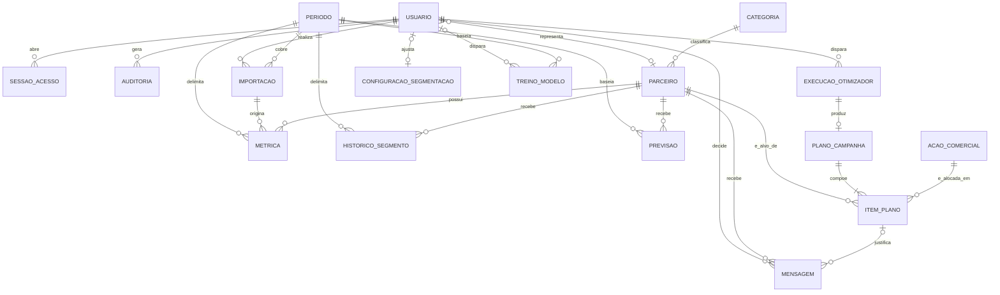
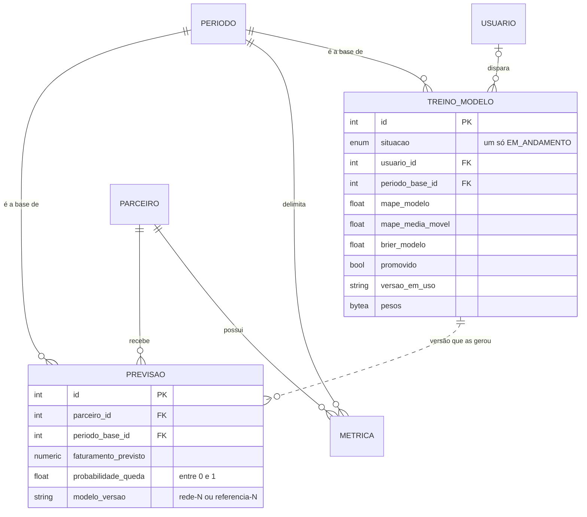

# 08 — Modelo de Dados

**Projeto:** Growth Intelligence Hub (GIH)
**Entrega:** Sprint 02 acadêmica — itens 3 (MER), 4 (modelo relacional) e 6 (banco criado)
**Versão:** 2.0 — 16/09/2026

> **O que mudou da versão 1.0.** Eram 14 tabelas; são **16**. A implementação da autenticação acrescentou
> `sessao_acesso` e `tentativa_login`, e este documento estava desatualizado em relação ao banco que já
> está no ar. A contagem agora vem de consulta ao banco, não de memória — a evidência está na seção 6.

Este documento apresenta **dois modelos**, na ordem em que a modelagem acontece:

1. **Modelo conceitual (MER)** — entidades, atributos e relacionamentos, na linguagem do negócio
2. **Modelo relacional** — as tabelas, com tipos, chaves primárias, chaves estrangeiras e restrições

O primeiro responde *"o que o sistema precisa saber"*. O segundo, *"como isso vira tabela"*.

---

## 1. Modelo conceitual (MER)

<!-- diagrama: mer-conceitual -->


**`TENTATIVA_LOGIN` não aparece no diagrama porque não se relaciona com nada.** É deliberado: ela registra
tentativas de autenticação inclusive contra logins que não existem, e por isso **não** pode ter chave
estrangeira para `USUARIO`. Ligá-la quebraria justamente o caso que ela existe para cobrir — o ataque por
dicionário usa login desconhecido (RNF11).

Os atributos de cada entidade estão na tabela abaixo, e não dentro das caixas do desenho: com dezessete
entidades e mais de cem atributos, a figura ficaria ilegível impressa, que é critério de aceite da entrega.

### Entidades e atributos, na linguagem do negócio

| Entidade | O que representa | Atributos |
|---|---|---|
| **Usuario** | Quem acessa o sistema | login, nome, senha (armazenada só como hash), perfil, situação, data de cadastro |
| **SessaoAcesso** | Uma sessão autenticada em curso | identificador da sessão, início, expiração, revogação e motivo, origem, navegador |
| **TentativaLogin** | Uma tentativa de autenticação, bem ou malsucedida | login tentado, origem, resultado, momento |
| **Auditoria** | Uma ação sensível praticada no sistema | autor, ação, parâmetros, origem, momento |
| **Categoria** | Ramo de atuação do parceiro | nome, situação |
| **Parceiro** | Comércio da rede | nome, categoria, origem da categoria, status comercial, contato, situação |
| **Periodo** | Janela de tempo de um relatório | data inicial, data final |
| **Importacao** | Uma carga de relatório | período coberto, autor, origem, total gravado, total rejeitado, momento |
| **Metrica** | Desempenho de um parceiro em um período | faturamento, número de pedidos, projeção |
| **HistoricoSegmento** | Classificação de um parceiro em um período | segmento, momento do cálculo |
| **ConfiguracaoSegmentacao** | Os limiares de RN01, configuráveis (RF21) | tamanho do Top N, períodos de tendência, períodos para ser recém-chegado, quem alterou e quando |
| **Previsao** | Estimativa do modelo para um parceiro | faturamento previsto, probabilidade de queda, versão do modelo |
| **TreinoModelo** | Uma execução do treino do modelo preditivo (RF27) | autor, situação, período-base, volume de dados, métricas lado a lado com as referências, se entrou em uso, versão em uso depois dele, motivo, pesos |
| **AcaoComercial** | Tipo de ação que a campanha pode alocar | nome, custo unitário, uplift esperado, situação |
| **ExecucaoOtimizador** | Uma rodada do otimizador | modo, parâmetros, viabilidade, restrição violada, uplift, custo, tempo |
| **PlanoCampanha** | O plano resultante de uma execução viável | janela de aplicação |
| **ItemPlano** | Par (parceiro, ação) escolhido pelo otimizador | uplift esperado, custo |
| **Mensagem** | Comunicação gerada para um parceiro | texto gerado, texto final, estado, autor da decisão, motivo da rejeição |

### Quatro relacionamentos que carregam regra de negócio

- **Metrica é única por (Parceiro, Periodo).** Não é detalhe técnico: é o que impede uma reimportação de
  duplicar a série e corromper a segmentação por tendência.
- **ExecucaoOtimizador produz *zero ou um* PlanoCampanha.** RN07: ou o plano respeita todas as restrições,
  ou não existe plano. A execução inviável fica registrada com o motivo.
- **PlanoCampanha compõe *um ou mais* ItemPlano**, e no máximo um por parceiro. Item sem plano não tem
  significado.
- **Usuario representa *zero ou um* Parceiro.** Só o perfil `PARCEIRO` usa esse vínculo, e é ele que
  restringe aquele usuário a consultar o próprio desempenho (RF26).

---

## 2. Modelo relacional

Notação: **sublinhado** é chave primária, `*` marca chave estrangeira.

```
usuario(id, login, nome, senha_hash, perfil, ativo, parceiro_id*, criado_em)
sessao_acesso(id, token_hash, usuario_id*, criada_em, expira_em, revogada_em, motivo_revogacao,
              origem, agente)
tentativa_login(id, login, origem, sucesso, ocorrido_em)
auditoria(id, usuario_id*, acao, detalhes, origem, ocorrido_em)

categoria(id, nome, ativa)
parceiro(id, nome, nome_normalizado, categoria_id*, origem_categoria, status, contato, ativo,
         criado_em)

periodo(id, data_inicio, data_fim)
importacao(id, periodo_id*, usuario_id*, origem, total_gravado, total_rejeitado, enviado_em)
metrica(id, parceiro_id*, periodo_id*, importacao_id*, faturamento, pedidos, projecao)
historico_segmento(id, parceiro_id*, periodo_id*, segmento, calculado_em)
configuracao_segmentacao(id, top_n, periodos_tendencia, periodos_novato, atualizado_em,
                         atualizado_por_id*)

previsao(id, parceiro_id*, periodo_base_id*, faturamento_previsto, probabilidade_queda,
         modelo_versao, gerada_em)
treino_modelo(id, situacao, usuario_id*, periodo_base_id*, semente, iniciado_em, concluido_em,
              parceiros, periodos, amostras_treino, amostras_validacao, amostras_teste,
              mape_modelo, mape_ultimo, mape_media_movel, brier_modelo, brier_referencia,
              calibracao_modelo, calibracao_referencia, detalhes, promovido, versao_em_uso,
              motivo, pesos)
acao_comercial(id, nome, custo_unitario, uplift_esperado_pct, ativa)
execucao_otimizador(id, usuario_id*, modo, parametros, viavel, restricao_violada, uplift_total,
                    custo_total, tempo_ms, executada_em)
plano_campanha(id, execucao_id*, aplicacao_inicio, aplicacao_fim)
item_plano(id, plano_id*, parceiro_id*, acao_id*, uplift_esperado, custo)

mensagem(id, parceiro_id*, item_plano_id*, texto_gerado, texto_final, estado, decidida_por_id*,
         motivo_rejeicao, gerada_em, decidida_em)
```

Toda tabela tem chave primária `id` inteira e sequencial. A escolha por chave substituta, e não por chave
natural composta, é o que mantém as chaves estrangeiras com uma coluna só — e o que permite corrigir um
nome de parceiro sem reescrever as métricas dele.

### 2.1 Acesso e auditoria

**usuario**

| Coluna | Tipo | Chave | Restrição |
|---|---|---|---|
| id | serial | **PK** | |
| login | varchar(60) | | **único** |
| nome | varchar(120) | | |
| senha_hash | varchar(255) | | somente hash Argon2id (RNF09) |
| perfil | enum | | ADMINISTRADOR, GESTOR, ANALISTA, PARCEIRO |
| ativo | boolean | | padrão verdadeiro |
| parceiro_id | integer | **FK** → parceiro | nulo, exceto no perfil PARCEIRO |
| criado_em | timestamptz | | padrão `now()` |

`CHECK (perfil = 'PARCEIRO') = (parceiro_id IS NOT NULL)` — ter vínculo e ser do perfil Parceiro são a
mesma condição, nos dois sentidos.

**sessao_acesso**

| Coluna | Tipo | Chave | Restrição |
|---|---|---|---|
| id | serial | **PK** | |
| token_hash | varchar(64) | | **único** — SHA-256 do identificador, nunca ele próprio |
| usuario_id | integer | **FK** → usuario | |
| criada_em | timestamptz | | padrão `now()` |
| expira_em | timestamptz | | |
| revogada_em | timestamptz | | nulo enquanto a sessão vale |
| motivo_revogacao | varchar(40) | | LOGOUT, NOVO_LOGIN, SENHA_ALTERADA, USUARIO_DESATIVADO |
| origem | varchar(45) | | cabe IPv6 |
| agente | varchar(255) | | |

**tentativa_login**

| Coluna | Tipo | Chave | Restrição |
|---|---|---|---|
| id | serial | **PK** | |
| login | varchar(60) | | **texto livre, não FK** — ver seção 1 |
| origem | varchar(45) | | |
| sucesso | boolean | | |
| ocorrido_em | timestamptz | | padrão `now()` |

**auditoria**

| Coluna | Tipo | Chave | Restrição |
|---|---|---|---|
| id | serial | **PK** | |
| usuario_id | integer | **FK** → usuario | **nulo** quando o login tentado não existe |
| acao | varchar(60) | | |
| detalhes | jsonb | | nunca senha nem identificador de sessão |
| origem | varchar(45) | | |
| ocorrido_em | timestamptz | | padrão `now()` |

### 2.2 Parceiros

**categoria**

| Coluna | Tipo | Chave | Restrição |
|---|---|---|---|
| id | serial | **PK** | |
| nome | varchar(60) | | **único** |
| ativa | boolean | | padrão verdadeiro |

**parceiro**

| Coluna | Tipo | Chave | Restrição |
|---|---|---|---|
| id | serial | **PK** | |
| nome | varchar(160) | | **único**, indexado |
| nome_normalizado | varchar(160) | | sem acento e sem caixa; índice de trigrama (RF24) |
| categoria_id | integer | **FK** → categoria | nulo permitido |
| origem_categoria | enum | | INFERIDA, SUGERIDA_IA, MANUAL |
| status | enum | | ATIVO, INATIVO, PROSPECCAO |
| contato | varchar(120) | | |
| ativo | boolean | | padrão verdadeiro |
| criado_em | timestamptz | | padrão `now()` |

`CHECK (categoria_id IS NULL) = (origem_categoria IS NULL)` — categoria sem origem seria uma classificação
sem procedência, e RN05 depende de saber se ela foi confirmada por alguém.

**`nome_normalizado` entrou na Sprint 6** (H37). `unaccent(lower(nome))` na consulta resolveria o acento e
impediria qualquer índice de servir, porque a função é aplicada linha a linha. A forma normalizada é coluna,
gravada pela aplicação a cada alteração do nome, e o índice GIN de trigrama é o único que faz
`LIKE '%termo%'` usar índice em qualquer posição do nome.

### 2.3 Dados de desempenho

**periodo**

| Coluna | Tipo | Chave | Restrição |
|---|---|---|---|
| id | serial | **PK** | |
| data_inicio | date | | **único em conjunto** com data_fim |
| data_fim | date | | `CHECK data_fim >= data_inicio` |

**importacao**

| Coluna | Tipo | Chave | Restrição |
|---|---|---|---|
| id | serial | **PK** | |
| periodo_id | integer | **FK** → periodo | |
| usuario_id | integer | **FK** → usuario | autor da carga (RF13) |
| origem | enum | | TEXTO, CSV |
| total_gravado | integer | | padrão 0 |
| total_rejeitado | integer | | padrão 0 |
| enviado_em | timestamptz | | padrão `now()` |

**metrica** — a tabela central do sistema

| Coluna | Tipo | Chave | Restrição |
|---|---|---|---|
| id | serial | **PK** | |
| parceiro_id | integer | **FK** → parceiro | **único em conjunto** com periodo_id |
| periodo_id | integer | **FK** → periodo | |
| importacao_id | integer | **FK** → importacao | de qual carga o registro veio |
| faturamento | numeric(12,2) | | `CHECK >= 0` |
| pedidos | integer | | `CHECK >= 0` |
| projecao | numeric(12,2) | | nulo permitido |

**Não existe coluna `ticket_medio`.** Ele é faturamento dividido por pedidos, calculado na consulta (RN04).
Como coluna, divergiria das parcelas que o originam na primeira correção de dado.

**historico_segmento**

| Coluna | Tipo | Chave | Restrição |
|---|---|---|---|
| id | serial | **PK** | |
| parceiro_id | integer | **FK** → parceiro | **único em conjunto** com periodo_id |
| periodo_id | integer | **FK** → periodo | |
| segmento | enum | | TOP, EM_ASCENSAO, EM_RISCO, RECEM_CHEGADO, ESTAVEL, PROSPECCAO |
| calculado_em | timestamptz | | padrão `now()` |

**configuracao_segmentacao** — entrou na Sprint 7 (H34)

| Coluna | Tipo | Chave | Restrição |
|---|---|---|---|
| id | integer | **PK** | `CHECK id = 1` — uma linha só |
| top_n | integer | | `CHECK >= 1` |
| periodos_tendencia | integer | | `CHECK >= 1` |
| periodos_novato | integer | | `CHECK >= 1` |
| atualizado_em | timestamptz | | padrão `now()` |
| atualizado_por_id | integer | **FK** → usuario | nulo nos valores de fábrica |

**Uma linha só, garantida pelo banco.** Configuração global sem essa trava vira duas linhas na primeira
gravação concorrente, e a regra passa a depender de qual delas o `SELECT` devolver primeiro. A linha nasce
com a migração, com os valores de RN01: Top 15, 2 períodos de tendência, 3 períodos para ser recém-chegado
— este último ainda sem aval do PO (issue #59).

### 2.4 Núcleo computacional

**previsao**

| Coluna | Tipo | Chave | Restrição |
|---|---|---|---|
| id | serial | **PK** | |
| parceiro_id | integer | **FK** → parceiro | **único em conjunto** com periodo_base_id e modelo_versao |
| periodo_base_id | integer | **FK** → periodo | |
| faturamento_previsto | numeric(12,2) | | |
| probabilidade_queda | double | | `CHECK entre 0 e 1` |
| modelo_versao | varchar(40) | | versionar é o que permite comparar modelos |
| gerada_em | timestamptz | | padrão `now()` |

**Previsão e treino se ligam pela versão, não por chave estrangeira.** `modelo_versao` é `rede-7` quando a
previsão saiu da rede treinada no treino 7, e `referencia-7` quando saiu das contas simples medidas nele —
o que vale enquanto nenhuma versão da rede superou as referências (UC07-A1, RN09). O nome carrega a origem,
e é o que a tela mostra ao lado da estimativa.

**treino_modelo** — entrou na Sprint 05 da disciplina (H42 a H45, ADR-010)

O recorte do modelo que o módulo de previsão usa — o MER inteiro, na seção 1, fica ilegível impresso na
largura de uma página:

<!-- diagrama: mer-previsao -->


A ligação entre treino e previsão é **tracejada** porque não é chave estrangeira: vem da versão, pelo nome
(`rede-7` saiu do treino 7).

| Coluna | Tipo | Chave | Restrição |
|---|---|---|---|
| id | serial | **PK** | |
| situacao | enum | | EM_ANDAMENTO, CONCLUIDO, FALHOU — **um só em andamento**, por índice único parcial |
| usuario_id | integer | **FK** → usuario | nulo quando o treino veio do terminal |
| periodo_base_id | integer | **FK** → periodo | o período mais recente com dado — de onde as previsões partem |
| semente | integer | | a do treino, para que ele possa ser refeito (RNF16) |
| iniciado_em, concluido_em | timestamptz | | a data do treino que o RF27 pede |
| parceiros, periodos, amostras_treino, amostras_validacao, amostras_teste | integer | | o volume de dados (RF27) |
| mape_modelo, mape_ultimo, mape_media_movel | double | | faturamento: a rede e as duas referências (H42, H46) |
| brier_modelo, brier_referencia, calibracao_modelo, calibracao_referencia | double | | risco: a rede e a taxa observada (H43) |
| detalhes | jsonb | | curva de calibração, épocas, temperatura, duração, taxas da referência |
| promovido | boolean | | a versão treinada entrou em uso (UC07-A1) |
| versao_em_uso | varchar(40) | | a que ficou valendo **depois** deste treino |
| motivo | text | | por que não entrou em uso, ou por que falhou |
| pesos | bytea | | a rede treinada, com a normalização — poucos KB (ADR-010) |

`CHECK` que exige versão em uso de todo treino concluído, e motivo de todo treino que falhou. **A versão em
uso não fica em configuração à parte**: é o que o último treino concluído registra. Duas fontes para a
mesma resposta acabariam discordando.

**acao_comercial**

| Coluna | Tipo | Chave | Restrição |
|---|---|---|---|
| id | serial | **PK** | |
| nome | varchar(80) | | **único** |
| custo_unitario | numeric(10,2) | | `CHECK >= 0` |
| uplift_esperado_pct | double | | |
| ativa | boolean | | padrão verdadeiro |

**execucao_otimizador**

| Coluna | Tipo | Chave | Restrição |
|---|---|---|---|
| id | serial | **PK** | |
| usuario_id | integer | **FK** → usuario | |
| modo | enum | | SERIAL, CPU_PARALELO, GPU |
| parametros | jsonb | | restrições usadas na rodada |
| viavel | boolean | | |
| restricao_violada | varchar(120) | | |
| uplift_total | numeric(12,2) | | nulo quando inviável |
| custo_total | numeric(12,2) | | nulo quando inviável |
| tempo_ms | integer | | base do benchmark (RF33, RF34) |
| executada_em | timestamptz | | padrão `now()` |

`CHECK (viavel AND restricao_violada IS NULL) OR (NOT viavel AND restricao_violada IS NOT NULL)` — é RN07
no banco: execução inviável **tem** que dizer o que violou.

**plano_campanha**

| Coluna | Tipo | Chave | Restrição |
|---|---|---|---|
| id | serial | **PK** | |
| execucao_id | integer | **FK** → execucao_otimizador | **único** — um plano por execução |
| aplicacao_inicio | date | | |
| aplicacao_fim | date | | |

**item_plano**

| Coluna | Tipo | Chave | Restrição |
|---|---|---|---|
| id | serial | **PK** | |
| plano_id | integer | **FK** → plano_campanha | **único em conjunto** com parceiro_id |
| parceiro_id | integer | **FK** → parceiro | no máximo uma ação por parceiro |
| acao_id | integer | **FK** → acao_comercial | |
| uplift_esperado | numeric(12,2) | | |
| custo | numeric(10,2) | | |

### 2.5 Comunicação

**mensagem**

| Coluna | Tipo | Chave | Restrição |
|---|---|---|---|
| id | serial | **PK** | |
| parceiro_id | integer | **FK** → parceiro | |
| item_plano_id | integer | **FK** → item_plano | nulo: nem toda mensagem vem de um plano |
| texto_gerado | text | | o que a IA escreveu |
| texto_final | text | | o que o Gestor deixou |
| estado | enum | | PENDENTE, APROVADA, REJEITADA |
| decidida_por_id | integer | **FK** → usuario | |
| motivo_rejeicao | varchar(240) | | |
| gerada_em | timestamptz | | padrão `now()` |
| decidida_em | timestamptz | | |

`CHECK` que impede estado diferente de `PENDENTE` sem autor e data de decisão. É **RN06 no banco**: nenhuma
mensagem sai do estado pendente sem um humano registrado. Guardar `texto_gerado` e `texto_final` separados
é o que permite responder depois *"o que a IA escreveu, e o que de fato foi enviado?"*.

---

## 3. Índices

Cada índice existe por causa de uma consulta concreta, não por precaução (RNF05).

| Índice | Tabela | Colunas | Serve a |
|---|---|---|---|
| `ix_parceiro_nome` | parceiro | nome | Casamento de nome na importação |
| `ix_parceiro_nome_normalizado_trgm` | parceiro | nome_normalizado (GIN, trigrama) | Busca sem acento em qualquer posição do nome (RF24) |
| `ix_metrica_periodo_faturamento` | metrica | periodo_id, faturamento | Ranking do período sem varrer a tabela (RF17) |
| `ix_segmento_periodo_segmento` | historico_segmento | periodo_id, segmento | Filtro por segmento no painel (RF21) |
| `ix_auditoria_ocorrido_em` | auditoria | ocorrido_em | Consulta da trilha por intervalo (RF08) |
| `ix_sessao_acesso_usuario` | sessao_acesso | usuario_id | Derrubar as sessões de um usuário de uma vez |
| `ix_tentativa_origem_ocorrido` | tentativa_login | origem, ocorrido_em | Contagem de falhas na janela do bloqueio (RNF11) |
| `ix_mensagem_estado` | mensagem | estado | Fila de aprovação (RF37) |
| `ix_previsao_periodo_versao` | previsao | periodo_base_id, modelo_versao | As previsões de uma versão sobre um período, para a rede toda |
| `uq_treino_um_em_andamento` | treino_modelo | situacao, só onde é `EM_ANDAMENTO` (único, parcial) | Um treino por vez, travado pelo banco e não pela memória do processo (ADR-010) |

---

## 4. Tipos enumerados

Oito tipos `ENUM` do PostgreSQL, em vez de texto livre. O banco recusa valor fora da lista, o que é mais
forte que uma validação de aplicação que alguém pode esquecer de chamar.

| Tipo | Valores |
|---|---|
| `perfil` | ADMINISTRADOR, GESTOR, ANALISTA, PARCEIRO |
| `segmento` | TOP, EM_ASCENSAO, EM_RISCO, RECEM_CHEGADO, ESTAVEL, PROSPECCAO |
| `origemcategoria` | INFERIDA, SUGERIDA_IA, MANUAL |
| `statuscomercial` | ATIVO, INATIVO, PROSPECCAO |
| `origemimportacao` | TEXTO, CSV |
| `modoexecucao` | SERIAL, CPU_PARALELO, GPU |
| `estadomensagem` | PENDENTE, APROVADA, REJEITADA |
| `situacaotreino` | EM_ANDAMENTO, CONCLUIDO, FALHOU |

> **Armadilha registrada:** o `autogenerate` do Alembic **não** remove tipos ENUM no `downgrade` — só
> derruba as tabelas. Sem acrescentar `DROP TYPE` à mão, reverter e reaplicar falha com *type already
> exists*, e o erro só aparece na segunda execução. Toda migração que cria enum precisa derrubá-lo.

---

## 5. O que o banco garante sozinho

Onze restrições `CHECK` que impedem estado inválido independentemente do código da aplicação. É a diferença
entre uma regra que vale e uma regra que valeria se ninguém esquecesse de chamá-la.

| Restrição | Garante |
|---|---|
| `ck_usuario_parceiro_apenas_perfil_parceiro` | Vínculo com parceiro **se e somente se** o perfil for PARCEIRO |
| `ck_parceiro_categoria_com_origem` | Categoria sempre acompanhada da procedência (RN05) |
| `ck_periodo_ordem` | Data final nunca anterior à inicial |
| `ck_metrica_faturamento_nao_negativo` | Faturamento ≥ 0 |
| `ck_metrica_pedidos_nao_negativo` | Pedidos ≥ 0 |
| `ck_previsao_probabilidade` | Probabilidade entre 0 e 1 |
| `ck_acao_custo_nao_negativo` | Custo de ação ≥ 0 |
| `ck_execucao_inviavel_tem_motivo` | Execução inviável **tem** motivo registrado (RN07) |
| `ck_mensagem_decisao_tem_autor` | Mensagem decidida **tem** autor e data (RN06) |
| `ck_treino_concluido_tem_versao` | Treino concluído **diz** qual versão ficou em uso (UC07-A1) |
| `ck_treino_falho_tem_motivo` | Treino que falhou **diz** por quê |

---

## 6. O banco criado — evidência

O esquema não está só desenhado: está aplicado e em uso. O ambiente sobe com um comando
(`docker compose up`), e o `entrypoint` aplica as migrações antes de servir a API.

**Migração aplicada:**

```
$ docker compose exec api alembic current
d2c9b1a21c53 (head)
```

**Tabelas criadas** (`docker compose exec postgres psql -U gih -d gih -c "\dt"`):

```
 Schema |           Name           | Type  | Owner 
--------+--------------------------+-------+-------
 public | acao_comercial           | table | gih
 public | alembic_version          | table | gih
 public | auditoria                | table | gih
 public | categoria                | table | gih
 public | configuracao_segmentacao | table | gih
 public | execucao_otimizador      | table | gih
 public | historico_segmento       | table | gih
 public | importacao               | table | gih
 public | item_plano               | table | gih
 public | mensagem                 | table | gih
 public | metrica                  | table | gih
 public | parceiro                 | table | gih
 public | periodo                  | table | gih
 public | plano_campanha           | table | gih
 public | previsao                 | table | gih
 public | sessao_acesso            | table | gih
 public | tentativa_login          | table | gih
 public | treino_modelo            | table | gih
 public | usuario                  | table | gih
(19 rows)
```

São as 18 tabelas de domínio mais `alembic_version`, que é da própria ferramenta de migração e registra
qual versão do esquema está aplicada.

**Contagem por consulta ao catálogo do PostgreSQL:**

| Objeto | Quantidade |
|---|---|
| Tabelas de domínio | 18 |
| Chaves primárias | 18 |
| Chaves estrangeiras | 24 |
| Restrições `UNIQUE` | 11 |
| Restrições `CHECK` declaradas | 15 |
| Índices | 39 |
| Tipos `ENUM` | 8 |

Medido em 24/09/2026, contra o banco no ar. **Na Sprint 02 eram 16, 16, 21, 11, 9, 34 e 7.** A diferença é
de três migrações: o nome normalizado do parceiro com o índice de trigrama (Sprint 6, +1 índice), a
configuração da segmentação (Sprint 7, +1 tabela, +1 chave estrangeira, +4 `CHECK`, +1 índice) e o treino
do modelo (Sprint 05 da disciplina, +1 tabela, +2 chaves estrangeiras, +2 `CHECK`, +3 índices contando o da
chave primária, +1 enum). O índice único parcial do treino não aparece entre as restrições `UNIQUE`: é
índice, e não restrição — o PostgreSQL só aceita condição (`WHERE`) em índice.

**O esquema é gerado por migração versionada, não por script solto.** Isso é o que permite qualquer
integrante chegar ao mesmo estado a partir de um clone limpo, e é o que torna a evolução do banco
auditável no histórico do repositório.

---

## 7. Verificação

O ciclo de reverter e reaplicar foi testado **duas vezes**, e não uma: a falha de ENUM da seção 4 só
aparece na segunda execução. A migração do treino do modelo, que cria o enum `situacaotreino`, passou pelo
mesmo ciclo em 24/09/2026, num banco descartável.

```bash
alembic upgrade head     # aplica
alembic downgrade base   # reverte tudo
alembic upgrade head     # reaplica — é aqui que o erro apareceria
```

Além disso, a suíte de testes da API cria um banco `gih_teste` separado e aplica **as mesmas migrações**
nele, em vez de montar o esquema com `create_all`. Custa alguns segundos a mais por execução e cobre a
divergência entre o modelo em código e a migração — que é o defeito que ninguém percebe até a hora de
implantar.

---

## 8. Onde está a implementação

| Preciso de… | Está em |
|---|---|
| As entidades em código | [`api/app/modelos.py`](../api/app/modelos.py) |
| A migração que cria o esquema | [`api/migrations/versions/`](../api/migrations/versions/) |
| Diagrama de classes, incluindo serviços e núcleo | [`10-diagrama-de-classes.md`](10-diagrama-de-classes.md) |
| Decisões de arquitetura (ADR-001 a ADR-010) | [`07-arquitetura-preliminar.md`](07-arquitetura-preliminar.md) |
| Massa de demonstração sintética | [`scripts/gerar_dados_sinteticos.py`](../scripts/gerar_dados_sinteticos.py) |
