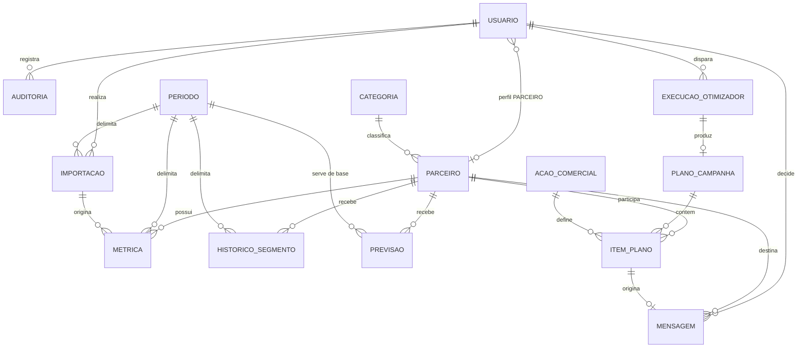

# 08 — Modelo de Dados

**Projeto:** Growth Intelligence Hub (GIH)
**Sprint:** 2 — Modelagem e fundação · história **H07**
**Versão:** 1.0 — 15/09/2026

> Implementado em [`api/app/modelos.py`](../api/app/modelos.py) e criado pela migração
> `esquema_inicial`. O esquema é recriável do zero: `alembic upgrade head`.

---

## 1. Diagrama



**14 tabelas.** Cada uma tem chave primária `id` inteira e sequencial.

---

## 2. Entidades

### Acesso

**`usuario`** — credenciais e perfil.

| Coluna | Tipo | Observação |
|---|---|---|
| `id` | serial | PK |
| `login` | varchar(60) | **único** |
| `nome` | varchar(120) | |
| `senha_hash` | varchar(255) | Somente hash (RNF09) |
| `perfil` | enum | ADMINISTRADOR, GESTOR, ANALISTA, PARCEIRO |
| `ativo` | boolean | |
| `parceiro_id` | FK → `parceiro` | Nulo, exceto no perfil PARCEIRO |
| `criado_em` | timestamptz | |

> **Restrição `ck_usuario_parceiro_apenas_perfil_parceiro`:** o vínculo com parceiro existe **se e somente
> se** o perfil for PARCEIRO. É o que garante no banco — e não só no código — que RF26 restringe a consulta
> ao próprio desempenho.

**`auditoria`** — trilha de ações sensíveis (RF06). `usuario_id` é **nulo por necessidade**: tentativa de
login com usuário inexistente precisa ser registrada, e nesse caso não existe usuário a referenciar.
Indexada por `ocorrido_em`, que é como a consulta filtra.

### Parceiros

**`categoria`** — `id`, `nome` (único), `ativa`.

**`parceiro`** — `id`, `nome` (único), `categoria_id`, `origem_categoria`, `status`, `contato`, `ativo`,
`criado_em`.

> **Restrição `ck_parceiro_categoria_com_origem`:** categoria e origem andam juntas — ou ambas preenchidas,
> ou ambas nulas. Categoria em branco é resultado aceitável e deliberado; categoria **sem saber de onde
> veio** não é, porque RN05 depende de distinguir sugestão de confirmação.

### Dados de desempenho

**`periodo`** — `data_inicio`, `data_fim`, com **unicidade no par** e `ck_periodo_ordem` garantindo
`data_fim >= data_inicio`. O relatório de origem não traz datas: o período é informado no upload, e a
importação sem ele é recusada (RN03).

**`importacao`** — registro de uma carga: período, autor, origem (TEXTO ou CSV), total gravado, total
rejeitado, data de envio.

**`metrica`** — o dado central.

| Coluna | Tipo | Observação |
|---|---|---|
| `parceiro_id`, `periodo_id` | FK | **Únicos em conjunto** |
| `importacao_id` | FK | De qual carga o registro veio |
| `faturamento` | numeric(12,2) | `>= 0` |
| `pedidos` | integer | `>= 0` |
| `projecao` | numeric(12,2) | Opcional |

> **Ticket médio não é coluna (RN04).** É faturamento dividido por pedidos, calculado na consulta. Guardá-lo
> faria o valor divergir das parcelas na primeira correção de dado.
>
> **A unicidade por (parceiro, período) é a defesa contra o pior defeito possível aqui**: uma reimportação
> duplicando a série faria a segmentação por tendência classificar errado **sem emitir erro**.

**`historico_segmento`** — segmento do parceiro em cada período, único no par, com o segmento **final** já
resolvido pela precedência de RN01.

> **Não derive a mobilidade do Top N daqui (RN02).** Como Em Risco vence Top, um parceiro entre os N maiores
> mas em queda fica gravado como EM_RISCO. Ler daqui faria o painel anunciar que ele saiu do Top N enquanto
> ele continua lá. RF22 lê o **ranking**, ordenando `metrica` por faturamento.

### Núcleo computacional

**`previsao`** — faturamento previsto e probabilidade de queda por parceiro, a partir de um período base.
Única por (parceiro, período, versão do modelo), o que permite comparar versões. `probabilidade_queda`
restrita ao intervalo de 0 a 1.

**`acao_comercial`** — catálogo de ações: nome, custo unitário, uplift esperado, ativa.

**`execucao_otimizador`** — parâmetros, modo (SERIAL, CPU_PARALELO, GPU), tempo em milissegundos, uplift e
custo totais, viabilidade. **É a base do benchmark** (RF33, RF34): comparar modos é comparar linhas desta
tabela.

> **Restrição `ck_execucao_inviavel_tem_motivo`:** execução inviável **obriga** o registro de qual restrição
> foi violada. É RN07 no banco: o sistema não entrega plano parcialmente inviável nem inviabilidade sem
> explicação.

**`plano_campanha`** — uma por execução (relação 1:1), com o período de aplicação.

**`item_plano`** — par (parceiro, ação) com uplift e custo. **Único por (plano, parceiro)**: no máximo uma
ação por parceiro em cada plano, que é a formulação do problema de otimização.

### Comunicação

**`mensagem`** — `texto_gerado` e `texto_final` são colunas **separadas de propósito**: se o Gestor editar
antes de aprovar, o original permanece para auditoria.

> **Restrição `ck_mensagem_decisao_tem_autor`:** uma mensagem pendente não tem decisor nem data de decisão;
> uma mensagem decidida tem obrigatoriamente os dois. É **RN06 imposta pelo banco** — nenhuma mensagem sai
> do estado pendente sem um humano registrado, mesmo que a aplicação tenha um defeito.

---

## 3. Índices

Escolhidos a partir das consultas que o painel realmente faz, não por precaução (RNF05).

| Índice | Tabela | Para que |
|---|---|---|
| `ix_metrica_periodo_faturamento` | `metrica` (periodo_id, faturamento) | **Ranking do período** — a consulta mais frequente do sistema (RF18) |
| `uq_metrica_parceiro_periodo` | `metrica` | Série histórica de um parceiro, além de garantir a unicidade |
| `ix_segmento_periodo_segmento` | `historico_segmento` (periodo_id, segmento) | Filtro por segmento no painel (RF23) |
| `ix_parceiro_nome` | `parceiro` (nome) | Busca por nome (RF24) |
| `ix_mensagem_estado` | `mensagem` (estado) | Fila de pendentes (RF37) |
| `ix_auditoria_ocorrido_em` | `auditoria` (ocorrido_em) | Consulta da trilha por intervalo (RF08) |

> **A segmentação não pode consultar parceiro a parceiro.** Recalcular com uma consulta por parceiro roda em
> segundos com 100 e morre nos 10.000 do RNF04, contra o teto de 2 s do RNF03. O recálculo usa **consulta
> agregada** — ver o critério de aceite de H33.

---

## 4. Decisões que valem registrar

**Restrição no banco, não só no código.** Cinco regras de negócio viraram `CHECK`: vínculo de parceiro por
perfil, categoria com origem, ordem das datas do período, inviabilidade com motivo, e decisão de mensagem
com autor. A aplicação também valida — mas um defeito na aplicação não consegue gravar estado inconsistente.

**Enums nativos do PostgreSQL.** Sete tipos. Dão validação no banco e legibilidade nas consultas manuais.
O custo está registrado como armadilha no `CLAUDE.md`: o `autogenerate` do Alembic não os remove no
downgrade, e é preciso fazer isso à mão.

**Sem entidade de consumidor final.** O modelo trata apenas pessoas jurídicas parceiras, em conformidade com
RNF28. Não existe tabela onde um dado pessoal de consumidor caberia.

---

## 5. Verificação

```bash
docker compose up -d postgres
cd api && alembic upgrade head
```

Critérios de aceite de H20, conferidos:

- [x] As migrações aplicam e revertem — ciclo `upgrade` → `downgrade base` → `upgrade` executado duas vezes
      sem resíduo
- [x] Esquema recriável do zero em banco vazio
- [x] Índices de RNF05 criados pela migração
- [x] `GET /api/health` responde `banco: "ok"` contra o banco real
