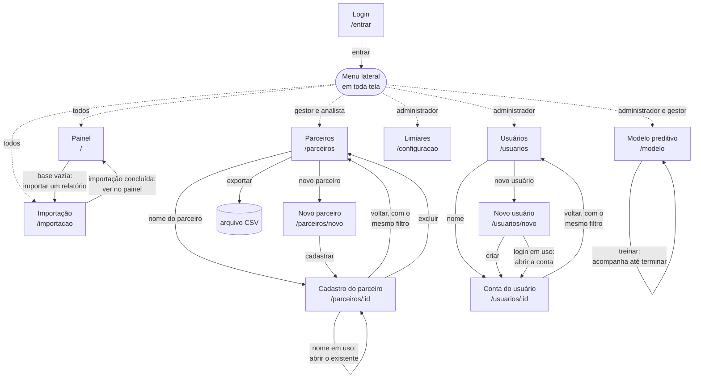

# 09 — Sistema Visual

**Projeto:** Growth Intelligence Hub (GIH)
**Sprint:** 3 — história **H08**
**Versão:** 1.0 — 15/09/2026
**Status:** ⏳ aguardando aprovação da equipe

> **Este documento é portão.** Nenhuma linha de CSS entra em `web/` antes de a equipe aprovar a direção
> visual aqui. Num projeto anterior do mesmo domínio, "tema escuro e elegante" foi tratado como
> especificação suficiente e o redesign inteiro foi rejeitado depois de pronto — cerca de 500 linhas de CSS
> descartadas. Validar antes custa uma conversa.

**Protótipo navegável:** [`docs/prototipo/index.html`](prototipo/index.html) — quatro telas: painel,
importação, campanha e aprovação.

---

## 1. As duas regras que não se negociam

### 1.1 Cada cor tem um trabalho só

O **âmbar** significa *"responde ao seu clique"* — botão, link, foco, item de menu selecionado. Nada mais.
Quando uma cor é marca, ação **e** dado ao mesmo tempo, ela deixa de significar qualquer coisa.

- As cores de **segmento** aparecem **apenas como ponto ou barra**, nunca como fundo de linha ou texto
- O rótulo do segmento é **texto neutro** — "Top 15" repetido doze vezes em cor é ruído puro
- Os **gráficos** usam uma rampa fria própria, nunca o âmbar nem as cores de segmento

Se você for acrescentar `--acao` em algo que não responde a clique, a cor errada está sendo usada.

### 1.2 Hierarquia vem do peso e da superfície

Passar no teste de contraste não faz o olho achar nada. Na tabela de parceiros, **o nome do parceiro é o
único elemento em peso 600 e tinta cheia** (`--ink`). Todo o resto da linha é `--ink-2`.

A escada de superfícies é `--ground` → `--surface` → `--surface-2` → `--raise`, com degraus largos o
suficiente para serem percebidos sem precisar de borda em tudo.

---

## 2. Cor

### Neutros e ação

| Papel | Token | Claro | Escuro |
|---|---|---|---|
| Fundo da página | `--ground` | `#f7f8fa` | `#0d1117` |
| Superfície (cartão, tabela) | `--surface` | `#ffffff` | `#12161c` |
| Superfície elevada (hover) | `--surface-2` | `#f0f2f6` | `#171c24` |
| Borda | `--border` | `#e3e7ed` | `#262d38` |
| Tinta principal | `--ink` | `#101826` | `#eef1f6` |
| Tinta secundária | `--ink-2` | `#5a6474` | `#a8b1bf` |
| Tinta terciária | `--ink-3` | `#8a93a3` | `#6f7987` |
| **Ação** | `--acao` | `#d97706` | `#f0a02a` |
| Ação sobre claro (texto) | `--acao-ink` | `#a1560a` | `#f0a02a` |
| Ação, fundo fraco | `--acao-fraca` | `#fdf3e3` | `#2a1f10` |

Os neutros têm viés frio, escolhido para conversar com a rampa azul dos gráficos. Cinza puro lê como
não decidido.

### Segmentos

| Segmento | Token | Claro | Escuro |
|---|---|---|---|
| Em risco | `--seg-risco` | `#d03b3b` | `#d03b3b` |
| Em ascensão | `--seg-ascensao` | `#1baf7a` | `#199e70` |
| Recém-chegado | `--seg-recem` | `#4a3aa7` | `#9085e9` |
| Prospecção | `--seg-prosp` | `#eb6834` | `#d95926` |
| Top | `--seg-top` | `#2a78d6` | `#3987e5` |
| Estável | `--seg-estavel` | `#8a93a3` | `#6f7987` |

**Estável é cinza de propósito:** sem tendência, sem atenção necessária. Ausência de sinal é informação.

### Séries de gráfico

| Papel | Token | Claro | Escuro |
|---|---|---|---|
| Série 1 (serial, linha única) | `--serie-1` | `#2a78d6` | `#3987e5` |
| Série 2 (CPU paralelo) | `--serie-2` | `#eb6834` | `#d95926` |
| Série 3 (GPU) | `--serie-3` | `#1baf7a` | `#199e70` |
| Grade | `--grade` | `#e8ecf3` | `#232a34` |

---

## 3. A paleta foi validada, não escolhida no olho

Rodada no validador de daltonismo e contraste, nos dois modos.

**O primeiro conjunto reprovou.** `Em risco` em vermelho e `Em ascensão` em verde mediram **ΔE 4,1 em
deuteranopia** — um daltônico não distinguiria os dois estados mais consequentes do painel. É o erro mais
comum em dashboards, e teria passado despercebido numa escolha por gosto.

A correção foi trocar o verde por **turquesa**, o que levou o par crítico a **ΔE 9,9**, acima da meta de 8.

| Verificação | Claro | Escuro |
|---|---|---|
| Faixa de luminosidade | ✅ | ✅ |
| Piso de croma | ✅ | ✅ |
| Separação sob daltonismo | ✅ 9,9 (pior par: risco ↔ ascensão) | ⚠️ 7,2 |
| Piso de visão normal | ✅ 31,9 | ✅ 24,6 |
| Contraste com a superfície | ⚠️ turquesa 2,82:1 | ✅ |

**Os dois avisos têm a mesma mitigação, já obrigatória pela regra 1.1:** a cor de segmento nunca aparece
sozinha — sempre ao lado do rótulo em texto. Nenhuma informação depende de distinguir a cor.

Houve um trade-off explícito: um turquesa mais escuro passaria no contraste, mas cairia para ΔE 7,2 em
daltonismo no modo claro. Escolhemos proteger o daltonismo, que é mais difícil de compensar do que
visibilidade — e a compensação da visibilidade já existe.

**Para reproduzir:**

```bash
node validate_palette.js "#d03b3b,#1baf7a,#4a3aa7,#eb6834,#2a78d6" --mode light --surface "#ffffff"
```

---

## 4. Tipografia

| Papel | Família | Uso |
|---|---|---|
| Interface | **Fira Sans** | Títulos, rótulos, corpo, botões |
| Dados | **Fira Code** | Toda coluna numérica, com `font-variant-numeric: tabular-nums` |

Fira Code nos números não é enfeite: em tabela de ranking, dígito que não alinha obriga o olho a reler.

**Escala:** 11 · 11,5 · 12 · 13 · 13,5 · 14 · 19 · 22 px. Fora dela, não existe.

**Pesos:** 400 corpo · 500 rótulos · 600 nomes e títulos · 700 apenas o título da página e a marca.

---

## 5. Espaçamento e layout

Escala densa, apropriada a painel: **4 · 6 · 8 · 12 · 15 · 16 · 20 · 24 px**.

- **Trilho lateral** de 208 px com as quatro telas; vira barra horizontal rolável abaixo de 860 px
- **Resumo antes do detalhe**: indicadores no topo, gráficos, depois a tabela
- Tabelas largas rolam no próprio container (`overflow-x: auto`) — a página nunca rola na horizontal
- Raio de 6 px em controles, 8 px em painéis
- Layout funcional a partir de **768 px** (RNF21)

---

## 6. Estados vazios

Tela vazia sem explicação é defeito. Os três previstos:

| Situação | O que mostrar |
|---|---|
| Base sem dados | "Nenhum dado importado ainda" + botão que leva à importação |
| Período único | Valores absolutos, avisando que variação e tendência exigem histórico |
| Otimização inviável | Qual restrição foi violada e quanto falta — nunca plano parcial (RN07) |

---

## 7. Acessibilidade

- Contraste mínimo **AA (4,5:1)** para texto (RNF22) — medido com ferramenta, não presumido
- Foco visível em todo controle: contorno de 2 px na cor de ação
- Alvo de toque mínimo de 44 × 44 px
- Ícones em SVG, nunca emoji
- Transições de 150–300 ms; `prefers-reduced-motion` respeitado
- Nenhuma informação transmitida apenas por cor

> **Ao medir contraste, desconfie do instrumento.** Numa auditoria anterior, um regex esperando `rgb()`
> leu cores em outro formato como zeros e acusou falha catastrófica inexistente. Meça pintando a cor num
> `<canvas>` e lendo o pixel.

---

## 8. Como aprovar

Abra o [protótipo](prototipo/index.html), percorra as quatro telas e responda:

1. A hierarquia funciona? O nome do parceiro salta na tabela?
2. As cores de segmento são distinguíveis à primeira vista?
3. O âmbar aparece **só** onde se clica?
4. Os gráficos são legíveis sem esforço?
5. Algo parece decorativo em vez de informativo?

Aprovação registrada na issue **#8**. Só depois disso começa o CSS em `web/`.

---

## 9. Telas e navegação

Onze telas, cada uma com **endereço próprio**. Não é detalhe: o botão voltar precisa desfazer o último
passo, um recorte filtrado precisa poder ser mandado por link, e um cadastro precisa poder ser aberto
direto — tudo isso depende de a tela estar na URL, e não num estado escondido da página.

<!-- diagrama: navegacao-telas -->


**O menu lateral aparece como um nó só**, com setas tracejadas: ele fica visível em todas as telas depois do
login. Desenhá-lo como setas de cada tela para cada tela faria o mapa virar uma teia — e, sem ele, o desenho
saía em grupos soltos, sem mostrar como se vai do painel à lista de parceiros. As setas cheias são os
caminhos que **a própria tela** oferece.

**O menu mostra só o que o perfil abre.** A lista vem do servidor — a sessão traz as telas do perfil, lidas
das permissões das próprias rotas —, e a interface só desenha o que ouviu (regras 2.4 e 2.5 do
`CLAUDE.md`). O Administrador vê Painel, Importação (só o histórico, pelo RF13), Modelo, Usuários e Limiares; o
Gestor vê Painel, Importação, Parceiros e Modelo; o Analista, Painel, Importação e Parceiros — ele lê a
previsão no cadastro do parceiro (RF28), mas não treina o modelo (UC07). Esconder o item não é controle de acesso: quem abre o
endereço direto recebe a recusa da rota.

Três comportamentos que o desenho não mostra, e que valem para todas as telas:

- **Sessão encerrada leva ao login, e o login devolve ao lugar de antes.** Quem abre um link direto sem
  estar autenticado entra e cai na tela que pediu, e não no painel genérico.
- **O filtro da lista vive na URL.** Por isso "voltar" do cadastro devolve o mesmo recorte, e o link de
  exportar é a mesma consulta em outro formato. A lista de usuários abre nos ativos; "todas as situações"
  tem valor próprio no endereço.
- **Estimativa não se veste de medição.** A previsão do modelo aparece com a etiqueta "Estimativa", o
  período de onde parte e a versão que a produziu; na série do parceiro, o trecho até o próximo período é
  tracejado, com marcador vazado e legenda — cor diferente sozinha não bastaria (H44).
- **Toda tela vazia oferece a saída.** Base sem dados leva à importação; parceiro ou usuário inexistente
  leva de volta à lista — nunca uma tela em branco sem explicação (seção 6).
