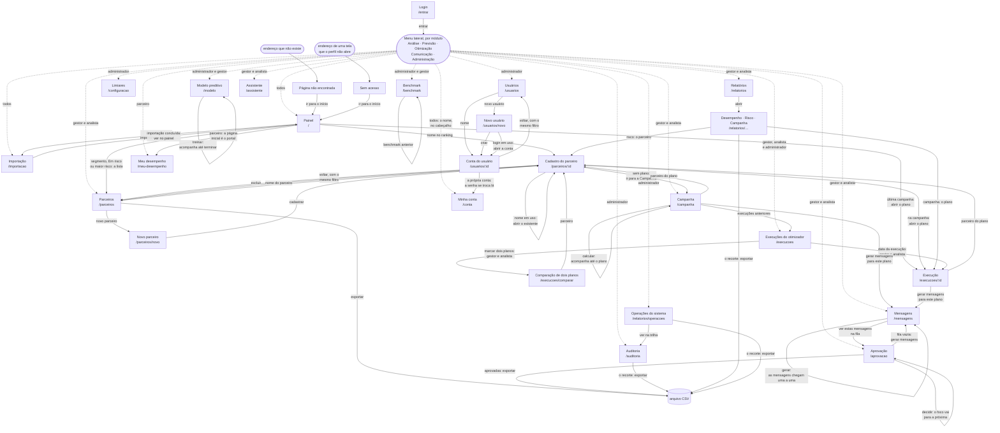

# 09 — Sistema Visual

**Projeto:** Growth Intelligence Hub (GIH)
**Sprint:** 3 — história **H08**
**Versão:** 1.0 — 15/09/2026
**Status:** ⏳ aguardando aprovação da equipe

> **Este documento é portão.** Nenhuma linha de CSS entra em `web/` antes de a equipe aprovar a direção
> visual aqui. Num projeto anterior do mesmo domínio, "tema escuro e elegante" foi tratado como
> especificação suficiente e o redesign inteiro foi rejeitado depois de pronto — cerca de 500 linhas de CSS
> descartadas. Validar antes custa uma conversa.

**Protótipo navegável:** [`docs/prototipo/index.html`](prototipo/index.html) — quatro telas: painel,
importação, campanha e aprovação.

---

## 1. As duas regras que não se negociam

### 1.1 Cada cor tem um trabalho só

O **âmbar** significa *"responde ao seu clique"* — botão, link, foco, item de menu selecionado. Nada mais.
Quando uma cor é marca, ação **e** dado ao mesmo tempo, ela deixa de significar qualquer coisa.

- As cores de **segmento** aparecem **apenas como ponto ou barra**, nunca como fundo de linha ou texto
- O rótulo do segmento é **texto neutro** — "Top 15" repetido doze vezes em cor é ruído puro
- Os **gráficos** usam uma rampa fria própria, nunca o âmbar nem as cores de segmento

Se você for acrescentar `--acao` em algo que não responde a clique, a cor errada está sendo usada.

### 1.2 Hierarquia vem do peso e da superfície

Passar no teste de contraste não faz o olho achar nada. Na tabela de parceiros, **o nome do parceiro é o
único elemento em peso 600 e tinta cheia** (`--ink`). Todo o resto da linha é `--ink-2`.

A escada de superfícies é `--ground` → `--surface` → `--surface-2` → `--raise`, com degraus largos o
suficiente para serem percebidos sem precisar de borda em tudo.

---

## 2. Cor

### Neutros e ação

| Papel | Token | Claro | Escuro |
|---|---|---|---|
| Fundo da página | `--ground` | `#f7f8fa` | `#0d1117` |
| Superfície (cartão, tabela) | `--surface` | `#ffffff` | `#12161c` |
| Superfície elevada (hover) | `--surface-2` | `#f0f2f6` | `#171c24` |
| Borda | `--border` | `#e3e7ed` | `#262d38` |
| Tinta principal | `--ink` | `#101826` | `#eef1f6` |
| Tinta secundária | `--ink-2` | `#5a6474` | `#a8b1bf` |
| Tinta terciária | `--ink-3` | `#8a93a3` | `#6f7987` |
| **Ação** | `--acao` | `#d97706` | `#f0a02a` |
| Ação sobre claro (texto) | `--acao-ink` | `#a1560a` | `#f0a02a` |
| Ação, fundo fraco | `--acao-fraca` | `#fdf3e3` | `#2a1f10` |

Os neutros têm viés frio, escolhido para conversar com a rampa azul dos gráficos. Cinza puro lê como
não decidido.

### Segmentos

| Segmento | Token | Claro | Escuro |
|---|---|---|---|
| Em risco | `--seg-risco` | `#d03b3b` | `#d03b3b` |
| Em ascensão | `--seg-ascensao` | `#1baf7a` | `#199e70` |
| Recém-chegado | `--seg-recem` | `#4a3aa7` | `#9085e9` |
| Prospecção | `--seg-prosp` | `#eb6834` | `#d95926` |
| Top | `--seg-top` | `#2a78d6` | `#3987e5` |
| Estável | `--seg-estavel` | `#8a93a3` | `#6f7987` |

**Estável é cinza de propósito:** sem tendência, sem atenção necessária. Ausência de sinal é informação.

### Séries de gráfico

| Papel | Token | Claro | Escuro |
|---|---|---|---|
| Série 1 (serial em Python, linha única) | `--serie-1` | `#2a78d6` | `#3987e5` |
| Série 2 (CPU paralelo, OpenMP) | `--serie-2` | `#eb6834` | `#d95926` |
| Série 3 (GPU) | `--serie-3` | `#1baf7a` | `#199e70` |
| Série 4 (C++ serial, só no benchmark) | `--serie-4` | `#b0409a` | `#c75fb4` |
| Grade | `--grade` | `#e8ecf3` | `#232a34` |

---

## 3. A paleta foi validada, não escolhida no olho

Rodada no validador de daltonismo e contraste, nos dois modos.

**O primeiro conjunto reprovou.** `Em risco` em vermelho e `Em ascensão` em verde mediram **ΔE 4,1 em
deuteranopia** — um daltônico não distinguiria os dois estados mais consequentes do painel. É o erro mais
comum em dashboards, e teria passado despercebido numa escolha por gosto.

A correção foi trocar o verde por **turquesa**, o que levou o par crítico a **ΔE 9,9**, acima da meta de 8.

| Verificação | Claro | Escuro |
|---|---|---|
| Faixa de luminosidade | ✅ | ✅ |
| Piso de croma | ✅ | ✅ |
| Separação sob daltonismo | ✅ 9,9 (pior par: risco ↔ ascensão) | ⚠️ 7,2 |
| Piso de visão normal | ✅ 31,9 | ✅ 24,6 |
| Contraste com a superfície | ⚠️ turquesa 2,82:1 | ✅ |

**Os dois avisos têm a mesma mitigação, já obrigatória pela regra 1.1:** a cor de segmento nunca aparece
sozinha — sempre ao lado do rótulo em texto. Nenhuma informação depende de distinguir a cor.

Houve um trade-off explícito: um turquesa mais escuro passaria no contraste, mas cairia para ΔE 7,2 em
daltonismo no modo claro. Escolhemos proteger o daltonismo, que é mais difícil de compensar do que
visibilidade — e a compensação da visibilidade já existe.

### A quarta série, do benchmark (H57)

O benchmark tem quatro colunas (ADR-012): Python, C++ serial, OpenMP e GPU. As três primeiras cores já
tinham dono — o serial da campanha é o Python, o CPU paralelo é o OpenMP —, e **a cor segue o modo**, em
qualquer tela e em qualquer execução: sem a GPU, o OpenMP continua laranja. Faltava a do C++ serial.

**Validada com todos os pares, e não só com os vizinhos**, porque no gráfico de escalabilidade as linhas se
cruzam. Duas candidatas reprovaram antes:

- o **violeta** dos segmentos passava no claro, mas no escuro ficava a ΔE 1,9 do azul em protanopia;
- o **amarelo**, a quarta cor da paleta de referência da skill de visualização, ficava a ΔE 13,7 do laranja
  em visão normal no claro, e a 4,8 em deuteranopia no escuro.

A **orquídea** passou nos dois modos:

| Verificação | Claro | Escuro |
|---|---|---|
| Faixa de luminosidade | ✅ | ✅ |
| Piso de croma | ✅ | ✅ |
| Separação sob daltonismo, todos os pares | ✅ 9,2 (turquesa ↔ laranja) | ✅ 8,2 (orquídea ↔ azul) |
| Piso de visão normal, todos os pares | ✅ 22,0 | ✅ 18,4 |
| Contraste com a superfície | ⚠️ turquesa 2,82:1 | ✅ |

O aviso de contraste é o mesmo turquesa de sempre, com a mesma mitigação: no gráfico, a legenda fica acima,
o nome do modo vai no fim da linha quando cabe, a dica lista os tempos e a tabela dos números está a um
clique. Nenhum texto usa a cor da série.

```bash
node validate_palette.js "#2a78d6,#b0409a,#eb6834,#1baf7a" --mode light --surface "#ffffff" --pairs all
node validate_palette.js "#3987e5,#c75fb4,#d95926,#199e70" --mode dark --surface "#12161c" --pairs all
```

**Para reproduzir:**

```bash
node validate_palette.js "#d03b3b,#1baf7a,#4a3aa7,#eb6834,#2a78d6" --mode light --surface "#ffffff"
```

---

## 4. Tipografia

| Papel | Família | Uso |
|---|---|---|
| Interface | **Fira Sans** | Títulos, rótulos, corpo, botões |
| Dados | **Fira Code** | Toda coluna numérica, com `font-variant-numeric: tabular-nums` |

Fira Code nos números não é enfeite: em tabela de ranking, dígito que não alinha obriga o olho a reler.

**Escala:** 11 · 11,5 · 12 · 13 · 13,5 · 14 · 19 · 22 px. Fora dela, não existe.

**Pesos:** 400 corpo · 500 rótulos · 600 nomes e títulos · 700 apenas o título da página e a marca.

---

## 5. Espaçamento e layout

Escala densa, apropriada a painel: **4 · 6 · 8 · 12 · 15 · 16 · 20 · 24 px**.

- **Trilho lateral** de 208 px com as quatro telas; vira barra horizontal rolável abaixo de 860 px
- **Resumo antes do detalhe**: indicadores no topo, gráficos, depois a tabela
- Tabelas largas rolam no próprio container (`overflow-x: auto`) — a página nunca rola na horizontal
- Raio de 6 px em controles, 8 px em painéis
- Layout funcional a partir de **768 px** (RNF21)

---

## 6. Estados vazios

Tela vazia sem explicação é defeito. Os três previstos:

| Situação | O que mostrar |
|---|---|
| Base sem dados | "Nenhum dado importado ainda" + botão que leva à importação |
| Período único | Valores absolutos, avisando que variação e tendência exigem histórico |
| Otimização inviável | Qual restrição foi violada e quanto falta — nunca plano parcial (RN07) |

---

## 7. Acessibilidade

- Contraste mínimo **AA (4,5:1)** para texto (RNF22) — medido com ferramenta, não presumido
- Foco visível em todo controle: contorno de 2 px na **tinta** da ação (`--acao-ink`)
- A borda de todo campo em `--borda-controle`, a 3:1 do fundo; a `--border` é decoração
- Alvo de toque mínimo de 44 × 44 px
- Ícones em SVG, nunca emoji
- Transições de 150–300 ms; `prefers-reduced-motion` respeitado
- Nenhuma informação transmitida apenas por cor

**Medido, e não presumido (H76).** Três verificações, em três lugares:

| O quê | Onde | Quando |
|---|---|---|
| O contraste de cada par de tinta e fundo, nos dois temas, lido do `tokens.css`; e toda cor de texto, anel de foco e borda de campo da CSS conferidos contra esses pares | `web/src/estilos/contraste.test.js` | A cada PR |
| Rótulos, papéis e nomes acessíveis, pelo axe-core, no fim de **todo** teste da interface — cada estado que a suíte monta é um estado verificado | `web/src/testes/preparar.js` | A cada PR |
| Cada tela a 768 e a 1440 px: sem rolagem horizontal da página, sem conteúdo cortado, o axe com o contraste do que está desenhado, e a captura | `scripts/medir_telas.py` → [`docs/medicoes/acessibilidade.md`](medicoes/acessibilidade.md) | Ao mudar a interface |

A medição corrigiu duas coisas que a validação da paleta não pegava, porque não são texto — e o AA pede 3:1
também para o que identifica um controle (WCAG 1.4.11):

- **O anel de foco em âmbar** mediu 2,84:1 sobre a `--surface-2` e 2,998:1 sobre o `--ground`, no claro.
  Passou para a `--acao-ink`, a 4,87:1 no pior fundo; no escuro, as duas são a mesma cor.
- **A borda dos campos** usava a `--border`, a 1,24:1: o campo se distinguia do fundo pelo rótulo, e não por
  ele mesmo. Ganhou um token próprio, a `--borda-controle`: 3,19:1 no pior fundo do claro, e 3,31:1 no do
  escuro. Painéis, avisos e cartões continuam com a `--border`, que é separação, e não controle.

**O axe-core é MPL-2.0** — copyleft fraco, por arquivo —, e fica só nos testes e na medição: não entra no que
a aplicação distribui. A regra 2.8 pede licença permissiva para o que o sistema usa; para a ferramenta de
teste, a escolha fica registrada aqui. O navegador da medição é o Edge da máquina, pelo Playwright (Apache
2.0), sem nenhum navegador baixado.

> **Ao medir contraste, desconfie do instrumento.** Numa auditoria anterior, um regex esperando `rgb()`
> leu cores em outro formato como zeros e acusou falha catastrófica inexistente. Por isso o teste lê só
> hexadecimais de seis dígitos e reprova alto qualquer outra forma, e confere a fórmula contra 21:1 e 4,54:1
> antes de medir. As verificações também provam que acham o que existe: o axe precisa acusar um botão sem
> nome, e o teste da CSS, um texto em `--ink-3`.

---

## 8. Como aprovar

Abra o [protótipo](prototipo/index.html), percorra as quatro telas e responda:

1. A hierarquia funciona? O nome do parceiro salta na tabela?
2. As cores de segmento são distinguíveis à primeira vista?
3. O âmbar aparece **só** onde se clica?
4. Os gráficos são legíveis sem esforço?
5. Algo parece decorativo em vez de informativo?

Aprovação registrada na issue **#8**. Só depois disso começa o CSS em `web/`.

---

## 9. Telas e navegação

Vinte e nove telas, cada uma com **endereço próprio**. Não é detalhe: o botão voltar precisa desfazer o último
passo, um recorte filtrado precisa poder ser mandado por link, e um cadastro precisa poder ser aberto
direto — tudo isso depende de a tela estar na URL, e não num estado escondido da página.

<!-- diagrama: navegacao-telas -->

```mermaid
flowchart TD
    Login["Login<br/>/entrar"]
    Menu(["Menu lateral, por módulo<br/>Análise · Previsão · Otimização<br/>Comunicação · Administração"])
    Painel["Painel<br/>/"]
    Importacao["Importação<br/>/importacao"]
    Parceiros["Parceiros<br/>/parceiros"]
    Novo["Novo parceiro<br/>/parceiros/novo"]
    Cadastro["Cadastro do parceiro<br/>/parceiros/:id"]
    CSV[("arquivo CSV")]
    Usuarios["Usuários<br/>/usuarios"]
    NovoUsuario["Novo usuário<br/>/usuarios/novo"]
    Conta["Conta do usuário<br/>/usuarios/:id"]
    Auditoria["Auditoria<br/>/auditoria"]
    Relatorios["Relatórios<br/>/relatorios"]
    DaRede["Desempenho · Risco · Campanha<br/>/relatorios/…"]
    Operacoes["Operações do sistema<br/>/relatorios/operacoes"]
    Configuracao["Limiares<br/>/configuracao"]
    Modelo["Modelo preditivo<br/>/modelo"]
    Campanha["Campanha<br/>/campanha"]
    Execucoes["Execuções do otimizador<br/>/execucoes"]
    Execucao["Execução<br/>/execucoes/:id"]
    Comparacao["Comparação de dois planos<br/>/execucoes/comparar"]
    Benchmark["Benchmark<br/>/benchmark"]
    Mensagens["Mensagens<br/>/mensagens"]
    Aprovacao["Aprovação<br/>/aprovacao"]
    Assistente["Assistente<br/>/assistente"]
    MeuDesempenho["Meu desempenho<br/>/meu-desempenho"]
    MinhaConta["Minha conta<br/>/conta"]
    Inexistente(["endereço que não existe"])
    NaoEncontrada["Página não encontrada"]
    DeOutroPerfil(["endereço de uma tela<br/>que o perfil não abre"])
    SemAcesso["Sem acesso"]

    Login -- "entrar" --> Menu
    Menu -. "todos" .-> Painel
    Menu -. "todos" .-> Importacao
    Menu -. "gestor e analista" .-> Parceiros
    Menu -. "administrador" .-> Usuarios
    Menu -. "administrador" .-> Auditoria
    Menu -. "administrador" .-> Operacoes
    Menu -. "gestor e analista" .-> Relatorios
    Menu -. "administrador" .-> Configuracao
    Menu -. "administrador e gestor" .-> Modelo
    Menu -. "gestor e analista" .-> Campanha
    Menu -. "gestor, analista<br/>e administrador" .-> Execucoes
    Menu -. "administrador e gestor" .-> Benchmark
    Menu -. "gestor e analista" .-> Mensagens
    Menu -. "gestor e analista" .-> Aprovacao
    Menu -. "gestor e analista" .-> Assistente
    Menu -. "parceiro" .-> MeuDesempenho
    Menu -. "todos: o nome,<br/>no cabeçalho" .-> MinhaConta
    Painel -- "parceiro: a página<br/>inicial é o portal" --> MeuDesempenho
    Painel -- "base vazia:<br/>importar um relatório" --> Importacao
    Importacao -- "importação concluída:<br/>ver no painel" --> Painel
    Painel -- "nome no ranking" --> Cadastro
    Painel -- "segmento, Em risco<br/>ou maior risco: a lista" --> Parceiros
    Painel -- "última campanha:<br/>abrir o plano" --> Execucao
    Cadastro -- "na campanha:<br/>abrir o plano" --> Execucao
    Cadastro -- "sem plano:<br/>ir para a Campanha" --> Campanha
    Parceiros -- "nome do parceiro" --> Cadastro
    Parceiros -- "novo parceiro" --> Novo
    Parceiros -- "exportar" --> CSV
    Aprovacao -- "aprovadas: exportar" --> CSV
    Auditoria -- "o recorte: exportar" --> CSV
    Relatorios -- "abrir" --> DaRede
    DaRede -- "o recorte: exportar" --> CSV
    DaRede -- "risco: o parceiro" --> Cadastro
    DaRede -- "campanha: o plano" --> Execucao
    Operacoes -- "o recorte: exportar" --> CSV
    Operacoes -- "ver na trilha" --> Auditoria
    Novo -- "cadastrar" --> Cadastro
    Cadastro -- "nome em uso:<br/>abrir o existente" --> Cadastro
    Cadastro -- "voltar, com o<br/>mesmo filtro" --> Parceiros
    Cadastro -- "excluir" --> Parceiros
    Usuarios -- "nome" --> Conta
    Usuarios -- "novo usuário" --> NovoUsuario
    NovoUsuario -- "criar" --> Conta
    NovoUsuario -- "login em uso:<br/>abrir a conta" --> Conta
    Conta -- "voltar, com o<br/>mesmo filtro" --> Usuarios
    Conta -- "a própria conta:<br/>a senha se troca lá" --> MinhaConta
    Modelo -- "treinar:<br/>acompanha até terminar" --> Modelo
    Campanha -- "calcular:<br/>acompanha até o plano" --> Campanha
    Campanha -- "parceiro do plano" --> Cadastro
    Campanha -- "execuções anteriores" --> Execucoes
    Execucoes -- "data da execução:<br/>gestor e analista" --> Execucao
    Execucoes -- "marcar dois planos:<br/>gestor e analista" --> Comparacao
    Execucao -- "parceiro do plano" --> Cadastro
    Comparacao -- "parceiro" --> Cadastro
    Benchmark -- "rodar:<br/>acompanha até o resultado" --> Benchmark
    Benchmark -- "benchmark anterior" --> Benchmark
    Campanha -- "gerar mensagens<br/>para este plano" --> Mensagens
    Execucao -- "gerar mensagens<br/>para este plano" --> Mensagens
    Mensagens -- "gerar:<br/>as mensagens chegam uma a uma" --> Mensagens
    Mensagens -- "ver estas mensagens<br/>na fila" --> Aprovacao
    Aprovacao -- "decidir: o foco vai<br/>para a próxima" --> Aprovacao
    Aprovacao -- "fila vazia:<br/>gerar mensagens" --> Mensagens
    Inexistente --> NaoEncontrada
    NaoEncontrada -- "ir para o início" --> Painel
    DeOutroPerfil --> SemAcesso
    SemAcesso -- "ir para o início" --> Painel
```

**O menu lateral aparece como um nó só**, com setas tracejadas: ele fica visível em todas as telas depois do
login. Desenhá-lo como setas de cada tela para cada tela faria o mapa virar uma teia — e, sem ele, o desenho
saía em grupos soltos, sem mostrar como se vai do painel à lista de parceiros. As setas cheias são os
caminhos que **a própria tela** oferece.

**O menu se agrupa pelos módulos do produto, na ordem do fluxo** (H79): **Análise** (Painel, Importação,
Parceiros, Assistente, Relatórios), **Previsão** (Modelo), **Otimização** (Campanha, Execuções, Benchmark),
**Comunicação** (Mensagens, Aprovação) e, por último e à parte, **Administração** (Usuários, Auditoria, Operações,
Limiares). Até a
Sprint 06 eram itens soltos, na ordem em que foram construídos, e a pessoa precisava conhecer o sistema para
achar o módulo. O título do grupo é rótulo, e não item: não responde a clique e não usa a cor de ação. Abaixo
de 860 px o menu vira barra horizontal, os títulos ficam só para o leitor de tela e um fio separa os grupos.

**O menu mostra só o que o perfil abre**, e grupo sem nenhuma tela do perfil não aparece. A lista vem do
servidor — a sessão traz as telas do perfil, lidas das permissões das próprias rotas —, e a interface só
desenha o que ouviu (regras 2.4 e 2.5 do `CLAUDE.md`). O Administrador vê Análise (Painel e Importação, só
o histórico, pelo RF13), Previsão, Otimização (Execuções, sem abrir o plano, pelo RF34, e Benchmark) e
Administração; o Parceiro, só Meu desempenho, que é a página inicial dele (RF26); o Gestor vê Análise,
Previsão, Otimização e Comunicação inteiros; o Analista, os mesmos menos a Previsão e o Benchmark — ele lê a
previsão no cadastro do parceiro (RF28) e consulta o plano, mas não treina o modelo (UC07) nem calcula a
campanha (UC08), e vê a fila de aprovação sem os botões de decidir (RN06). Dentro da tela, o botão de calcular,
o de editar o catálogo e os de aprovar, editar e rejeitar seguem a mesma regra: a API diz a quem pergunta se ele pode, lendo a permissão da própria rota. Esconder o item não é controle de acesso: quem abre o
endereço direto vê a página "Sem acesso", e quem chama a rota recebe a recusa da API, que é quem decide.

Os comportamentos que o desenho não mostra, e que valem para todas as telas:

- **Sessão encerrada leva ao login, e o login devolve ao lugar de antes.** Quem abre um link direto sem
  estar autenticado entra e cai na tela que pediu, e não no painel genérico. Quando é o servidor que encerra
  a sessão com a tela aberta — ela expirou, ou a senha foi redefinida —, o login diz "A sua sessão terminou"
  (H96): sem isso, a pessoa era jogada na tela de entrada sem saber se tinha errado alguma coisa. Quem saiu
  de propósito, e quem ainda não tinha entrado, não vê o aviso.
- **O que foi feito tem tela** (H89, H90). A trilha de auditoria — quem fez o quê, e quando — é do
  Administrador: filtra por pessoa, ação e datas, busca por texto e exporta o recorte. A frase de cada
  operação vem do servidor, e é a mesma na tela, no arquivo e no cadastro do parceiro, que mostra o
  histórico das alterações dele, sem a origem nem os parâmetros, que são da auditoria.
- **Os módulos se ligam pelos próprios dados** (H81). O nome no ranking do painel abre o cadastro do
  parceiro; cada segmento da distribuição, e o indicador de Em risco, abrem a lista filtrada; o cadastro
  mostra a ação do parceiro no último plano de campanha, com o link para o plano, e a lista mostra o risco
  estimado de cada um (H80). Seguir um parceiro do painel até a campanha não passa pelo menu.
- **O painel tem recorte, e diz o que o recorte não muda** (H82). O período e a categoria ficam no topo, e
  no endereço: recarregar ou mandar o link abre o mesmo painel. A categoria escolhe quem entra, e não
  renumera — a posição do ranking e a mobilidade do Top N continuam as da rede inteira (RN02), e a tela
  escreve "na rede inteira" onde as duas aparecem. Em outro período que não o mais recente, o segmento e o
  Em risco deixam de levar à lista de parceiros, que mostra o segmento do período mais recente: o número
  do painel não seria o que a lista encontra.
- **Os três módulos num lugar só** (H83). Entre o gráfico e o ranking, o Gestor e o Analista veem o que o
  modelo prevê — o previsto ao lado do medido nos mesmos parceiros, e os cinco de maior risco de queda — e
  o que a última campanha decidiu, com o caminho para o cadastro, para a lista ordenada pelo risco e para
  o plano. O previsto é o único número em peso alto do bloco, e a etiqueta "Estimativa" o separa do que o
  painel mede. Não é gráfico novo: são três números e uma tabela curta. Sem modelo treinado ou sem plano,
  o bloco diz o que falta; o Administrador, que não abre a campanha, não o vê.
- **O relatório é o que se leva para fora, e diz de que recorte é** (H84 a H88). São quatro — desempenho
  por período, parceiros em risco, campanha e operações do sistema —, e resumem o que as outras telas
  mostram: o total do desempenho é o indicador do painel, o risco é o do cadastro do parceiro, e as
  operações são as da trilha. Cada um escreve o recorte aplicado logo abaixo do título, a partir do que a
  API devolveu, porque quem lê a folha não tem os filtros na frente. O título vem antes dos filtros:
  primeiro o que é, depois o que se pode mudar nele. O resumo fica antes das tabelas, com um número só em
  peso alto, e toda tabela de grupos fecha com o total.
- **O PDF é a impressão do navegador, e a folha não é a tela.** "Imprimir ou salvar em PDF" não usa
  biblioteca nenhuma: a folha de impressão (`web/src/estilos/impressao.css`) tira o menu, o cabeçalho, os
  filtros e os botões, solta as tabelas da rolagem, repete o cabeçalho da tabela em cada página, não corta
  linha entre duas páginas e mostra a linha de emissão — quando foi gerado, e por quem —, que na tela não
  aparece. A folha sai sempre no tema claro: o escuro é para a tela, e no papel o texto claro some. Vale
  para quem imprime pelo atalho do teclado também.
- **Barra e número, e não só barra.** No relatório de operações, cada grupo tem a barra, que dá a proporção
  de relance, e a contagem em texto ao lado. A barra usa a primeira cor da rampa dos gráficos — é
  quantidade, e não categoria —, fica fora da leitura de quem usa leitor de tela, e a folha continua
  legível sem ela. Na tela vêm as quinze pessoas que mais fizeram e, numa linha, a soma das outras; o
  arquivo traz todas.
- **O cadastro volta para de onde a pessoa veio.** Aberto do painel, a trilha diz "Painel" e o botão, "Voltar
  para o painel"; aberto de um plano ou da comparação, volta para eles — e não para a lista, que a pessoa
  nem tinha aberto.
- **O filtro da lista vive na URL.** Por isso "voltar" do cadastro devolve o mesmo recorte, e o link de
  exportar é a mesma consulta em outro formato. A lista de usuários abre nos ativos; "todas as situações"
  tem valor próprio no endereço. Vale para todas as listas (H91): o histórico de execuções filtra pelo
  resultado, pelo modo em que rodou, por quem calculou e pelas datas, e a lista de usuários busca por nome
  ou login, sem maiúscula nem acento. Mudar um filtro volta para a primeira página, e o recorte sem
  resultado diz que é o recorte que está vazio — e não que a lista nunca teve nada.
- **O plano também sai do sistema** (H91). A execução aberta pelo histórico tem "Exportar CSV", com os
  itens que a tela mostra, e "Imprimir ou salvar em PDF", pela mesma folha dos relatórios: na folha, a
  trilha vira o título "Plano de campanha", com quando foi calculado e por quem.
- **A conta de quem está usando fica no nome, no cabeçalho** (H92). É onde a pessoa procura "os meus
  dados", e a conta não é item de menu: os quatro perfis a têm. O nome só parece link ao passar por ele —
  num cabeçalho que está em toda tela, um sublinhado fixo competiria com o título. A troca da senha é uma
  coluna só, de cima para baixo: a atual, a nova e a nova de novo, com o erro embaixo do campo a que pertence.
- **Senha alheia pede confirmação e não volta para a tela** (H93). Redefinir a senha de outra pessoa derruba
  as sessões dela na hora, e por isso passa pela confirmação na própria página. Depois de salva, o campo
  esvazia: quem a passa adiante é o administrador, por fora do sistema. Na própria conta, o bloco vira o
  caminho para a Minha conta.
- **O que o perfil não lista, ele acha por busca** (H101). O administrador não tem a lista de parceiros, e
  para vincular uma conta ele digita o nome: os achados aparecem como botões, só com o nome e a situação, e
  o escolhido fica escrito embaixo do campo. Sem duas letras, a tela não pede nada — a API recusaria.
- **Estimativa não se veste de medição.** A previsão do modelo aparece com a etiqueta "Estimativa", o
  período de onde parte e a versão que a produziu — e o ganho esperado do plano de campanha também; na série do parceiro, o trecho até o próximo período é
  tracejado, com marcador vazado e legenda — cor diferente sozinha não bastaria (H44).
- **Toda tela vazia oferece a saída.** Base sem dados leva à importação; parceiro ou usuário inexistente
  leva de volta à lista — nunca uma tela em branco sem explicação (seção 6).
- **Endereço que não existe diz que não existe** (H79). A página "não encontrada" mostra o endereço pedido,
  mantém o menu e oferece a volta ao início. Antes, ele era redirecionado ao painel sem aviso, e o endereço
  sumia da barra.
- **A tela que o perfil não abre diz isso** (H94). O endereço de uma tela de outro perfil mostra a página
  "Sem acesso": o perfil de quem está usando, o endereço pedido e a volta ao início, com o menu ao lado.
  Antes, a tela era montada assim mesmo — os filtros, o título e, no meio, a recusa da API —, e não dava para
  saber se era defeito ou falta de permissão. O menu e a guarda das rotas leem a mesma tabela
  (`web/src/navegacao/telas.js`): o item que o menu esconde é a tela que o endereço não monta. Não é controle
  de acesso; é a interface deixando de pedir o que ela já sabe que vai ser recusado.
- **O teclado chega ao conteúdo sem atravessar o menu** (H96). O primeiro Tab de toda tela é "Pular para o
  conteúdo", que só aparece ao receber o foco. Ao trocar de tela, o foco vai para o título dela: o leitor de
  tela anuncia onde a pessoa chegou, e o Tab seguinte já está no conteúdo. Mudar um filtro não é trocar de
  tela — o endereço muda, o foco fica no campo.
- **A senha se confere antes de enviar** (H96). Todo campo de senha tem "Mostrar" e "Ocultar", que dizem ao
  leitor de tela de que senha se trata. O botão não envia o formulário.
- **Formulário alterado avisa antes de perder** (H97). Com um campo mudado e não salvo, o clique num link
  que leva a outra tela — o menu, a trilha, o "Voltar" — para numa confirmação na própria página, que recebe
  o foco: "Sair sem salvar" ou "Continuar editando". Fechar a aba ou recarregar passa pelo aviso do próprio
  navegador. Vale para o cadastro do parceiro, a conta de usuário, os limiares, a linha em edição do catálogo
  de ações e o texto ou o motivo digitado na fila de aprovação; sem alteração, nada pergunta. **O botão
  voltar do navegador e "Encerrar sessão" não avisam**: bloquear a navegação inteira exigiria trocar o
  roteador da aplicação, e o que se intercepta é o clique no link, que é por onde se sai de um formulário.
- **Cada aba diz onde está** (H79). O título vai do mais específico ao mais geral — "Ponto Azul 2 · Parceiros
  · GIH" —, que é o que aparece com a aba estreita e no histórico do botão voltar. Antes, toda aba dizia
  "Growth Intelligence Hub".
