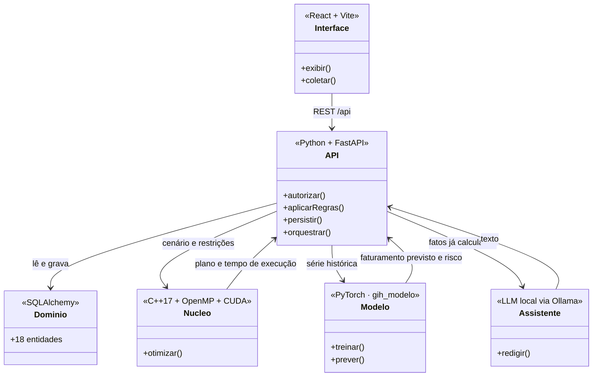
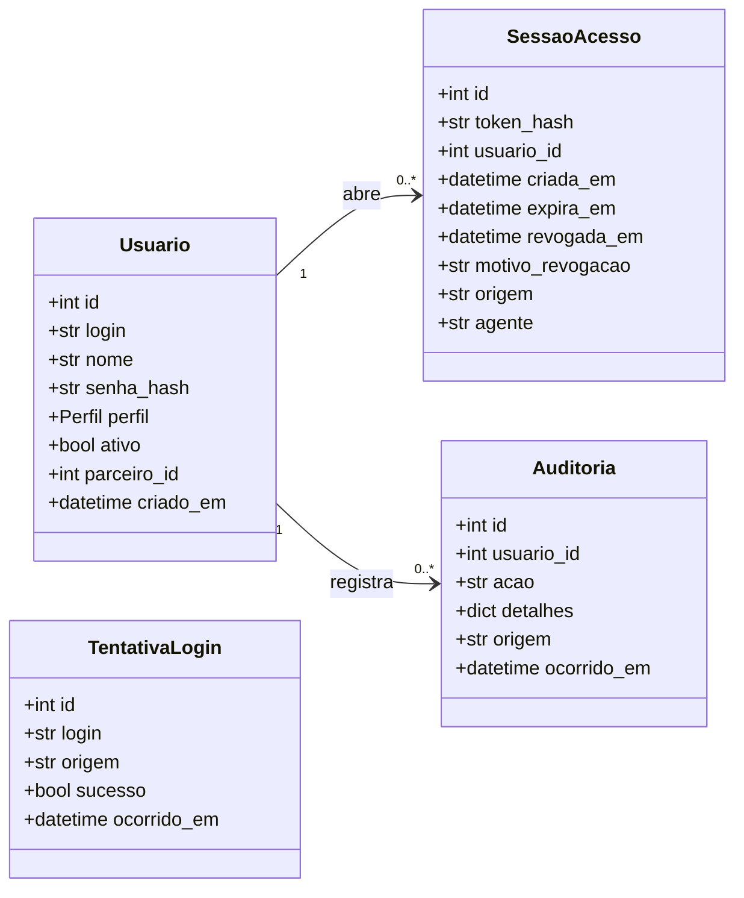
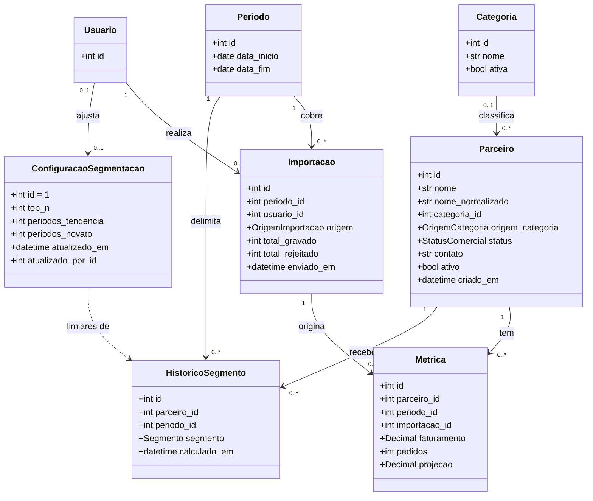
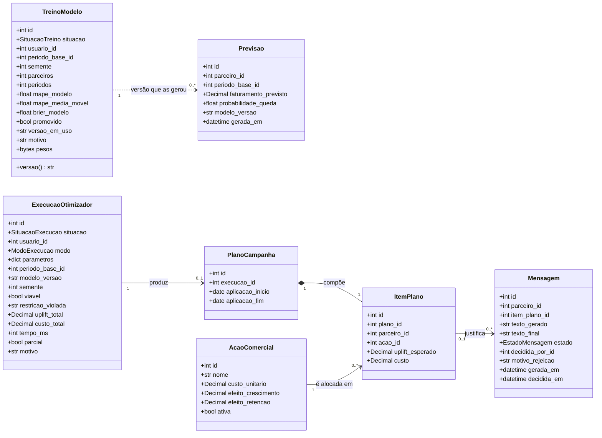
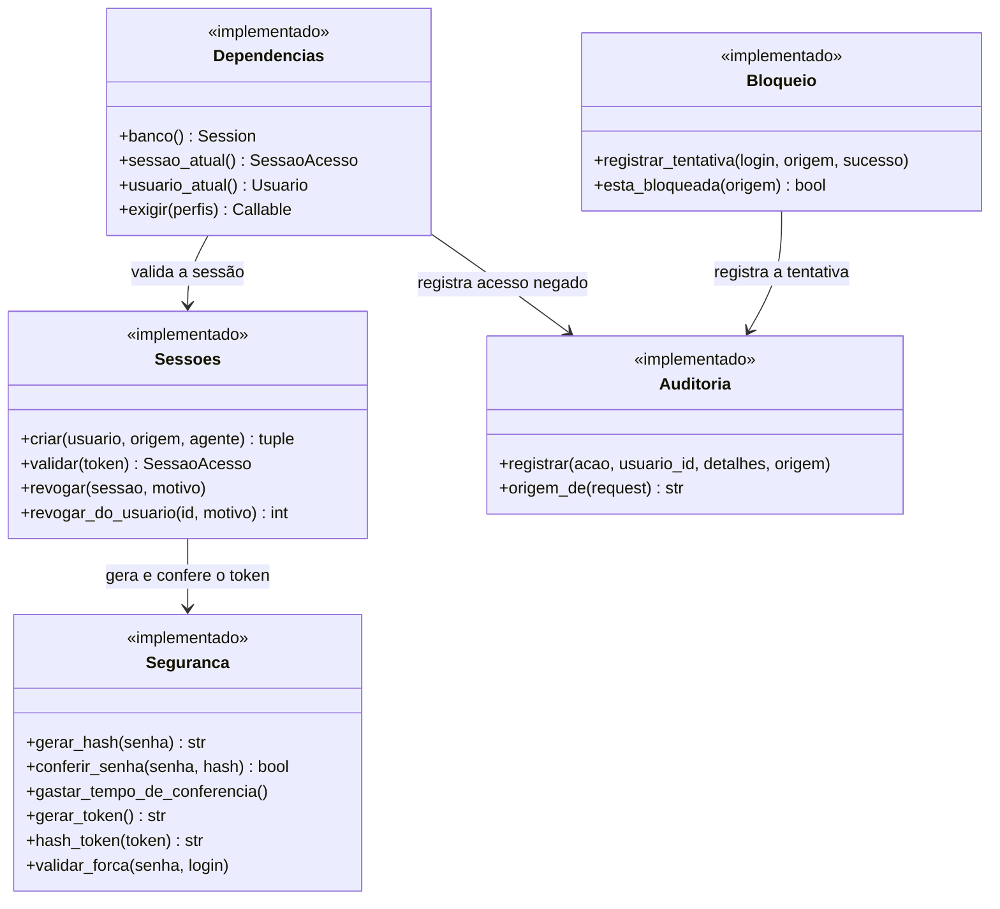
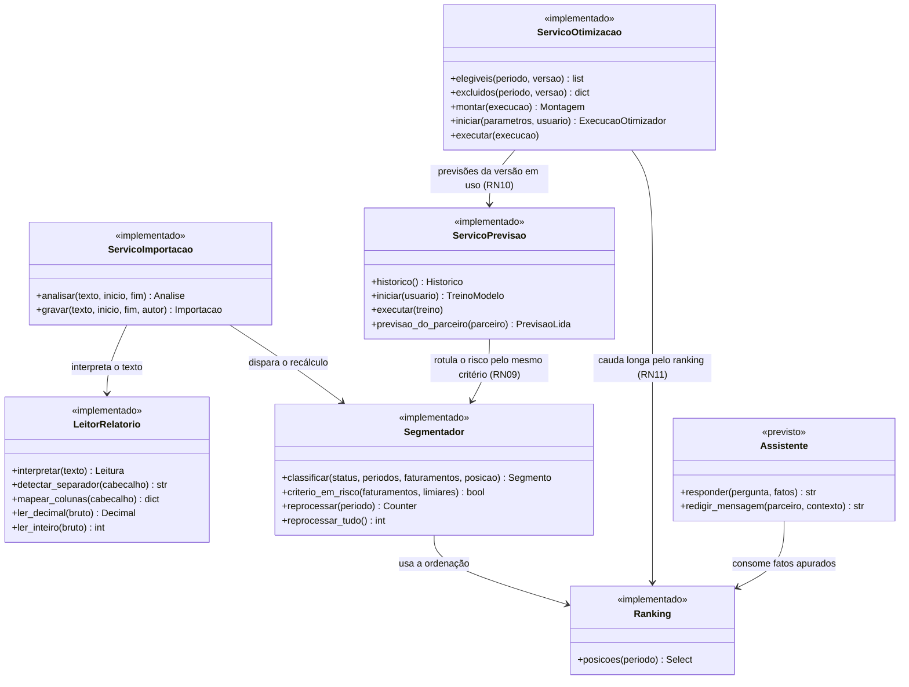
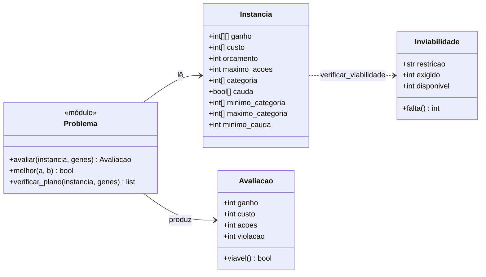
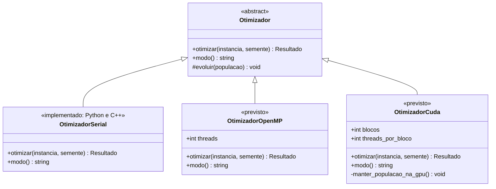

# 10 — Diagrama de Classes

**Projeto:** Growth Intelligence Hub (GIH)
**Entrega:** Sprint 02 acadêmica — arquitetura e modelagem
**Versão:** 1.0 — 16/09/2026

> **Por que oito diagramas e não um.** O sistema tem três camadas com naturezas diferentes: entidades de
> domínio (dados), serviços (regra de negócio) e núcleo computacional (C++/CUDA). Espremer as três num
> desenho só produziria uma figura de oitenta caixas, ilegível impressa — que é exatamente o critério de
> aceite da entrega. Cada diagrama abaixo se lê sozinho, e o **primeiro** mostra como eles se ligam.

---

## 1. Visão de integração

Onde cada camada vive e o que atravessa a fronteira entre elas. É esta figura que responde ao item 1 da
entrega — *"a arquitetura deverá contemplar a integração entre o software e o componente computacional
avançado"*.

<!-- diagrama: classes-integracao -->

Três fronteiras que não se atravessam, e o motivo de cada uma:

- **A interface não conhece regra de negócio.** Ela exibe e coleta; a API decide. Um `if` sobre valor de
  negócio no React está no lugar errado.
- **O núcleo não conhece autenticação nem banco.** Recebe um cenário e devolve um plano. Isso é o que
  permite compilá-lo e medi-lo fora da aplicação — foi assim que o spike da GPU rodou oito semanas antes
  do resto existir.
- **O assistente não calcula número.** Recebe fatos já apurados e redige texto em volta deles (RN08). Se
  ele somasse, o número deixaria de ser reproduzível, e a reprodutibilidade é critério de avaliação.

---

## 2. Domínio — acesso, sessões e auditoria

Quem entra, por quanto tempo, e o rastro que fica.

<!-- diagrama: classes-dominio-acesso -->

**`SessaoAcesso` guarda o hash do identificador, nunca ele próprio.** Quem conseguir ler esta tabela não
consegue se passar por ninguém. E a sessão é **revogada**, não apagada: "esta sessão caiu por troca de
senha" é informação de investigação, e some se a linha for removida.

**`TentativaLogin` não se liga a `Usuario`, e isso é deliberado.** O login é texto livre, não chave
estrangeira: tentativa contra usuário inexistente também precisa ser contada, senão a defesa contra força
bruta só protege quem já existe — e é justamente o login desconhecido que o ataque por dicionário usa
(RNF11).

**`Auditoria.usuario_id` é opcional** pelo mesmo motivo: a tentativa de login com usuário inexistente
precisa ser registrada, e nesse caso não há usuário para apontar.

---

## 3. Domínio — parceiros e dados de desempenho

O núcleo informacional do produto: quem são os parceiros, o que faturaram em cada período, e como foram
classificados.

<!-- diagrama: classes-dominio-desempenho -->

*`Usuario` aparece reduzido ao identificador: o detalhe dele está no diagrama anterior.*

**Há um vínculo a mais, omitido do desenho para não cruzá-lo de ponta a ponta:** `Usuario.parceiro_id`
aponta para `Parceiro`, e **só o perfil `PARCEIRO` o usa** — é o que restringe aquele usuário a consultar
o próprio desempenho (RF26). O banco cobra isso por `CHECK`: ter vínculo e ser do perfil Parceiro são a
mesma condição.

**`Metrica` não tem `ticket_medio`.** Ele é faturamento dividido por pedidos, calculado na consulta
(RN04). Como atributo, divergiria das parcelas que o originam na primeira correção de dado.

**`Metrica` é única por (parceiro, período).** É essa restrição que impede uma reimportação de duplicar a
série e corromper a segmentação por tendência.

**`Periodo` é obrigatório e não tem valor padrão.** O relatório de origem não carrega datas; sem o período
informado, as métricas ficam órfãs na linha do tempo e a segmentação classifica errado **sem emitir erro**
(RN03). Já aconteceu num projeto anterior do mesmo domínio.

**`ConfiguracaoSegmentacao` entrou na Sprint 7** (H34, RF21): os três limiares de RN01 saíram do código e
passaram a mudar sem alteração de código. **Uma instância só** — o banco cobra `id = 1` —, e a seta
tracejada até `HistoricoSegmento` é dependência, não associação: os limiares decidem o segmento que é
gravado, mas nenhum histórico aponta para a configuração que o produziu.

**`Parceiro.nome_normalizado` entrou na Sprint 6** (H37): o nome sem acento e sem caixa, gravado pela
aplicação, que é o que permite a busca sem acento usar índice.

**`HistoricoSegmento` guarda o segmento já resolvido pela precedência de RN01.** Por isso a mobilidade do
Top N **não** pode ser derivada dele: um parceiro entre os N maiores mas em queda fica gravado como
`EM_RISCO`, e lê-lo daqui faria o painel anunciar que ele saiu do Top N enquanto continua lá (RN02).

---

## 4. Domínio — núcleo computacional e comunicação

<!-- diagrama: classes-dominio-nucleo -->

**`ExecucaoOtimizador` existe mesmo quando não há plano.** A cardinalidade `0..1` é RN07: ou o plano
respeita **todas** as restrições, ou não existe plano. A execução inviável fica registrada com
`restricao_violada` preenchido, porque explicar por que não deu é mais útil que sumir com a tentativa. Ela
guarda também a versão do modelo, o período das previsões e a semente: com os três e os mesmos parâmetros,
sai o mesmo plano (ADR-011).

**`AcaoComercial` tem os dois efeitos da RN10.** O ganho de aplicá-la a um parceiro é o que ela acrescenta
ao faturamento previsto mais a parte da perda que evita quando ele cairia — por isso uma ação de retenção
vale mais para quem está em risco.

**`PlanoCampanha` compõe `ItemPlano` (losango cheio).** Item sem plano não tem significado; apagar o plano
apaga os itens.

**`TreinoModelo` liga-se à `Previsao` pela versão, e não por chave (seta tracejada).** `rede-7` é a rede
do treino 7; `referencia-7`, as contas simples medidas nele, que valem enquanto nenhuma rede superou as
referências (UC07-A1). O treino guarda a métrica da rede ao lado da de cada referência — o atributo listado
é uma amostra; o modelo de dados tem todas.

**`Mensagem` separa `texto_gerado` de `texto_final`.** Se o Gestor editar antes de aprovar, o original
permanece — é o que permite responder depois *"o que a IA escreveu, e o que de fato foi enviado?"*, e
medir se o modelo está acertando o tom.

---

## 5. Camada de serviços — acesso e segurança

O domínio das seções 2 a 4 é **anêmico de propósito**: as entidades carregam dados e restrições, e a regra
de negócio vive nos serviços. A razão é testabilidade — a regra fica exercitável sem instanciar entidade,
e o interpretador do relatório, por exemplo, é função pura de texto para resultado.

Módulos marcados **implementado** já existem em `api/app/` e estão cobertos por teste; **previsto** são os
das próximas sprints.

<!-- diagrama: servicos-acesso -->

Duas decisões desta camada que valem registro:

- **A autorização é dependência declarada na rota, não `if` no corpo da função.** Esquecer um `if` é
  silencioso; esquecer a dependência reprova o teste que percorre cada endpoint contra cada perfil
  (RNF14).
- **`Auditoria` e `Bloqueio` gravam em transação própria.** Se participassem da transação da requisição,
  o `rollback` de uma falha de login levaria junto o registro da falha — a trilha teria só sucessos, e o
  contador de força bruta apagaria as próprias evidências antes de chegar às cinco tentativas (ADR-008).

---

## 6. Camada de serviços — ingestão e análise

<!-- diagrama: servicos-negocio -->

**`LeitorRelatorio` não toca no banco.** É função pura de texto para resultado, e é isso que permite a
prévia da importação usar exatamente o mesmo código da gravação — sem risco de a prévia mostrar uma coisa
e a gravação fazer outra.

**`ServicoPrevisao` rotula o treino com o critério do `Segmentador`.** A queda que o modelo aprende a
prever é entrar em Em Risco no período seguinte (RN09), e o rótulo sai de `criterio_em_risco` — a mesma
função que classifica o segmento. O modelo em si mora fora da API, no pacote `gih_modelo` (ADR-010): recebe
séries e devolve números, e quem decide se uma versão entra em uso é este serviço.

**`ServicoOtimizacao` traduz a campanha para o núcleo, e o núcleo não sabe o que é campanha.** Aqui ficam
a regra de negócio e o texto: o ganho da RN10 em centavos, quem é elegível, as cotas em contagem, a cauda
longa pelo ranking (a leitura da RN02) e a recusa com o nome da categoria e o valor em reais. O pacote
`gih_nucleo` recebe inteiros e devolve o plano (ADR-011).

**`Assistente` consome `Ranking`, nunca o banco direto.** Ele recebe fatos já apurados e redige texto em
volta deles. Se somasse, contasse ou comparasse, o número deixaria de ser reproduzível (RN08).

---

## 7. Núcleo computacional — as estruturas

A parte avaliada pela disciplina de **Tópicos Avançados**. O otimizador resolve um problema combinatório:
dados *N* parceiros e *A* ações possíveis, escolher no máximo uma ação por parceiro maximizando o ganho
esperado sem violar orçamento, máximo de ações e cotas. O espaço de busca é `(A+1)^N`. A formulação está na
`docs/07` §4.1, e a versão serial, no pacote `nucleo/gih_nucleo` (Sprint 9 interna).

O que entra, o que sai, e quem avalia um candidato:

<!-- diagrama: nucleo-estruturas -->

**Nenhuma dessas estruturas conhece banco, sessão ou HTTP.** O núcleo recebe uma instância já montada, em
**inteiros** — ganho e custo em centavos, cotas em contagem — e devolve o plano. Foi o que permitiu medir o
kernel oito semanas antes de o resto do sistema existir, e é o que permite testá-lo sem subir a aplicação.

**A violação é um número, e não um "inviável" que zera a aptidão.** Um plano inviável compete pela
violação — em unidades de ação — contra outro inviável, e perde para qualquer viável (`melhor`, ADR-011).
Assim a busca pode atravessar o inviável para chegar ao ótimo; e o plano devolvido ainda passa por
`verificar_plano`, escrito sem reaproveitar `avaliar` (RN07).

**`Inviabilidade` é decidida antes da busca, com exatidão.** Com as cotas em contagem, basta ver se o menor
conjunto que as cumpre cabe no máximo de ações e no orçamento pagando a ação mais barata (`docs/07` §4.1).

---

## 8. Núcleo computacional — as três implementações

Três implementações do **mesmo** algoritmo, para que o benchmark compare o que é comparável (RF32 a RF34).
Todas recebem a `Instancia` e a semente e devolvem o mesmo plano — o sorteio é por coordenadas e a
aritmética é inteira (ADR-011). A serial existe em Python (Sprint 9 interna) e em C++ (H53a), com plano
**idêntico** conferido por teste a cada PR; o executável é chamado pela API por processo (ADR-012). OpenMP e
CUDA são das Sprints 10 e 11.

<!-- diagrama: nucleo-otimizadores -->

**`manter_populacao_na_gpu()` é privado e não é detalhe de implementação — é o que justifica a classe
existir.** O spike da história H47 mediu: com transferência a cada geração, a GPU ganha apenas **1,1x a
1,3x** do OpenMP, e abaixo de ~4.000 planos candidatos **perde**. Sem a transferência, o kernel ganha
**11x**. A residência da população entre gerações deixou de ser otimização e virou o requisito que
sustenta o caminho CUDA. Medições completas em [`nucleo/spike/RESULTADO.md`](../nucleo/spike/RESULTADO.md).

**`Otimizador` é abstrato e a escolha do modo é em tempo de execução.** Sem GPU compatível, o sistema cai
para CPU paralela e avisa na interface (RNF06, ADR-004). Nunca se assume CUDA disponível.

---

## 9. O que já existe e o que está previsto

Um diagrama que promete código inexistente é pior que diagrama nenhum, porque ninguém reconfere. A tabela
abaixo separa os dois — e o repositório comprova cada linha da coluna ✅.

| Camada | Implementado ✅ | Previsto ⏳ |
|---|---|---|
| Domínio | **as 18 entidades**, com restrições `CHECK` no banco | — |
| Serviços | `seguranca`, `sessoes`, `bloqueio`, `auditoria`, `dependencias`, `leitor_relatorio`, `servico_importacao`, `servico_segmentacao`, `ranking`, `calculos`, `sugestao_categoria`, `servico_previsao`, `servico_otimizacao`, `erros` | `assistente` |
| Rotas | `/api/sessao`, `/api/usuarios`, `/api/importacoes`, `/api/parceiros`, `/api/categorias`, `/api/painel`, `/api/configuracao`, `/api/modelo`, `/api/campanha`, `/api/otimizacoes`, `/api/acoes-comerciais`, `/api/auditoria`, `/api/health` | benchmark, mensagens, assistente |
| Núcleo | pacote `gih_nucleo`: instância, viabilidade exata, gulosos e o genético serial (H48, H49, H52); o mesmo genético em C++, idêntico ao Python (H53a); kernel de avaliação validado em CUDA e OpenMP (spike H47) | as versões com OpenMP e em CUDA |
| Modelo preditivo | pacote `gih_modelo`: variáveis, referências, rede e treino (H41 a H43, H46) | — |

Cobertura de teste da API em 26/09/2026: **624 testes, 97%**. Os pacotes do modelo e do
otimizador têm as próprias suítes, em `modelo/tests` e `nucleo/tests`.

---

## 10. Como conferir este diagrama contra o código

Diagrama que diverge do código é pior que diagrama ausente. As três verificações que valem:

1. **Entidades e atributos** — [`api/app/modelos.py`](../api/app/modelos.py). Cada classe das seções 2 a 4
   corresponde a uma `class` desse arquivo, com os mesmos atributos.
2. **Serviços e assinaturas** — os módulos de [`api/app/`](../api/app/). Os métodos listados nas seções 5 e 6
   são as funções públicas de cada um.
3. **Tabelas realmente criadas** — `docker compose exec postgres psql -U gih -d gih -c "\dt"`. São 18
   tabelas de domínio mais a `alembic_version`, de controle das migrações.

Modelo de dados detalhado, com tipos, chaves e índices, em
[`08-modelo-de-dados.md`](08-modelo-de-dados.md).
